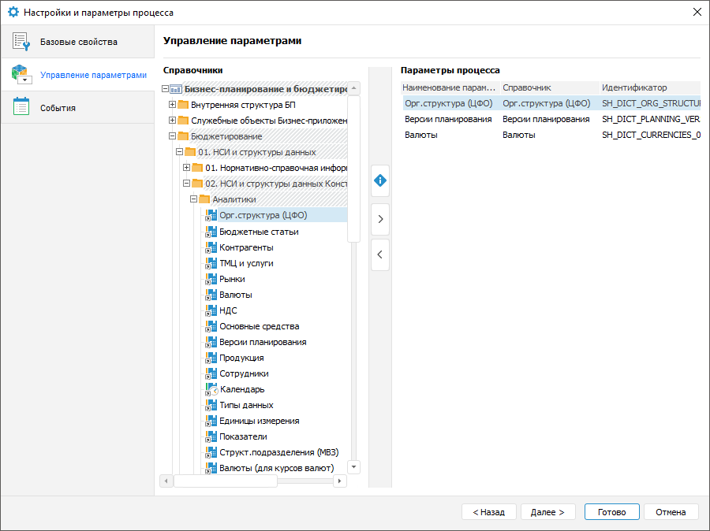

# Управление параметрами: Процесс, настольное приложение

Управление параметрами: Процесс, настольное приложение
-

# Управление параметрами

Формирование параметров процесса выполняется на странице «Управление
 параметрами» окна «[Настройки
 и параметры процесса](Setting_Process_Parameters.htm)»:

Сформируйте параметры процесса из справочников, которые будут использоваться
 в качестве параметров. Доступные операции:

[Добавление
 параметров](javascript:TextPopup(this))

	Для добавления справочника в качестве параметра процесса:

		- Выберите справочник в списке
		 «Справочники».

		- Выполните одно из действий:

			- нажмите кнопку  «Добавить»;

			- дважды щёлкните по выбранному справочнику.

	После выполнения действий выбранный справочник будет добавлен в
	 список «Параметры процесса».

[Особенности
 добавления параметров](javascript:TextPopup(this))

	Если при выполнении бизнес-процесса предполагается внесение изменений
	 в справочник, добавленный в бизнес-процесс в качестве параметра, то
	 для корректной работы бизнес-процесса рекомендуется настроить в справочнике
	 режим кеширования по временной отметке. Для этого свойству [IMetabaseObject.CachingMode](kesom.chm::/interface/imetabaseobject/imetabaseobject.cachingmode.htm)
	 справочника требуется установить значение [MetabaseObjectCachingMode.FlushCacheByTimestamp](kesom.chm::/enums/metabaseobjectcachingmode.htm).
	 Данная рекомендация также отображается в виде всплывающего сообщения
	 в настольном приложении при нажатии кнопки  «Информация» или при наведении на
	 неё курсора.

	Во избежание порчи данных в справочнике не рекомендуется параллельно
	 запускать несколько бизнес-процессов, при выполнении которых в указанный
	 справочник вносятся изменения.

[Переименование
 параметров](javascript:TextPopup(this))

	Для переименования параметра процесса:

		- Переведите наименование процесса в режим редактирования:

			- дважды щёлкните по наименованию параметра;

			- выполните команду «Переименовать»
			 в контекстном меню параметра;

			- нажмите клавишу F2.

		- Переименуйте процесс и нажмите клавишу ENTER.

	После выполнения действий параметр процесса будет переименован.

[Удаление
 параметров](javascript:TextPopup(this))

	Для удаления параметра процесса выполните одно из действий:

		- нажмите кнопку  «Удалить»;

		- выполните команду «Удалить»
		 в контекстном меню параметра;

		- нажмите клавишу DELETE.

	Будет запрошено подтверждение действия.

После формирования параметров настройте события процесса на странице
 «[События](Events.htm)»
 в настольном приложении при необходимости.

См. также:

[Настройка
 параметров процесса](Setting_Process_Parameters.htm) | [Настройка
 базовых свойств](Basic_properties.htm) | [Настройка событий](Events.htm)

		Справочная
		 система на версию 10.9
		 от 18/08/2025,
		 © ООО «ФОРСАЙТ»,
