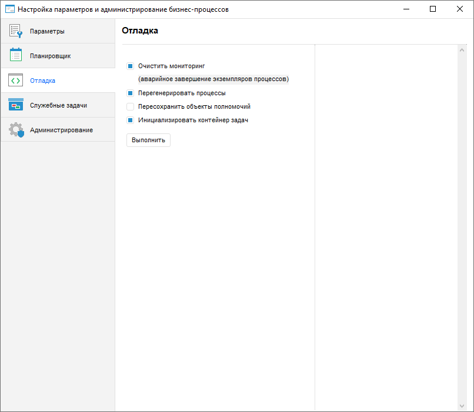

# Настройка отладки бизнес-процессов

Настройка отладки бизнес-процессов
-

# Настройка отладки бизнес-процессов

Настройка отладки предназначена для очистки мониторинга, перегенерации
 процессов, пересохранения объектов полномочий и инициализации контейнера
 задач. Все операции отладки бизнес-процессов выполняются на локальном
 компьютере вне зависимости от выбранного [типа
 исполнения процессов](../../Web/Process/Setting_planner.htm). Для настройки отладки бизнес-процессов используйте
 страницу «Отладка» в окне «[Настройка
 параметров и администрирование бизнес-процессов](../../Web/Process/Setting_and_administrating_process_parameters.htm)».

[Для открытия
 страницы «Отладка»](javascript:TextPopup(this))

	- Запустите утилиту с идентификатором BP_UTIL в [навигаторе
	 объектов](GetStarted.chm::/Interface/Interface_Navigator.htm). После чего будет открыто окно «[Настройка параметров и администрирование
	 бизнес-процессов](Setting_and_administrating_process_parameters.htm)».

		- Перейдите на страницу «Отладка».

Установите или снимите флажки:

	- Очистить мониторинг (аварийное завершение
	 всех экземпляров процессов). Флажок установлен по умолчанию.
	 При включенном флажке происходит удаление системных процессов, валидация
	 динамических сегментов и очищение справочников;

	- Перегенерировать процессы. Флажок установлен
	 по умолчанию. Операция выполняет пересоздание системных процессов
	 после их удаления предыдущей командой «Очистить
	 мониторинг»;

	- Пересохранить объекты полномочий. По умолчанию
	 флажок снят. Установите флажок для пересохранения всех объектов полномочий
	 после [установки
	 обновления](UpdManager.chm::/Admin_UpMBObj_DoUpdate.htm),
	 содержащего объекты полномочий или процессы, связанные с ними.

Примечание.
 Для создания задачи пересохранения объектов полномочий на сервере установите
 флажок «Пересохранить объекты полномочий»
 на странице «Служебные задачи».

	- Инициализировать
	 контейнер задач. Установите флажок, если [контейнер запланированных
	 задач](uiappsrv.chm::/Getting_Started.htm) с идентификатором BPM_EXECUTOR_CONTAINER
	 отсутствует или пуст.

Примечание.
 Операция доступна только при выборе [серверного
 исполнения](../../Web/Process/Setting_planner.htm#server).

Для выполнения отмеченных операций нажмите кнопку «Выполнить».
 Будет открыто информационное окно для подтверждения действия.

Процесс выполнения операций будет выведен в правой части диалога «Отладка». Во время выполнения операций
 переход на другие страницы недоступен.

Примечание.
 Работа с существующими экземплярами процессов может быть прервана. После
 выполнения операции отладки перезайдите в репозиторий.

См. также:

[Настройка
 параметров и администрирование бизнес-процессов](../../Web/Process/Setting_and_administrating_process_parameters.htm) | [Настройка
 параметров бизнес-процессов](../../Web/Process/Parameters_setting.htm) | [Настройка
 планировщика бизнес-процессов](../../Web/Process/Setting_planner.htm) | [Создание
 служебных задач для бизнес-процессов](Creating_service_tasks.htm) | [Администрирование
 бизнес-процессов](Administrating.htm)

		Справочная
		 система на версию 10.9
		 от 18/08/2025,
		 © ООО «ФОРСАЙТ»,
