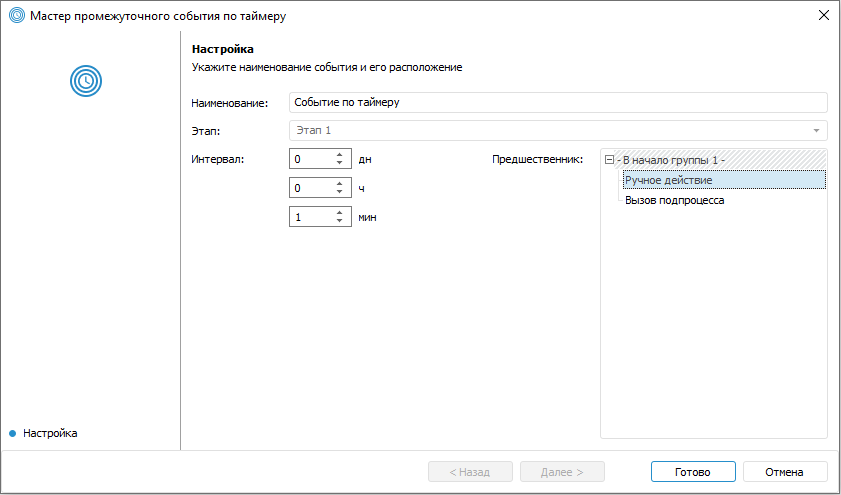

# Настройка промежуточных событий по времени: Настольное приложение

Настройка промежуточных событий по времени: Настольное приложение
-

# Настройка промежуточных событий по времени

Во время построения процесса есть возможность настроить промежуточное
 событие по времени, которое позволит прервать выполнение процесса до истечения
 времени, указанного в настройках события. При активации промежуточного
 события исполнение текущей ветки процесса приостанавливается до истечения
 указанного в событии времени.

Для добавления промежуточного события в окне «[Настройка
 бизнес-процесса](../Starting/Starting.htm#setting_business_process)»:

	- нажмите кнопку  «Промежуточное»
	 в группе «Событие» на вкладке
	 «Процесс» ленты инструментов.
	 Выберите тип события  «По
	 таймеру»;

	- выполните команду контекстного меню «Промежуточное
	 > По таймеру» в рабочей области или дереве процессов.

В результате будет открыто окно «Мастер
 промежуточного события по таймеру»:

Задайте параметры:

	- Наименование. Введите
	 наименование события;

	- Этап. В поле отображается
	 этап, в котором создаётся событие. Этап не доступен для изменения.
	 Чтобы добавить событие в другом этапе:

		- закройте мастер, выделите нужный этап или шаг этапа и снова
		 откройте мастер;

		- закончите создание события и переместите его в требуемый
		 этап с помощью кнопок  «Вырезать»/ «Вставить» в группе «Правка»
		 на вкладке «Процесс» ленты
		 инструментов.

	- Интервал. Введите значение
	 временного интервала, в течение которого выполнение процесса должно
	 быть приостановлено. Интервал может быть задан в днях и/или часах
	 и/или минутах;

	- Предшественник. В списке
	 выберите шаг-предшественник, после выполнения которого будет запускаться
	 создаваемое событие. Список отображается для второго и последующего
	 блоков.

Примечание.
 Настройка шага-предшественника доступна только при создании события.

Промежуточное событие появится в рабочей области в виде блока аналогичного
 шагам процесса после сохранения настроек.

В рабочей области мониторинга процессов каждое событие обозначается
 цветом, соответствующем его текущему статусу.

Возможные варианты индикации статусов выполнения:

	- серый фон. Выполнение не начато;

	- синий фон. Таймер события активирован;

	- зелёный фон. Выполнено успешно.

См. также:

[Построение
 процесса](Create_process_screenshot.htm) | [Создание
 шагов этапа](StepsProcess/CreateStepsProcess.htm) | [Настройка
 условий выполнения шагов этапа](Setting_up_steps_conditions.htm)

		Справочная
		 система на версию 10.9
		 от 18/08/2025,
		 © ООО «ФОРСАЙТ»,
