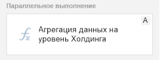
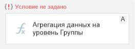
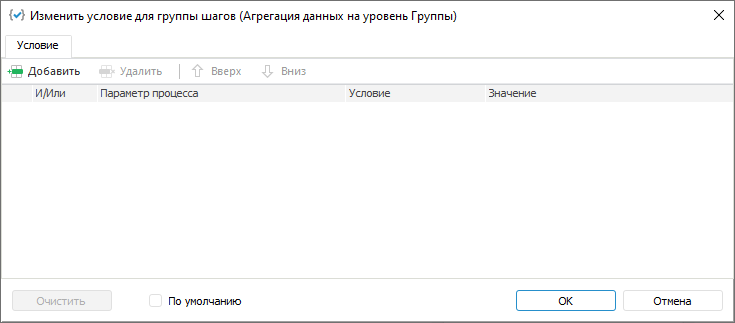
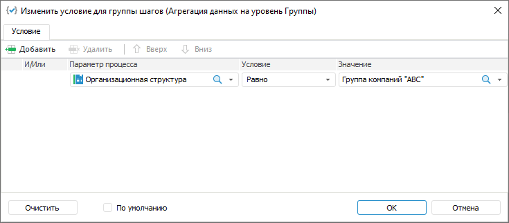

# Настройка условий выполнения шагов этапа: Процесс, настольное приложение

Настройка условий выполнения шагов этапа: Процесс, настольное приложение
-

# Настройка условий выполнения шагов этапа

	После создания шагов этапа можно настроить условия выполнения шагов
	 с помощью шлюза. Шлюз используется для автоматического объединения
	 шагов этапа в группы, состоящие из одного и более шагов. Если
	 этап содержит только один шаг, то шлюз не может быть использован.
	 Для одного этапа можно выбрать только один тип шлюза.

	Для настройки условий выполнения шагов этапа:

		- Выделите шаг или группу шагов.

		- Добавьте [шлюз](#gateway) требуемого типа. При
		 добавлении шлюза автоматически создаются группы шагов.

	Для перемещения шагов из одной группы
	 в другую используйте кнопки  «Переместить вверх» и  «Переместить
	 вниз» на вкладке «Процесс»
	 ленты инструментов в окне «[Настройка
	 бизнес-процесса](../Starting/Starting.htm#setting_business_process)» или в контекстном меню шага.

		- Добавьте [условия](Setting_up_steps_conditions.htm#add)
		 выполнения для группы шагов.

	В результате для шагов этапа будут настроены условия выполнения.

## Добавление шлюза

	Для использования шлюза выделите шаг процесса в рабочей области
	 или дереве процессов [окна
	 настройки бизнес-процесса](../Starting/Starting.htm#setting_business_process) и выполните одно из действий:

		- выберите тип шлюза в раскрывающемся меню кнопки  «Шлюз» на вкладке «Процесс»
		 ленты инструментов:

			-  «Параллельный шлюз». Группы
			 шагов выполняются параллельно.

	При выборе шлюза группа шагов принимает
	 вид:

	

			-  «Исключающий шлюз». Выполняется
			 последовательная проверка [условий](Setting_up_steps_conditions.htm#add)
			 групп шагов:

				- если условие выполняется, то только одна группа
				 шагов выполняется и процесс переходит к следующему этапу;

				- если условие не выполняется, то проверяется условие
				 следующей группы шагов;

				- если ни одно условие группы шагов не выполняется,
				 то выполняется группа шагов по умолчанию. Если группа
				 шагов по умолчанию не задана, выполнение процесса переходит
				 к следующему этапу.

	При выборе шлюза условие для группы шагов
	 не задано. Группа шагов принимает вид:

	

			-  «Включающий шлюз». Выполняется
			 параллельная проверка [условий](Setting_up_steps_conditions.htm#add)
			 групп шагов. Если выполнены несколько условий, то группы шагов
			 выполняются одновременно.

	При выборе шлюза условие для группы шагов
	 не задано. Группа шагов принимает вид:

	

			-  «Без шлюза». Используется
			 по умолчанию. Шаги в группе выполняются последовательно.

		- выполните команду «<Тип
		 шлюза>» контекстного меню шага или шлюза;

		- используйте сочетание клавиш:

			- CTRL+ALT+P. Параллельный шлюз;

			- CTRL+ALT+E. Исключающий шлюз;

			- CTRL+ALT+I. Включающий шлюз;

			- CTRL+ALT+N. Без шлюза

	При создании шлюза «Исключающий
	 шлюз» или «Включающий
	 шлюз» добавьте [условия](Setting_up_steps_conditions.htm#add)
	 для каждой группы шагов. Возможные варианты статусов условий:

		-  «Условие
		 не задано». Используется при [настройке
		 бизнес-процесса](../Starting/Starting.htm). Условие не задано, запуск процесса невозможен.
		 В настольном приложении при попытке сохранения процесса будет
		 выведено сообщение об ошибке;

		-  «Условие задано». Используется
		 при [настройке бизнес-процесса](../Starting/Starting.htm).
		 Условие задано, при запуске процесса выполняется проверка заданного
		 условия для группы шагов;

		-  «Условие
		 выполнено». Используется при [мониторинге
		 процессов](../Starting/Monitoring_process_execution.htm). Условие выполнено, процесс выполнения переходит
		 к активации шагов в группах с выполненным условием;

		-  «Условие
		 не выполнено». Используется при [мониторинге
		 процессов](../Starting/Monitoring_process_execution.htm). Условие не выполнено, процесс выполнения переходит
		 к проверке условия следующей группы шагов или этапу;

		-  «По
		 умолчанию». Используется при [настройке
		 бизнес-процесса](../Starting/Starting.htm) и при [мониторинге
		 процессов](../Starting/Monitoring_process_execution.htm). Группа шагов выполняется только в том случае, если
		 ни одно из условий других групп шагов этапа не было выполнено.
		 Если для группы шагов добавлено условие, то оно не учитывается
		 при использовании статуса «По
		 умолчанию».

	Примечание.
	 Только для одной группы шагов этапа может быть добавлено условие «По умолчанию».

### Изменение типа шлюза

	Для изменения типа добавленного шлюза:

		- Выделите шаг, группу шагов или сам шлюз.

		- Выполните одно из действий:

			- выберите тип шлюза в раскрывающемся меню кнопки  «Шлюз»
			 на вкладке «Процесс»
			 ленты инструментов;

			- выполните команду «<Тип
			 шлюза>» контекстного меню;

			- нажмите сочетание клавиш требуемого типа шлюза.

### Удаление шлюза

	Для удаления добавленного шлюза [измените тип шлюза](#change)
	 на  «Без шлюза». Отобразится окно подтверждения
	 действия с предупреждением об объединении всех шагов в одну группу
	 для последовательного выполнения.

	При отсутствии шлюза шаги этапа выполняются последовательно.

## Добавление условий для групп шагов

	Для добавления условия группы шагов:

		- Выполните одно из действий:

			- дважды щёлкните по условию;

			- выполните команду «Редактировать»
			 контекстного меню условия.

	В результате будет открыто окно «Изменить условие для группы шагов»:

	

		- Нажмите кнопку  «Добавить»
		 в веб-приложении или кнопку  «Добавить» в настольном приложении.
		 Появится строка параметров условия:

	

		- Задайте параметры:

			- Параметр процесса.
			 Выберите справочник или атрибут справочника, который будет
			 участвовать в условии;

			- Условие. Выберите условие в раскрывающемся
			 списке:

				- Равно;

				- Не равно;

				- Содержит;

				- Не содержит;

				- Содержится в;

				- Не содержится в;

				- Не пересекаются/Не пересекается с;

	Примечание.
	 Набор отображаемых типов условия зависит [типа
	 данных атрибута](UiNavObj.chm::/reference_book/Master_RDS_reference_book/Attributes/Attribute.htm), выбранного в столбце «Параметр
	 подпроцесса».

			- Значение. Задайте
			 значение, которое будет сравниваться со значением параметра
			 процесса. При выборе элементов справочника с настроенными
			 [схемами
			 отметки](UiNavObj.chm::/reference_book/look-and-feel_Reference_book/UiMd_reference_book_look-and-feel_Scheme.htm) доступна возможность применения
			 настроенных схем с помощью команд в контекстном меню элементов
			 справочника;

			- И/Или. Выберите
			 один из логических операторов в раскрывающемся списке, если
			 добавлено несколько условий:

				- И. Если
				 все условия выполняются, то выполняется группа шагов;

				- Или. По
				 умолчанию. Если выполняется хотя бы одно условие, то выполняется
				 группа шагов.

		- При необходимости используйте статус условия «По
		 умолчанию». Для этого выполните одно из действий:

			- установите флажок «По
			 умолчанию»;

			- выполните команду «Поток
			 по умолчанию» контекстного меню статуса условия.

	В результате для группы шагов будут заданы условия выполнения.

### Изменения последовательности выполнения условий

	Для изменения последовательности выполнения условий используйте
	 кнопки  «Вверх» и  «Вниз».

### Удаление условия

	Для удаления одного из условий выделите условие и нажмите кнопку
	  «Удалить».

	Для удаления всех условий нажмите кнопку «Очистить».

	После настройки условий выполнения шагов этапа перейдите к [симуляции
	 выполнения шагов](BPM_Simulation_Process.htm).

См. также:

[Построение
 процесса](Create_process_screenshot.htm) | [Создание
 шагов этапа](StepsProcess/CreateStepsProcess.htm)

		Справочная
		 система на версию 10.9
		 от 18/08/2025,
		 © ООО «ФОРСАЙТ»,
