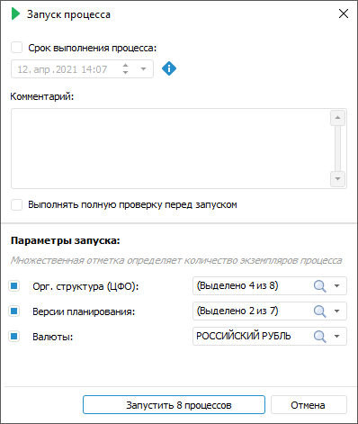

# Запуск процесса: Настольное приложение

Запуск процесса: Настольное приложение
-

# Запуск процесса

Запустить процесс возможно неограниченное количество раз, устанавливая
 различные параметры запуска в окне «[Настройки и параметры процесса](Setting_Process_Parameters.htm)».

Примечание.
 Доступно только для валидных процессов.

Запуск процесса возможен:

	- в окне [настройки
	 бизнес-процесса](../Starting/Starting.htm#setting_business_process);

	- в навигаторе объектов.

Выполнение запущенных процессов может осуществляться на сервере или
 локальном компьютере пользователя.

[Для запуска
 процесса](javascript:TextPopup(this))

	Для запуска процесса в окне [настройки
	 бизнес-процесса](../Starting/Starting.htm#setting_business_process):

		- Выполните одно из действий:

			- нажмите кнопку  «Запустить»
			 в группе «Запуск»
			 на вкладке «Процесс»
			 ленты инструментов;

			- выполните команду  «Запустить»
			 контекстного меню рабочей области окна настройки бизнес-процесса
			 или корневого элемента на боковой панели окна.

		- В открывшемся окне «Запуск
		 процесса» задайте необходимые параметры и нажмите кнопку
		 «Запустить N процессов»,
		 где N - количество
		 запускаемых экземпляров процесса.

	Для запуска процесса в [навигаторе
	 объектов](GetStarted.chm::/Interface/Interface_Navigator.htm):

		- Выполните команду «Запустить»
		 в контекстном меню процесса.

		- В открывшемся окне «Запуск
		 процесса» задайте необходимые параметры и нажмите кнопку
		 «Запустить N процессов»,
		 где N - количество
		 запускаемых экземпляров процесса.

	Примечание.
	 Права запуска процесса имеют пользователи с [ролью
	 ответственного](Basic_properties.htm#role_of_the_curator) за процесс и [администратор](Basic_properties.htm#role_of_admin)
	 при условии установленного у него полного доступа к процессу. Другим
	 пользователям при попытке запуска процесса в навигаторе объектов выводится
	 информационное сообщение об отсутствии прав на запуск процесса, в
	 окне с настройкой бизнес-процесса кнопка  «Запустить» будет не активна.

Задание параметров запуска процесса выполняется с помощью окна «Запуск процесса»:

Окно содержит общие параметры процесса и параметры запуска [экземпляров
 процесса](../Starting/Starting.htm#tree).

Для запуска процесса:

	- В области общих параметров введите значения параметров:

		- Срок выполнения процесса.
		 При необходимости установите флажок и задайте срок выполнения
		 процесса до указанной даты. После истечения данного срока процесс
		 будет считаться просроченным. Если флажок снят, то просроченными
		 могут быть только отдельные [шаги](StepsProcess/CreateStepsProcess.htm)
		 процесса;

Примечание.
 Минимальный срок выполнения процесса включает в себя сумму сроков выполнения
 всех этапов процесса.

		- Комментарий. При
		 необходимости введите комментарий к запуску процесса;

		- Выполнить полную проверку
		 перед запуском. При необходимости установите флажок для
		 проверки всех вложенных процессов и их шагов на отсутствие ошибок.
		 Если флажок снят, то такая проверка выполняется без проверки шагов
		 во вложенных подпроцессах.

	- В области «Параметры запуска»
	 задайте одиночную или множетственную отметку элементов в раскрывающемся
	 списке соответствующего параметра. Набор параметров запуска устанавливается
	 при настройке параметров процесса.

Выберите параметры, которые будут включены
 в множественный запуск. Для этого установите флажок напротив требуемого
 параметра. Для запуска одного экземпляра процесса со всеми заданными отметками
 элементов параметров снимите флажок напротив всех параметров процесса.

Примечание.
 Если параметр запуска является [параметром
 разбивки](StepsProcess/Subprocess.htm#splitting_parameter) для шага «Вызов подпроцесса»
 и флажок напротив параметра снят, то при выполнении процесса шаг будет
 завершаться без запуска подпроцессов.

	- Нажмите кнопку «Запустить N
	 процессов», где N -
	 количество запускаемых экземпляров процесса. Количество запускаемых
	 экземпляров равняется количеству комбинаций параметров запуска, которое
	 зависит от включённых параметров в запуск и выбранных значений параметров.

На приведённом выше примере в запуск включены
 параметры «Организационная структура»
 (4 организации), «Версии планирования»
 (2 версии планирования) и «Валюты»
 (1 валюта). Таким образом, количество комбинаций параметров равняется
 8 и, соответственно, будет запущено 8 экземпляров процесса для каждой
 комбинации параметров. Если флажок снят, то в качестве значения неотмеченного
 параметра будут приниматься все его выделенные элементы.

Количество запускаемых экземпляров процесса
 указывается на кнопке, например: «Запустить
 8 процессов».

После выполнения действий откройте окно «[Мониторинг процессов](../Starting/Starting.htm#open)»
 для выполнения шагов запущенного процесса. Мониторинг процессов содержит
 все запущенные экземпляры процесса, доступные пользователю.

Примечание.
 При разработке приложения с использованием языка программирования Fore
 для [повышения
 производительности](Setup.chm::/01_SysReq/Performance_Recommendations.htm) продукта «Форсайт. Аналитическая платформа»
 запускайте бизнес-процессы в отдельном потоке с помощью метода [IForeThread.Start](kefore.chm::/interface/iforethread/iforethread.start.htm).

См. также:

[Мониторинг
 процесса](../Starting/Monitoring_process_execution.htm) | [Настройка
 параметров и администрирование бизнес-процессов](Setting_and_administrating_process_parameters.htm)

		Справочная
		 система на версию 10.9
		 от 18/08/2025,
		 © ООО «ФОРСАЙТ»,
