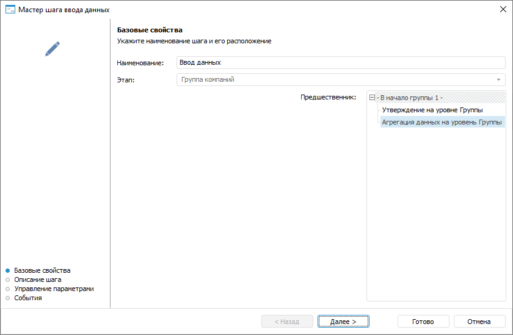

# Создание шагов этапа: Настольное приложение

Создание шагов этапа: Настольное приложение
-

# Создание шагов этапа

Этап процесса может состоять из неограниченного количества последовательных
 или параллельных шагов.

Для добавления шага этапа процесса используйте мастер шага.

[Для открытия
 мастера](javascript:TextPopup(this))

	Для открытия мастера шага в окне ««[Настройка бизнес-процесса](../../Starting/Starting.htm#setting_business_process)»
	 в рабочей области или дереве процессов выделите этап или шаг процесса,
	 для которого требуется добавить шаг и выполните одно из действий:

		- нажмите кнопку  «Добавить шаг» на вкладке «Процесс» ленты инструментов
		 и в открывшемся меню выберите тип создаваемого шага;

		- выполните команду «Наименование
		 шага» контекстного меню;

		- используйте сочетание клавиш CTRL+<номер
		 шага>:

			- 1. Ввод данных;

			- 2. Расчёт;

			- 3. Согласование;

			- 4. Вызов подпроцесса;

			- 5. Вызов Fore-метода;

			- 6. Задача ETL;

			- 7. Отправка
			 e-mail оповещения;

			- 8. Ручное действие.

Первая страница мастера шага «Базовые
 свойства»:

Мастер шага содержит страницы: «Базовые
 свойства», «Описание шага»,
 «Управление параметрами»/«Параметры письма» и «События».
 Содержание страниц зависит от типа создаваемого шага.

Шаги запускаются на выполнение вручную
 пользователем или автоматически после выполнения предыдущего шага:

	- автоматически: [Вызов
	 Fore-метода](Fore.htm), [Задача
	 ETL](ETL.htm), [Отправка
	 e-mail оповещения](E-mail.htm);

	- вручную: [Ввод
	 данных](Data_Entry.htm), [Согласование](Agreement.htm),
	 [Ручное действие](Manual_Task.htm);

	- способ исполнения устанавливается пользователем при настройке
	 шага или при редактировании процесса через контекстное меню: [Расчёт](Calculation.htm) и [Вызов
	 подпроцесса](Subprocess.htm).

Примечание.
 В рабочей области шаги процесса с автоматическим способом исполнения
 обозначаются пиктограммой .

## Определение базовых свойств шага

Шаги этапа процесса имеют ряд базовых настроек, одинаковых для всех
 типов шагов. Для задания базовых настроек на первой странице мастера шага
 задайте:

	- Наименование. Введите
	 наименование шага.

	- Этап. Отображает этап,
	 в котором создаётся шаг. Недоступно для изменения. Для добавления
	 шага в другом этапе:

		- закройте мастер, выделите нужный этап или шаг этапа и снова
		 откройте мастер;

		- закончите создание шага и переместите его в требуемый этап
		 с помощью кнопок  «Переместить
		 вверх»/ «Переместить
		 вниз» на вкладке «Процесс»
		 ленты инструментов;

	- Предшественник. В списке
	 выберите шаг-предшественник, после выполнения которого будет запускаться
	 создаваемый шаг. Список отображается для второго и последующего шагов.

После определения параметров на странице «Базовые
 свойства» нажмите кнопку «Далее».

Дальнейшие настройки зависят от выбранного
 шага:

	- [Ввод данных](Data_Entry.htm);

	- [Расчёт](Calculation.htm);

	- [Согласование](Agreement.htm);

	- [Вызов подпроцесса](Subprocess.htm);

	- [Вызов Fore-метода](Fore.htm);

	- [Задача ETL](ETL.htm);

	- [Отправка e-mail оповещения](E-mail.htm);

	- [Ручное действие](Manual_Task.htm).

После создания шагов процесса перейдите к [настройке
 условий выполнения шагов](../Setting_up_steps_conditions.htm).

См. также:

[Построение
 процесса](../Create_process_screenshot.htm) | [Симуляция
 выполнения шагов процесса](../BPM_Simulation_Process.htm)

		Справочная
		 система на версию 10.9
		 от 18/08/2025,
		 © ООО «ФОРСАЙТ»,
