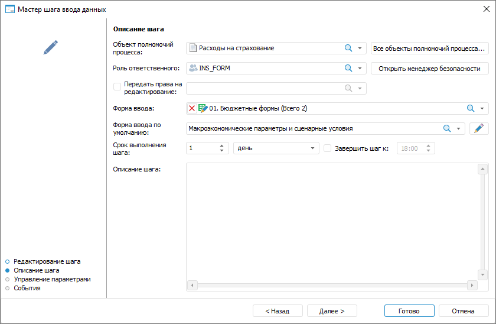
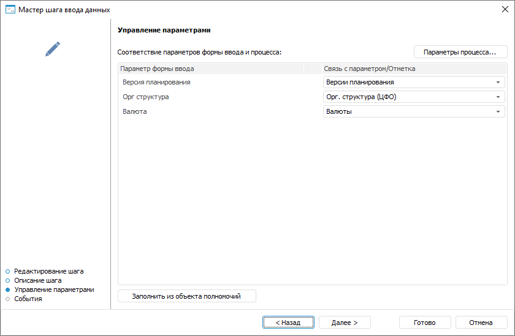
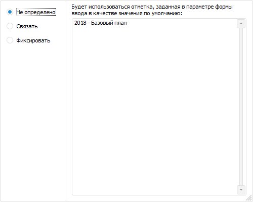
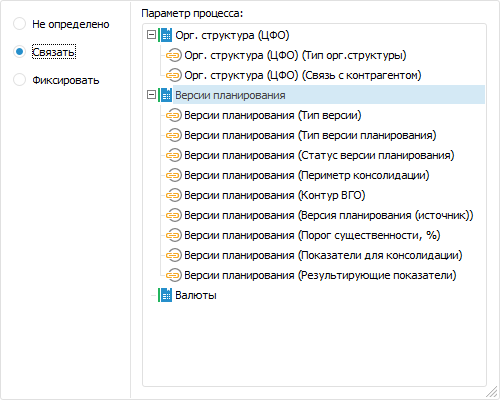
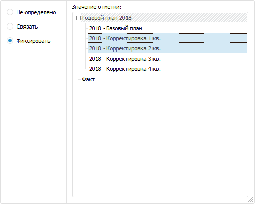
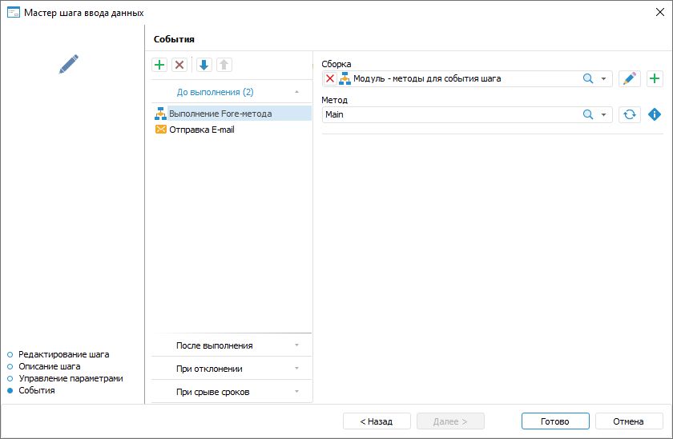

# Создание шага «Ввод данных»: Настольное приложение

Создание шага «Ввод данных»: Настольное приложение
-

# Создание шага «Ввод данных»

	Для создания шага по вводу определённого набора данных откройте
	 мастер шага ввода данных.

[Для открытия
 мастера](javascript:TextPopup(this))

	Для открытия мастера шага в окне ««[Настройка бизнес-процесса](../../Starting/Starting.htm#setting_business_process)»
	 в рабочей области или дереве процессов выделите этап или шаг процесса,
	 для которого требуется добавить шаг и выполните одно из действий:

		- нажмите кнопку  «Добавить шаг» на вкладке «Процесс» ленты инструментов
		 и в открывшемся меню выберите тип создаваемого шага;

		- выполните команду «Наименование
		 шага» контекстного меню;

		- используйте сочетание клавиш CTRL+<номер
		 шага>:

			- 1. Ввод данных;

			- 2. Расчёт;

			- 3. Согласование;

			- 4. Вызов подпроцесса;

			- 5. Вызов Fore-метода;

			- 6. Задача ETL;

			- 7. Отправка
			 e-mail оповещения;

			- 8. Ручное действие.

	Настройка шага «Ввод данных»
	 состоит из следующих действий:

		- Настройка [базовых
		 свойств шага](CreateStepsProcess.htm#steps_process_firs_page). После определения базовых свойств шага нажмите
		 кнопку «Далее».

		- [Настройка параметров
		 описания шага](Data_Entry.htm#base_settings).

		- [Настройка связи параметров
		 формы ввода/отчёта и процесса](Data_Entry.htm#parameters).

		- [Настройка событий, выполняемых
		 при запуске выполнения шага или после его завершения](Data_Entry.htm#events).

## Настройка параметров описания шага

	Для настройки параметров описания шага используйте страницу «Описание шага» мастера шага:

	

	Задайте параметры:

	- Объект полномочий процесса.
	 Поле обязательно для заполнения. Выберите в раскрывающемся списке
	 [объектов
	 полномочий процесса](../../Facility_Agreement/Configuring_the_Authorization_Object.htm) нужный объект.

В случае отсутствия подходящего объекта полномочий
 нажмите кнопку «Все объекты полномочий
 процесса». Будет открыто окно «[Настройка
 объектов полномочий процесса](../../Facility_Agreement/Configuring_the_Authorization_Object.htm)», в котором можно добавить объект полномочий.

Примечание.
 Для корректной работы бизнес-процессов в форме ввода [отметка
 по измерениям](../../Facility_Agreement/Configuring_the_Authorization_Object.htm) объекта полномочий должна полностью содержаться в [отметке
 по измерениям](DataEntryForms.chm::/Desktop/Table/Select_dimension_elements.htm) формы ввода, используемой в шаге процесса.

		- Роль
		 ответственного. Обязательное для заполнения поле. Выберите
		 в раскрывающемся списке пользователя или группу пользователей,
		 ответственных за выполнение шага при исполнении процесса. Список
		 состоит из пользователей, указанных в объекте полномочий.

	В случае отсутствия в списке необходимой
	 группы пользователей нажмите кнопку «Открыть
	 менеджер безопасности». Будет открыто окно [менеджера
	 безопасности](admin.chm::/01_RunSecManager/Admin_Organizational_Starting.htm) продукта «Форсайт. Аналитическая платформа»,
	 в котором можно создать необходимую [группу](Admin.chm::/03_Admin/Groups/Admin_Groups.htm)
	 пользователей.

	По умолчанию выбранному пользователю
	 предоставлен доступ на чтение и запись в сегмент данных;

	- Передать права на редактирование.
	 Установите флажок и выберите группу или пользователя из списка для
	 предоставления прав на чтение и запись в сегмент данных. По умолчанию
	 опция выключена. При включении данной опции группа или пользователь,
	 указанные в поле «Роль ответственного»,
	 получают права только на чтение;

	- Форма
	 ввода. Поле обязательно для заполнения. Выберите в раскрывающемся
	 списке [формы
	 ввода](DataEntryForms.chm::/DataEntryForms_Purpose.htm)
	 и/или [отчёты](UIReport.chm::/UiReport_purpose.htm),
	 где будет сохранён результат выполнения/отклонения шага. Список содержит
	 дерево объектов репозитория, в котором отображаются только формы ввода,
	 регламентные отчёты и папки, содержащие их. При выборе формы ввода/отчёта
	 можно воспользоваться [поиском](UiNav.chm::/GUI/combine_list.htm).

Если для сохранения результата выполнения/отклонения
 шага выбраны формы ввода, в которых используются данные из одного [объекта
 полномочий](../../Facility_Agreement/Create_Authorization_Object.htm), то в любой из выбранных форм будут доступны [ввод и согласование
 данных](DataEntryForms.chm::/Desktop/Work/Agreement.htm). Для корректного выполнения шага
 и отображения [дерева
 процессов](DataEntryForms.chm::/Desktop/Work/Agreement.htm)
 в форме ввода [отметка
 по измерениям](DataEntryForms.chm::/Desktop/Table/Select_dimension_elements.htm) формы ввода должна полностью содержать
 [отметку
 по измерениям](../../Facility_Agreement/Configuring_the_Authorization_Object.htm) объекта полномочий, используемого в шаге процесса.

Если для сохранения результата выполнения/отклонения
 шага выбраны регламентные отчёты, то управление шагом доступно только
 в [мониторинге
 процесса](../../Starting/Monitoring_process_execution.htm).

	- Форма
	 ввода по умолчанию. При выборе нескольких форм ввода или отчётов
	 укажите в раскрывающемся списке форму ввода/отчёт по умолчанию. Форма
	 ввода/отчёт по умолчанию будет открываться при выполнении шага процесса.
	 Для редактирования формы ввода/отчёта по умолчанию нажмите кнопку
	  «Редактировать».
	 Форма ввода/отчёт откроется на редактирование;

	- Срок
	 выполнения шага. Укажите срок, за который должен быть выполнен
	 шаг при исполнении процесса. Срок выполнения отсчитывается с момента
	 активации шага.

Введите числовое значение срока выполнения
 шага и рядом выберите из списка единицу измерения срока: минута, час,
 день (по умолчанию), неделя, месяц, квартал, полугодие, год.

Для указания времени, к которому необходимо
 завершить шаг, установите флажок «Завершить
 шаг к». При выборе единиц измерения «минута»
 или «час» данное поле скрывается.

Если шаг не завершён по истечении планового
 срока выполнения, то статус шага становится «Просрочено».

Срок выполнения шагов влияет на срок выполнения
 процесса в целом, который определяется при [запуске
 процесса](../Start_Process.htm);

	- Описание шага. Поле
	 необязательно для заполнения. Текстовое поле для ввода примечания
	 по шагу.

	После определения параметров на странице «Описание
	 шага» нажмите кнопку «Далее».

## Настройка связи параметров формы ввода/отчёта
	 и процесса

	Для открытия формы ввода/отчёта с теми же параметрами, что и запущенный
	 шаг процесса, выполните настройку связи параметров формы ввода/отчёта
	 и процесса на странице «Управление
	 параметрами» мастера шага:

	

Определите соответствие параметров
 формы ввода и процесса:

	- для автоматического копирования настроек параметров из объектов
	 полномочий нажмите кнопку «Заполнить
	 из объекта полномочий»;

	- для установки соответствий вручную в столбце «Связь
	 с параметром/Отметка» установите флажок:

		- Не определено. В
		 этом случае форма ввода/отчёт открывается со значением параметра,
		 заданным в форме ввода/отчёте по умолчанию:

		- Связать. В этом
		 случае выбирается параметр процесса, соответствующий параметру
		 формы ввода/отчёта:

Выберите атрибут справочника для передачи
 в качестве параметра в форму ввода/отчёт, если это требуется;

		- Фиксировать. В этом
		 случае в раскрывающемся списке отмечаются определённые значения
		 для передачи в форму ввода/отчёт ограниченного перечня значений
		 параметра:

Если нужный параметр процесса отсутствует, то нажмите кнопку «Параметры процесса». Будет открыто
 окно «[Настройки
 и параметры процесса](../Setting_Process_Parameters.htm)», в котором можно добавить параметр процесса.

	Примечание.
	 При установке связей между параметрами формы ввода и процесса используйте
	 справочники одного типа. Например, не следует связывать справочник
	 с текстовыми элементами и календарный справочник. В этом случае после
	 запуска процесса в окне мониторинга будет выводиться информационное
	 сообщение об ошибке.

	После определения параметров на странице
	 «Управление параметрами» нажмите
	 кнопку «Далее».

## Настройка событий, выполняемых при запуске
	 выполнения шага или после его завершения

	Для настройки событий, выполняемых автоматически при запуске выполнения
	 шага или после его завершения, используйте страницу «События»
	 мастера шага:

	

Сформируйте список выполняемых действий:

	- Выберите вкладку с настраиваемым событием на странице мастера
	 «События». Доступны следующие
	 события:

		- До выполнения. Список действий
		 будет запускаться перед выполнением текущего шага в указанной
		 последовательности;

		- После выполнения. Список действий
		 будет запускаться после выполнения текущего шага в указанной последовательности;

		- При отклонении. Список действий
		 будет запускаться при отклонении текущего шага. Выбор доступен
		 для шагов с ручным выполнением. Если шаг выполняется автоматически,
		 то вкладка не отображается;

		- При срыве сроков. Список действий
		 будет запускаться при нарушении срока выполнения текущего шага
		 в указанной последовательности. Для выполнения действий:

			- при [серверном
			 исполнении](../Setting_planner.htm#server) процессов установите флажок «Проверять
			 срыв сроков исполнения шагов» на странице «[Планировщик](../Setting_planner.htm)»
			 и задайте интервал, с которым будет производиться проверка;

			- при [клиентском
			 исполнении](../Setting_planner.htm#client) процессов выполните операцию «Проверить
			 срыв сроков» на странице «[Администрирование](../Administrating.htm)».

	- Нажмите кнопку  «Добавить»
	 на панели инструментов и выберите добавляемое действие:

		-  «Выполнение
		 Fore-метода». Определите:

			- Модуль.
			 В раскрывающемся списке выберите модуль, написанный на языке
			 Fore, список содержит все модули в репозитории и папки, в
			 которых есть модули. Доступен поиск по наименованию модуля.

Для редактирования выбранного модуля нажмите
 кнопку  «Редактировать».

Для создания модуля нажмите кнопку  «Добавить»;

			- Метод.
			 В раскрывающемся списке выберите метод. Список содержит все
			 методы модуля, соответствующие сигнатуре:

Sub <Наименование Fore-метода>(Sender: IBProcessInstance; Args: IBProcessStepStateEventArgs);

Параметр:

Sender.
 Экземпляр процесса;

Args.
 Информация о событии: шаг, старое состояние шага, новое состояние.

Для обновления списка методов нажмите кнопку
  «Обновить
 список».

Для копирования сигнатуры метода нажмите
 кнопку  «Копировать
 сигнатуру»;

		-  «Отправка
		 e-mail». Задайте параметры сообщения:

			- Кому. Введите адрес одного или нескольких
			 основных получателей сообщения через разделитель «;». Поле обязательно для заполнения;

			- Копия. Введите
			 адрес одного или нескольких получателей для ознакомления с
			 сообщением через разделитель «;»;

			- Скрытая
			 копия. Введите адрес одного или нескольких получателей
			 для ознакомления с сообщением через разделитель «;». Адрес
			 будет скрыт от других получателей сообщения;

			- Тема.
			 Введите тему письма;

			- Содержание.
			 Введите содержание сообщения с использованием [возможностей](E-mail.htm)
			 подстановки значений переменных с параметрами шага, добавления
			 ссылок на объекты шага для просмотра в веб-приложении, вложения
			 файлов.

Примечание.
 Количество добавляемых действий не ограничено.

Для изменения очерёдности выполнения действий используйте кнопки  «Переместить вверх» и  «Переместить
 вниз» на панели инструментов мастера «События»,
 для удаления - кнопку  «Удалить».

Список автоматически выполняемых действий
 может быть пустым.

После определения параметров на странице «События»
 нажмите кнопку «Готово».

	После
	 создания шагов процесса перейдите к [настройке
	 условий выполнения шагов](../Setting_up_steps_conditions.htm).

См. также:

[Создание
 шагов этапа](CreateStepsProcess.htm)

		Справочная
		 система на версию 10.9
		 от 18/08/2025,
		 © ООО «ФОРСАЙТ»,
