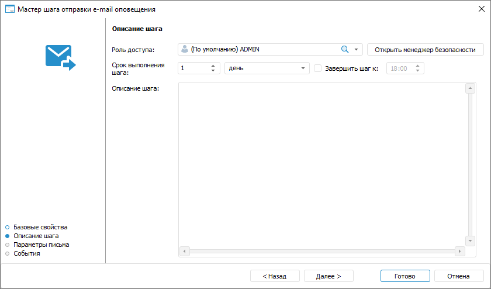
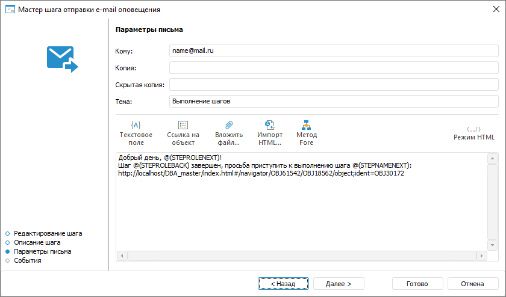
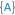
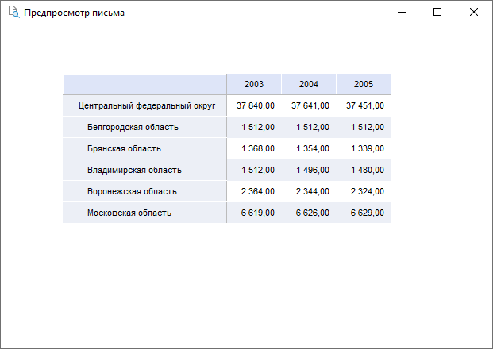
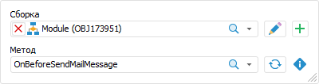

# Создание шага «Отправка e-mail оповещения»: Настольное приложение

Создание шага «Отправка e-mail оповещения»: Настольное приложение
-

# Создание шага «Отправка e-mail оповещения»

	Для шага по формированию автоматических e-mail оповещений откройте
	 мастер шага отправки e-mail оповещения.

[Для открытия
 мастера](javascript:TextPopup(this))

	Для открытия мастера шага в окне ««[Настройка бизнес-процесса](../../Starting/Starting.htm#setting_business_process)»
	 в рабочей области или дереве процессов выделите этап или шаг процесса,
	 для которого требуется добавить шаг и выполните одно из действий:

		- нажмите кнопку  «Добавить шаг» на вкладке «Процесс» ленты инструментов
		 и в открывшемся меню выберите тип создаваемого шага;

		- выполните команду «Наименование
		 шага» контекстного меню;

		- используйте сочетание клавиш CTRL+<номер
		 шага>:

			- 1. Ввод данных;

			- 2. Расчёт;

			- 3. Согласование;

			- 4. Вызов подпроцесса;

			- 5. Вызов Fore-метода;

			- 6. Задача ETL;

			- 7. Отправка
			 e-mail оповещения;

			- 8. Ручное действие.

	Для отправки e-mail оповещений должны быть настроены параметры отправки
	 на странице «[Параметры](../Parameters_setting.htm)»
	 в окне «[Настройка
	 параметров и администрирование бизнес-процессов](../Setting_and_administrating_process_parameters.htm)».

	Настройка шага «Отправка e-mail
	 оповещения» состоит из следующих действий:

		- Настройка [базовых
		 свойств шага](CreateStepsProcess.htm#steps_process_firs_page). После определения базовых свойств шага нажмите
		 кнопку «Далее».

		- [Настройка параметров
		 описания шага](E-mail.htm#base_settings).

		- [Настройка параметров письма](E-mail.htm#parameters).

		- [Настройка событий, выполняемых
		 при запуске выполнения шага или после его завершения](ETL.htm#events).

## Настройка параметров описания шага

	Для настройки параметров описания шага используйте страницу «Описание шага» мастера шага:

	

	Задайте параметры:

		- Роль доступа. Обязательное
		 для заполнения поле. Выберите в раскрывающемся списке роль ответственного.
		 Список состоит из ролей пользователей, указанных в объекте полномочий.
		 По умолчанию в поле указан пользователь «Admin».

	В случае отсутствия в списке необходимой
	 группы пользователей нажмите кнопку «Открыть
	 менеджер безопасности». Будет открыто окно [менеджера
	 безопасности](admin.chm::/01_RunSecManager/Admin_Organizational_Starting.htm) продукта «Форсайт. Аналитическая платформа»,
	 в котором можно создать необходимую [группу](Admin.chm::/03_Admin/Groups/Admin_Groups.htm)
	 пользователей;

	- Срок
	 выполнения шага. Укажите срок, за который должен быть выполнен
	 шаг при исполнении процесса. Срок выполнения отсчитывается с момента
	 активации шага.

Введите числовое значение срока выполнения
 шага и рядом выберите из списка единицу измерения срока: минута, час,
 день (по умолчанию), неделя, месяц, квартал, полугодие, год.

Для указания времени, к которому необходимо
 завершить шаг, установите флажок «Завершить
 шаг к». При выборе единиц измерения «минута»
 или «час» данное поле скрывается.

Если шаг не завершён по истечении планового
 срока выполнения, то статус шага становится «Просрочено».

Срок выполнения шагов влияет на срок выполнения
 процесса в целом, который определяется при [запуске
 процесса](../Start_Process.htm);

	- Описание шага. Поле
	 необязательно для заполнения. Текстовое поле для ввода примечания
	 по шагу.

	После определения параметров на странице «Описание
	 шага» нажмите кнопку «Далее».

## Параметры письма

	Для настройки параметров письма используйте страницу «Параметры
	 письма» мастера шага:

	

	Задайте параметры:

		- Кому;
		 Копия; Скрытая копия. Адрес получателей письма вводится
		 вручную с использованием функций копирования/вставки значений
		 из буфера обмена;

		- Тема.
		 Тема письма вводится вручную с использованием функций копирования/вставки
		 значений из буфера обмена;

		- Содержание. Вводится вручную
		 с использованием возможностей:

			- 
			 Текстовое поле. Вызов списка доступных переменных.
			 Значения переменных формируются в зависимости от уникальных
			 параметров каждого [экземпляра
			 процесса](../../Starting/Starting.htm#tree):

				- @(STEPROLEBACK). Роль предыдущего шага. Тип: строковый;

				- @(STEPNAMEBACK). Наименование предыдущего шага.
				 Тип: строковый;

				- @(STEPROLENEXT). Роль следующего шага. Тип: строковый;

				- @(STEPNAMENEXT). Наименование следующего шага. Тип:
				 строковый;

				- @(STEPNAME). Наименование шага. Тип: строковый;

				- @(PROCESSNAME). Наименование процесса. Тип: строковый;

				- @(PROCESSCUSTOMER). Куратор процесса. Тип: строковый;

				- @(PROCESSSTARTTIME). Время запуска процесса. Тип:
				 дата и время;

				- @(STEPDEADLINE). Крайний срок выполнения шага. Тип:
				 дата и время;

				- @(STEPBACKFINISHUSER). Пользователь, выполнивший
				 предыдущий ручной шаг. Тип: строковый;

				- @(STEPBACKFINISHCOMMENT). Комментарий при выполнении
				 предыдущего ручного шага. Тип: строковый;

				- @(STEPDECLINEUSER). Пользователь, отклонивший ручной
				 шаг. Тип: строковый;

				- @(STEPDECLINECOMMENT). Комментарий при отклонении
				 с ручного шага. Тип: строковый;

			- 
			 Ссылка на объект. Добавление ссылок на используемые
			 объекты шага: алгоритм, регламентный отчёт, форма ввода;

	Примечание.
	 Просмотр объектов по ссылке осуществляется в веб-приложении. Предварительно
	 убедитесь, что веб-приложение создано, в нём размещены объекты, на
	 которые ведут ссылки, и указан адрес веб-приложения на странице «Параметры» диалога «[Настройка параметров и администрирование
	 бизнес-процессов](../Setting_and_administrating_process_parameters.htm)».

			- 
			 Вложить файл. Прикрепление файлов к письму. Доступные
			 форматы файлов-вложений: картинка, документ MS Word и MS Excel;

	Примечание.
	 В одном письме может быть не более 10 прикрепленных файлов. Действуют
	 ограничения в зависимости от используемого почтового сервиса, например
	 для Gmail, размер прикрепленных файлов не должен превышать 25 Мб.

			- 
			 Импорт HTML. Вставка HTML-файла в содержание письма.
			 При загрузке HTML-файла по умолчанию включается  «Режим
			 HTML» и открывается окно «Предпросмотр
			 письма», например:

	

	Примечания.
	 При импорте HTML-файла содержание письма заменяется на HTML-код.

			- 
			 Метод Fore. Добавление обработчика метода, который
			 срабатывает при отправке письма:

	

	Для метода Fore определите:

				- Сборка.
				 В раскрывающемся списке выберите модуль, написанный на
				 языке Fore. Доступен поиск по наименованию модуля.

	Для редактирования выбранной сборки
	 нажмите кнопку .

	Для создания модуля нажмите кнопку .

				- Метод.
				 В раскрывающемся списке выберите метод. Список содержит
				 все методы модуля, соответствующие сигнатуре:

	Sub <Наименование
	 Fore-метода>(Sender: IBProcessInstance; Args: IBProcessEmailEventArgs);

	Параметр:

	Sender.
	 Экземпляр процесса;

	Args.
	 Информация о событии: шаг, старое состояние шага, новое состояние.

	Для обновления списка методов нажмите
	 кнопку .

	Для копирования сигнатуры метода нажмите
	 кнопку .

			- 
			 Режим HTML. Включение/выключение
			 режима HTML. Для открытия окна предварительного просмотра
			 письма нажмите кнопку «Режим
			 HTML» и установите
			 флажок «Окно предпросмотра».

	Примечание.
	 Вставка картинок через «Режим HTML»
	 невозможна, воспользуйтесь опцией 
	 «Вложить файл».

	После определения параметров на странице «Параметры
	 письма» нажмите кнопку «Далее».

## Настройка событий, выполняемых при запуске
	 выполнения шага или после его завершения

	Для настройки событий, выполняемых автоматически при запуске выполнения
	 шага или после его завершения, используйте страницу «События»
	 мастера шага:

	

Сформируйте список выполняемых действий:

	- Выберите вкладку с настраиваемым событием на странице мастера
	 «События». Доступны следующие
	 события:

		- До выполнения. Список действий
		 будет запускаться перед выполнением текущего шага в указанной
		 последовательности;

		- После выполнения. Список действий
		 будет запускаться после выполнения текущего шага в указанной последовательности;

		- При отклонении. Список действий
		 будет запускаться при отклонении текущего шага. Выбор доступен
		 для шагов с ручным выполнением. Если шаг выполняется автоматически,
		 то вкладка не отображается;

		- При срыве сроков. Список действий
		 будет запускаться при нарушении срока выполнения текущего шага
		 в указанной последовательности. Для выполнения действий:

			- при [серверном
			 исполнении](../Setting_planner.htm#server) процессов установите флажок «Проверять
			 срыв сроков исполнения шагов» на странице «[Планировщик](../Setting_planner.htm)»
			 и задайте интервал, с которым будет производиться проверка;

			- при [клиентском
			 исполнении](../Setting_planner.htm#client) процессов выполните операцию «Проверить
			 срыв сроков» на странице «[Администрирование](../Administrating.htm)».

	- Нажмите кнопку  «Добавить»
	 на панели инструментов и выберите добавляемое действие:

		-  «Выполнение
		 Fore-метода». Определите:

			- Модуль.
			 В раскрывающемся списке выберите модуль, написанный на языке
			 Fore, список содержит все модули в репозитории и папки, в
			 которых есть модули. Доступен поиск по наименованию модуля.

Для редактирования выбранного модуля нажмите
 кнопку  «Редактировать».

Для создания модуля нажмите кнопку  «Добавить»;

			- Метод.
			 В раскрывающемся списке выберите метод. Список содержит все
			 методы модуля, соответствующие сигнатуре:

Sub <Наименование Fore-метода>(Sender: IBProcessInstance; Args: IBProcessStepStateEventArgs);

Параметр:

Sender.
 Экземпляр процесса;

Args.
 Информация о событии: шаг, старое состояние шага, новое состояние.

Для обновления списка методов нажмите кнопку
  «Обновить
 список».

Для копирования сигнатуры метода нажмите
 кнопку  «Копировать
 сигнатуру»;

		-  «Отправка
		 e-mail». Задайте параметры сообщения:

			- Кому. Введите адрес одного или нескольких
			 основных получателей сообщения через разделитель «;». Поле обязательно для заполнения;

			- Копия. Введите
			 адрес одного или нескольких получателей для ознакомления с
			 сообщением через разделитель «;»;

			- Скрытая
			 копия. Введите адрес одного или нескольких получателей
			 для ознакомления с сообщением через разделитель «;». Адрес
			 будет скрыт от других получателей сообщения;

			- Тема.
			 Введите тему письма;

			- Содержание.
			 Введите содержание сообщения с использованием [возможностей](E-mail.htm)
			 подстановки значений переменных с параметрами шага, добавления
			 ссылок на объекты шага для просмотра в веб-приложении, вложения
			 файлов.

Примечание.
 Количество добавляемых действий не ограничено.

Для изменения очерёдности выполнения действий используйте кнопки  «Переместить вверх» и  «Переместить
 вниз» на панели инструментов мастера «События»,
 для удаления - кнопку  «Удалить».

Список автоматически выполняемых действий
 может быть пустым.

После определения параметров на странице «События»
 нажмите кнопку «Готово».

	После создания шагов процесса перейдите к [настройке
	 условий выполнения шагов](../Setting_up_steps_conditions.htm).

См. также:

[Создание
 шагов этапа](CreateStepsProcess.htm)

		Справочная
		 система на версию 10.9
		 от 18/08/2025,
		 © ООО «ФОРСАЙТ»,
