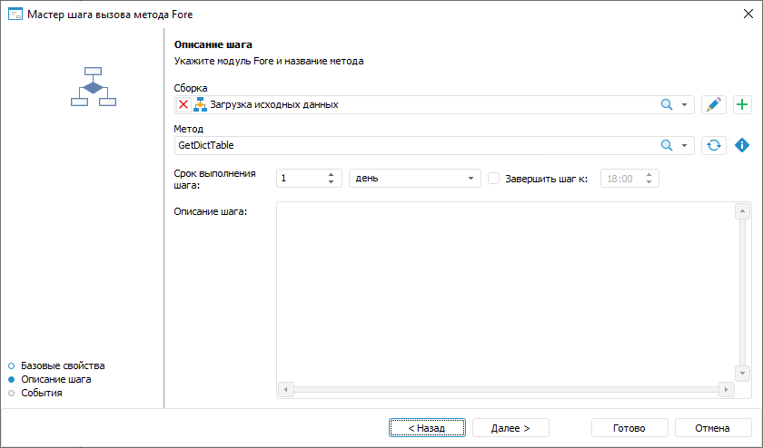
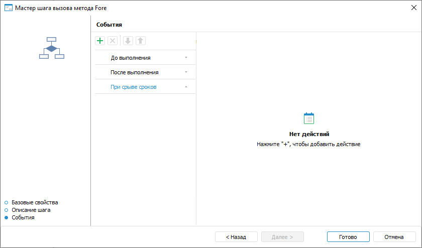

# Создание шага «Вызов Fore-метода»: Настольное приложение

Создание шага «Вызов Fore-метода»: Настольное приложение
-

# Создание шага «Вызов Fore-метода»

	Для создания шага по вызову метода Fore откройте мастер шага вызова
	 Fore-метода.

[Для открытия
 мастера](javascript:TextPopup(this))

	Для открытия мастера шага в окне ««[Настройка бизнес-процесса](../../Starting/Starting.htm#setting_business_process)»
	 в рабочей области или дереве процессов выделите этап или шаг процесса,
	 для которого требуется добавить шаг и выполните одно из действий:

		- нажмите кнопку  «Добавить шаг» на вкладке «Процесс» ленты инструментов
		 и в открывшемся меню выберите тип создаваемого шага;

		- выполните команду «Наименование
		 шага» контекстного меню;

		- используйте сочетание клавиш CTRL+<номер
		 шага>:

			- 1. Ввод данных;

			- 2. Расчёт;

			- 3. Согласование;

			- 4. Вызов подпроцесса;

			- 5. Вызов Fore-метода;

			- 6. Задача ETL;

			- 7. Отправка
			 e-mail оповещения;

			- 8. Ручное действие.

	Настройка шага «Fore-метод» состоит
	 из следующих действий:

		- Настройка [базовых
		 свойств шага](CreateStepsProcess.htm#steps_process_firs_page). После определения базовых свойств шага нажмите
		 кнопку «Далее».

		- [Настройка параметров описания
		 шага](Fore.htm#base_settings).

		- [Настройка событий, выполняемых
		 при запуске выполнения шага или после его завершения](Fore.htm#events).

## Настройка параметров описания шага

	Для настройки параметров описания шага используйте страницу «Описание шага» мастера шага:

	

	Задайте параметры:

		- Сборка. Обязательное
		 для заполнения поле. В раскрывающемся списке выберите модуль Fore
		 для запуска, при выборе можно воспользоваться [поиском](UiNav.chm::/GUI/combine_list.htm).
		 Список содержит дерево объектов репозитория, в котором отображаются
		 только модули и папки, содержащие их. Для редактирования выбранного
		 метода Fore нажмите кнопку . Будет открыта среда
		 разработки Fore.

	Примечание.
	 Модуль не должен содержать внешних параметров.

		- Метод. Выберите
		 из списка имя метода Fore. Имя метода должно полностью совпадать
		 с именем, указанным внутри модуля. Список содержит все методы
		 модуля, не содержащие параметры, соответствующие сигнатуре:

	Sub <Наименование Fore-метода>;

	- Срок
	 выполнения шага. Укажите срок, за который должен быть выполнен
	 шаг при исполнении процесса. Срок выполнения отсчитывается с момента
	 активации шага.

Введите числовое значение срока выполнения
 шага и рядом выберите из списка единицу измерения срока: минута, час,
 день (по умолчанию), неделя, месяц, квартал, полугодие, год.

Для указания времени, к которому необходимо
 завершить шаг, установите флажок «Завершить
 шаг к». При выборе единиц измерения «минута»
 или «час» данное поле скрывается.

Если шаг не завершён по истечении планового
 срока выполнения, то статус шага становится «Просрочено».

Срок выполнения шагов влияет на срок выполнения
 процесса в целом, который определяется при [запуске
 процесса](../Start_Process.htm);

	- Описание шага. Поле
	 необязательно для заполнения. Текстовое поле для ввода примечания
	 по шагу.

	Примечание.
	 Для ускорения выполнения ресурсоёмких методов в [настройках
	 процесса](../Basic_properties.htm#calculation_bi_server) установите флаг «Выполнять
	 шаги расчёта и методов Fore на BI-сервере».

	После определения параметров на странице «Описание
	 шага» нажмите кнопку «Далее».

## Настройка событий, выполняемых при запуске
	 выполнения шага или после его завершения

	Для настройки событий, выполняемых автоматически при запуске выполнения
	 шага или после его завершения, используйте страницу «События»
	 мастера шага:

	

Сформируйте список выполняемых действий:

	- Выберите вкладку с настраиваемым событием на странице мастера
	 «События». Доступны следующие
	 события:

		- До выполнения. Список действий
		 будет запускаться перед выполнением текущего шага в указанной
		 последовательности;

		- После выполнения. Список действий
		 будет запускаться после выполнения текущего шага в указанной последовательности;

		- При отклонении. Список действий
		 будет запускаться при отклонении текущего шага. Выбор доступен
		 для шагов с ручным выполнением. Если шаг выполняется автоматически,
		 то вкладка не отображается;

		- При срыве сроков. Список действий
		 будет запускаться при нарушении срока выполнения текущего шага
		 в указанной последовательности. Для выполнения действий:

			- при [серверном
			 исполнении](../Setting_planner.htm#server) процессов установите флажок «Проверять
			 срыв сроков исполнения шагов» на странице «[Планировщик](../Setting_planner.htm)»
			 и задайте интервал, с которым будет производиться проверка;

			- при [клиентском
			 исполнении](../Setting_planner.htm#client) процессов выполните операцию «Проверить
			 срыв сроков» на странице «[Администрирование](../Administrating.htm)».

	- Нажмите кнопку  «Добавить»
	 на панели инструментов и выберите добавляемое действие:

		-  «Выполнение
		 Fore-метода». Определите:

			- Модуль.
			 В раскрывающемся списке выберите модуль, написанный на языке
			 Fore, список содержит все модули в репозитории и папки, в
			 которых есть модули. Доступен поиск по наименованию модуля.

Для редактирования выбранного модуля нажмите
 кнопку  «Редактировать».

Для создания модуля нажмите кнопку  «Добавить»;

			- Метод.
			 В раскрывающемся списке выберите метод. Список содержит все
			 методы модуля, соответствующие сигнатуре:

Sub <Наименование Fore-метода>(Sender: IBProcessInstance; Args: IBProcessStepStateEventArgs);

Параметр:

Sender.
 Экземпляр процесса;

Args.
 Информация о событии: шаг, старое состояние шага, новое состояние.

Для обновления списка методов нажмите кнопку
  «Обновить
 список».

Для копирования сигнатуры метода нажмите
 кнопку  «Копировать
 сигнатуру»;

		-  «Отправка
		 e-mail». Задайте параметры сообщения:

			- Кому. Введите адрес одного или нескольких
			 основных получателей сообщения через разделитель «;». Поле обязательно для заполнения;

			- Копия. Введите
			 адрес одного или нескольких получателей для ознакомления с
			 сообщением через разделитель «;»;

			- Скрытая
			 копия. Введите адрес одного или нескольких получателей
			 для ознакомления с сообщением через разделитель «;». Адрес
			 будет скрыт от других получателей сообщения;

			- Тема.
			 Введите тему письма;

			- Содержание.
			 Введите содержание сообщения с использованием [возможностей](E-mail.htm)
			 подстановки значений переменных с параметрами шага, добавления
			 ссылок на объекты шага для просмотра в веб-приложении, вложения
			 файлов.

Примечание.
 Количество добавляемых действий не ограничено.

Для изменения очерёдности выполнения действий используйте кнопки  «Переместить вверх» и  «Переместить
 вниз» на панели инструментов мастера «События»,
 для удаления - кнопку  «Удалить».

Список автоматически выполняемых действий
 может быть пустым.

После определения параметров на странице «События»
 нажмите кнопку «Готово».

	Примечание.
	 Для ускорения выполнения ресурсоёмких расчётов в [настройках
	 процесса](../Basic_properties.htm#calculation_bi_server) установите флажок «Выполнять
	 шаги расчёта и методов Fore на BI-сервере».

	После создания шагов процесса перейдите к [настройке
	 условий выполнения шагов](../Setting_up_steps_conditions.htm).

См. также:

[Создание
 шагов этапа](CreateStepsProcess.htm)

		Справочная
		 система на версию 10.9
		 от 18/08/2025,
		 © ООО «ФОРСАЙТ»,
