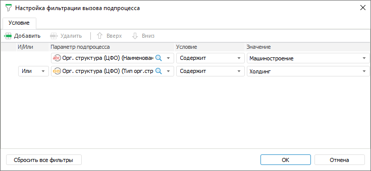
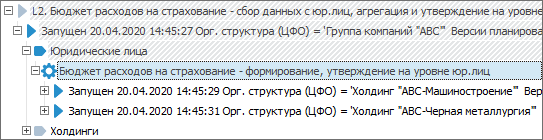
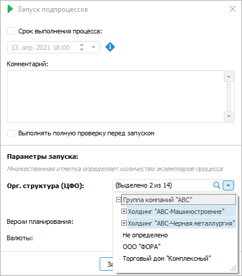

# Настройка условий вызова подпроцессов: Настольное приложение

Настройка условий вызова подпроцессов: Настольное приложение
-

# Настройка условий вызова подпроцессов

Для фильтрации запуска подпроцессов по атрибутам [параметра
 разбивки](Subprocess.htm#splitting_parameter) или его отдельным значениям настройте условия вызова подпроцессов.

При изменении [параметра
 разбивки](Subprocess.htm#splitting_parameter) условия вызова подпроцесса изменятся:

	- если условия были ранее заданы для выбранного параметра разбивки,
	 то они будут применены;

	- если условия не были заданы для выбранного параметра разбивки,
	 то область будет пустой.

Для создания и настройки условий вызова подпроцессов используйте окно
 «Настройка фильтрации вызова подпроцесса»:

[Для открытия
 окна](javascript:TextPopup(this))

	Для открытия окна «Настройка фильтрации
	 вызова подпроцесса»:

		- Откройте мастер шага «[Вызов
		 подпроцесса](Subprocess.htm)».

		- Перейдите на третью страницу мастера «[Управление параметрами](Subprocess.htm#parameters)».

		- Нажмите кнопку  «Фильтр».

	Примечание.
	 Если условия фильтрации уже были настроены, то кнопка находится в
	 нажатом состоянии.

Для добавления условия вызова подпроцесса нажмите кнопку  «Добавить»
 на панели инструментов.

Для удаления одного из условий выделите условие и нажмите кнопку 
 «Удалить» на панели инструментов.

Для изменения последовательности выполнения условий используйте кнопки
  «Вверх»/ «Вниз» на панели инструментов.

Для удаления всех условий нажмите кнопку «Сбросить
 все фильтры».

Для настройки условий вызова подпроцессов задайте следующие параметры:

	- Параметр подпроцесса.
	 Выберите справочник или атрибут справочника, который будет участвовать
	 в условии;

	- Условие.
	 Выберите условие сравнения параметра подпроцесса со значением
	 в раскрывающемся списке:

		- Равно;

		- Не равно;

		- Содержит;

		- Не содержит;

		- Содержится в;

		- Не содержится в;

		- Не пересекается с;

Примечание.
 Набор отображаемых типов условия зависит [типа
 данных атрибута](UiNavObj.chm::/reference_book/Master_RDS_reference_book/Attributes/Attribute.htm), выбранного в столбце «Параметр
 подпроцесса».

	- Значение. Задайте значение
	 или параметр процесса, которые будут сравниваться со значением параметра
	 подпроцесса;

	- И/Или. Если добавлено
	 несколько условий, выберите один из логических операторов в раскрывающемся
	 списке:

		- И. Запускаются подпроцессы,
		 удовлетворяющие всем условиям фильтрации;

		- Или. Используется
		 по умолчанию. Запускаются подпроцессы, удовлетворяющие одному
		 из условий фильтрации. Проверка условий выполняется последовательно.

Если ни одно условие фильтрации не выполняется,
 то при выполнении процесса шаг будет завершаться без запуска подпроцессов.

## Применение условий при выполнении шага в автоматическом режиме

При выполнении шага в [автоматическом
 режиме](../../MonitoringProcess/Auto_mode.htm) запускаются подпроцессы, соответствующие условиям фильтрации:

## Применение условий при выполнении шага в ручном режиме

При выполнении шага в [ручном
 режиме](../../MonitoringProcess/Manual_mode.htm) будет открыто окно «Запуск
 подпроцессов», где параметрами запуска являются значения, соответствующие
 условиям фильтрации:

При необходимости измените значения параметров запуска и нажмите кнопку
 «Запустить».

См. также:

[Создание
 шага «Вызов подпроцесса»](Subprocess.htm) | [Выполнение
 шагов подпроцесса](../../MonitoringProcess/Executing_Subprocess.htm)

		Справочная
		 система на версию 10.9
		 от 18/08/2025,
		 © ООО «ФОРСАЙТ»,
