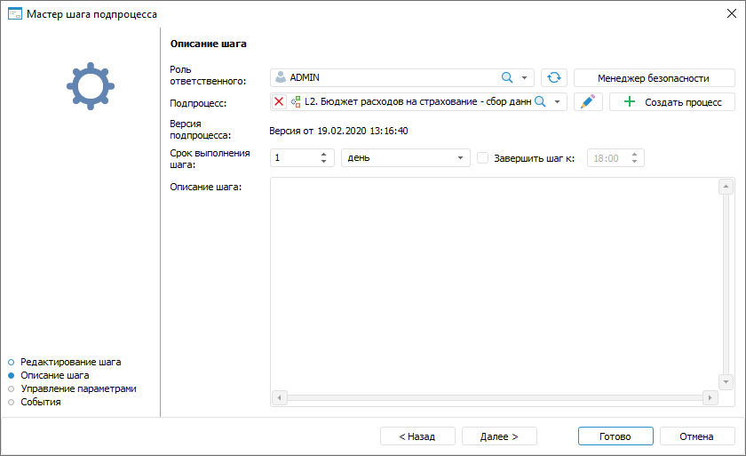
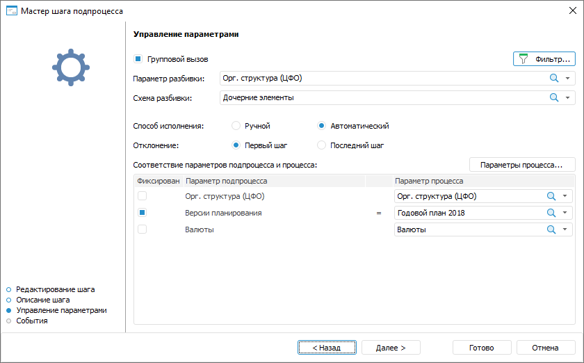
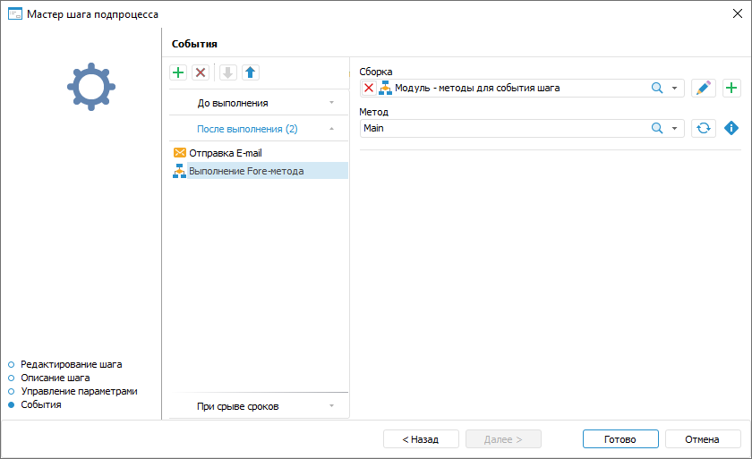

# Создание шага «Вызов подпроцесса»: Настольное приложение

Создание шага «Вызов подпроцесса»: Настольное приложение
-

# Создание шага «Вызов подпроцесса»

	Для создания шага по запуску одного или нескольких вложенных подпроцессов
	 с определёнными параметрами откройте мастер шага вызова подпроцесса.

[Для открытия
 мастера](javascript:TextPopup(this))

	Для открытия мастера шага в окне ««[Настройка бизнес-процесса](../../Starting/Starting.htm#setting_business_process)»
	 в рабочей области или дереве процессов выделите этап или шаг процесса,
	 для которого требуется добавить шаг и выполните одно из действий:

		- нажмите кнопку  «Добавить шаг» на вкладке «Процесс» ленты инструментов
		 и в открывшемся меню выберите тип создаваемого шага;

		- выполните команду «Наименование
		 шага» контекстного меню;

		- используйте сочетание клавиш CTRL+<номер
		 шага>:

			- 1. Ввод данных;

			- 2. Расчёт;

			- 3. Согласование;

			- 4. Вызов подпроцесса;

			- 5. Вызов Fore-метода;

			- 6. Задача ETL;

			- 7. Отправка
			 e-mail оповещения;

			- 8. Ручное действие.

	Настройки шага «Вызов подпроцесса»
	 состоит из следующих действий:

		- Настройка [базовых
		 свойств шага](CreateStepsProcess.htm#steps_process_firs_page). После определения базовых свойств шага нажмите
		 кнопку «Далее».

		- [Настройка параметров
		 описания шага](Subprocess.htm#base_settings).

		- [Настройка связи параметров
		 формы ввода/отчёта и процесса](Subprocess.htm#parameters).

		- [Настройка событий, выполняемых
		 при запуске выполнения шага или после его завершения](Subprocess.htm#events).

## Настройка параметров описания шага

	Для настройки параметров описания шага
	 используйте страницу «Описание шага»
	 мастера шага:

	

	Задайте параметры:

	- Роль
	 ответственного. Обязательное для заполнения поле. Выберите
	 в раскрывающемся списке пользователя или группу пользователей, ответственных
	 за выполнение шага при исполнении процесса.

В случае отсутствия в списке необходимой
 группы пользователей нажмите кнопку «Открыть
 менеджер безопасности». Будет открыто окно [менеджера
 безопасности](admin.chm::/01_RunSecManager/Admin_Organizational_Starting.htm) продукта «Форсайт. Аналитическая платформа»,
 в котором можно создать необходимую [группу](Admin.chm::/03_Admin/Groups/Admin_Groups.htm)
 пользователей;

		- Подпроцесс.
		 Обязательное для заполнения поле. В раскрывающемся списке выберите
		 подпроцесс для запуска, при выборе можно воспользоваться [поиском](UiNav.chm::/GUI/combine_list.htm).
		 Список содержит дерево объектов репозитория, в котором отображаются
		 только процессы и папки, содержащие их.

	Для редактирования выбранного подпроцесса
	 нажмите кнопку  «Редактировать процесс». Будет открыто
	 окно «Настройка бизнес-процесса»
	 для редактирования подпроцесса.

	В случае отсутствия нужного подпроцесса
	 в списке нажмите кнопку  «Создать
	 процесс». Будет отображён диалог для [создания
	 нового процесса](../../Starting/Starting.htm#creating_a_new_process).

		- Версия подпроцесса.
		 Выводится дата и время создания последней версии подпроцесса.

	- Срок
	 выполнения шага. Укажите срок, за который должен быть выполнен
	 шаг при исполнении процесса. Срок выполнения отсчитывается с момента
	 активации шага.

Введите числовое значение срока выполнения
 шага и рядом выберите из списка единицу измерения срока: минута, час,
 день (по умолчанию), неделя, месяц, квартал, полугодие, год.

Для указания времени, к которому необходимо
 завершить шаг, установите флажок «Завершить
 шаг к». При выборе единиц измерения «минута»
 или «час» данное поле скрывается.

Если шаг не завершён по истечении планового
 срока выполнения, то статус шага становится «Просрочено».

Срок выполнения шагов влияет на срок выполнения
 процесса в целом, который определяется при [запуске
 процесса](../Start_Process.htm);

	- Описание шага. Поле
	 необязательно для заполнения. Текстовое поле для ввода примечания
	 по шагу.

	После определения параметров на странице «Описание
	 шага» нажмите кнопку «Далее».

## Настройка связи параметров формы ввода/отчёта
	 и процесса

	Для запуска подпроцесса с теми же параметрами, что и шаг процесса,
	 выполните настройку связи параметров подпроцесса и процесса на странице
	 «Управление параметрами» мастера
	 шага:

	

	Задайте параметры:

		- Групповой
		 вызов. Установите флажок «Групповой
		 вызов» для запуска нескольких подпроцессов и задайте параметры
		 из раскрывающихся списков «Параметр
		 разбивки» и «Схема разбивки».

	По умолчанию флажок «Групповой
	 вызов» установлен с невыбранным значением параметра разбивки,
	 обязательным для заполнения. Если в исполнении процесса отсутствует
	 необходимость разбиения подпроцесса по параметру, то снимите флажок.

		- Параметр
		 разбивки. Выбор параметра разбивки возможен только при
		 установленном флажке «Групповой
		 вызов». В качестве параметра разбивки используются параметры
		 [подпроцесса](#subprocess). Выберите справочник, элементы
		 которого будут использоваться для [запуска
		 подпроцессов](../../MonitoringProcess/Executing_Subprocess.htm). Для каждого элемента справочника, отмеченного
		 при [запуске процесса](../Start_Process.htm), будет
		 запущен отдельный экземпляр подпроцесса.

	Для фильтрации запуска подпроцессов по
	 атрибутам параметра разбивки или его отдельным значениям [настройте
	 условия вызова подпроцессов](Setting_up_Subprocess_Call_Conditions.htm) с помощью кнопки 
	 «Фильтр».

		- Схема разбивки.
		 Выбор схемы разбивки возможен только при установленном флажке
		 «Групповой вызов». Выберите
		 способ разбивки шага на подпроцессы. Подпроцессы разбиваются по
		 элементам параметра главного процесса, указанным в области «[Соответствие
		 параметров подпроцесса и процесса](#parameter_consistency)». Для каждого отмеченного
		 при [запуске](../Start_Process.htm) элемента справочника,
		 который был выбран в качестве параметра разбивки, будут запущены
		 подпроцессы в зависимости от выбора схемы разбивки:

			- Исходная. Подпроцессы
			 запускаются для каждого отмеченного элемента справочника.
			 Подпроцессы не запускаются для дочерних элементов справочника;

			- Дочерние элементы.
			 Запуск подпроцессов выполняется только по дочерним элементам
			 справочника.

	Примечание.
	 Если у выбранных элементов справочника нет дочерних элементов, то
	 при выполнении процесса шаг будет завершаться без запуска подпроцессов.

			- Метод Fore.
			 Запуск подпроцессов выполняется по элементам, полученным в
			 результате выполнения Fore-метода. Для метода Fore определите
			 сборку и метод.

	[Определение
	 сборки и метода](javascript:TextPopup(this))

		

		Для метода Fore определите:

				- Сборка.
				 В иерархическом списке выберите модуль, который будет
				 определять отметку.

		Для редактирования выбранной сборки
		 нажмите кнопку .

		Для создания модуля нажмите кнопку
		 .

				- Метод. Метод
				 определяется автоматически в соответствие с сигнатурой:

		Sub <Наименование
		 Fore-метода>(Sender: IBProcessInstance; Args: IBProcessStepParamValueEventArgs);

		Параметр:

		Sender.
		 Экземпляр процесса;

		Args.
		 Информация о событии: шаг, значение параметра.

		Для обновления списка методов нажмите
		 кнопку .

		Для копирования сигнатуры метода
		 нажмите кнопку .

		- Способ
		 исполнения. Установите переключатель в положение «Ручной» или «Автоматический»:

			- [Ручной](../../MonitoringProcess/Manual_mode.htm). Запуск подпроцесса выполняется
			 вручную;

			- [Автоматический](../../MonitoringProcess/Auto_mode.htm).
			 Запуск подпроцесса выполняется автоматически после выполнения
			 предыдущего шага.

	По умолчанию для шага установлен автоматический
	 способ исполнения. Шаги процесса с автоматическим способом исполнения
	 обозначаются пиктограммой , расположенном в правом
	 верхнем углу блока.

	Изменить способ исполнения можно после
	 настройки шага, для этого выделите шаг в рабочей области при настройке
	 бизнес-процесса и выполните команду «Автоматическое
	 выполнение шага» контекстного меню шага;

		- Отклонение.
		 Установите переключатель в положение «Первый
		 шаг» или «Последний шаг»:

			- Первый шаг.
			 В подпроцессах будет активным первый шаг после отклонения текущего
			 шага на завершенный шаг «Вызов
			 подпроцесса»;

			- Последний шаг.
			 В подпроцессах будет активным последний шаг после отклонения
			 текущего шага на завершенный шаг «Вызов
			 подпроцесса».

	Примечание.
	 Для [перезапуска
	 отдельных экземпляров](../../MonitoringProcess/Restarting_subprocess_instances.htm#restarting_chosen_instances) подпроцесса с автоматическим способом исполнения
	 при отклонении текущего шага на завершенный шаг «Вызов
	 подпроцесса» установите флажок «[Выборочное
	 отклонение подпроцессов](../../MonitoringProcess/Reject_step.htm)» и запустите необходимые экземпляры подпроцесса
	 вручную.

		- Соответствие
		 параметров подпроцесса и процесса. Укажите:

			- Фиксирован.
			 Для ограничения перечня значений параметров, с которыми запускается
			 вложенный подпроцесс, установите флажок «Фиксирован»;

			- Параметр
			 подпроцесса. Список параметров [подпроцесса](#subprocess)
			 заполняется автоматически.

	Примечание.
	 Если для параметра подпроцсесса, который является [параметром
	 разбивки](#splitting_parameter), было зафиксировано пустое значение, то при выполнении
	 процесса шаг будет завершаться без запуска подпроцессов.

			- Параметр процесса.
			 В раскрывающемся списке «Параметр
			 процесса» выберите параметр или атрибут параметра главного
			 процесса. Если флажок «Групповой
			 вызов» установлен, то выберите из раскрывающегося списка
			 справочник, соответствующий параметру подпроцесса. Справочники,
			 выбранные в качестве параметров процесса и подпроцесса, должны
			 быть идентичной структуры. Если один справочник является параметром
			 разбивки по нескольким параметрам процесса, то его необходимо
			 добавить несколько раз в окне «[Настройки
			 и параметры процесса](../Setting_Process_Parameters.htm)» для каждого параметра.

	Если в раскрывающемся списке параметров
	 процесса нет нужного значения, то нажмите кнопку «Параметры
	 процесса». Будет открыто окно «[Настройки
	 и параметры процесса](../Setting_Process_Parameters.htm)», в котором можно добавить параметр процесса.

	После определения параметров на странице «Управление
	 параметрами» нажмите кнопку «Далее».

## Настройка событий, выполняемых при запуске
	 выполнения шага или после его завершения

	Для настройки событий, выполняемых автоматически при запуске выполнения
	 шага или после его завершения, используйте страницу «События»
	 мастера шага:

	

Сформируйте список выполняемых действий:

	- Выберите вкладку с настраиваемым событием на странице мастера
	 «События». Доступны следующие
	 события:

		- До выполнения. Список действий
		 будет запускаться перед выполнением текущего шага в указанной
		 последовательности;

		- После выполнения. Список действий
		 будет запускаться после выполнения текущего шага в указанной последовательности;

		- При отклонении. Список действий
		 будет запускаться при отклонении текущего шага. Выбор доступен
		 для шагов с ручным выполнением. Если шаг выполняется автоматически,
		 то вкладка не отображается;

		- При срыве сроков. Список действий
		 будет запускаться при нарушении срока выполнения текущего шага
		 в указанной последовательности. Для выполнения действий:

			- при [серверном
			 исполнении](../Setting_planner.htm#server) процессов установите флажок «Проверять
			 срыв сроков исполнения шагов» на странице «[Планировщик](../Setting_planner.htm)»
			 и задайте интервал, с которым будет производиться проверка;

			- при [клиентском
			 исполнении](../Setting_planner.htm#client) процессов выполните операцию «Проверить
			 срыв сроков» на странице «[Администрирование](../Administrating.htm)».

	- Нажмите кнопку  «Добавить»
	 на панели инструментов и выберите добавляемое действие:

		-  «Выполнение
		 Fore-метода». Определите:

			- Модуль.
			 В раскрывающемся списке выберите модуль, написанный на языке
			 Fore, список содержит все модули в репозитории и папки, в
			 которых есть модули. Доступен поиск по наименованию модуля.

Для редактирования выбранного модуля нажмите
 кнопку  «Редактировать».

Для создания модуля нажмите кнопку  «Добавить»;

			- Метод.
			 В раскрывающемся списке выберите метод. Список содержит все
			 методы модуля, соответствующие сигнатуре:

Sub <Наименование Fore-метода>(Sender: IBProcessInstance; Args: IBProcessStepStateEventArgs);

Параметр:

Sender.
 Экземпляр процесса;

Args.
 Информация о событии: шаг, старое состояние шага, новое состояние.

Для обновления списка методов нажмите кнопку
  «Обновить
 список».

Для копирования сигнатуры метода нажмите
 кнопку  «Копировать
 сигнатуру»;

		-  «Отправка
		 e-mail». Задайте параметры сообщения:

			- Кому. Введите адрес одного или нескольких
			 основных получателей сообщения через разделитель «;». Поле обязательно для заполнения;

			- Копия. Введите
			 адрес одного или нескольких получателей для ознакомления с
			 сообщением через разделитель «;»;

			- Скрытая
			 копия. Введите адрес одного или нескольких получателей
			 для ознакомления с сообщением через разделитель «;». Адрес
			 будет скрыт от других получателей сообщения;

			- Тема.
			 Введите тему письма;

			- Содержание.
			 Введите содержание сообщения с использованием [возможностей](E-mail.htm)
			 подстановки значений переменных с параметрами шага, добавления
			 ссылок на объекты шага для просмотра в веб-приложении, вложения
			 файлов.

Примечание.
 Количество добавляемых действий не ограничено.

Для изменения очерёдности выполнения действий используйте кнопки  «Переместить вверх» и  «Переместить
 вниз» на панели инструментов мастера «События»,
 для удаления - кнопку  «Удалить».

Список автоматически выполняемых действий
 может быть пустым.

После определения параметров на странице «События»
 нажмите кнопку «Готово».

	Примечание.
	 Для ускорения выполнения ресурсоёмких расчётов в [настройках
	 процесса](../Basic_properties.htm#calculation_bi_server) установите флаг «Выполнять
	 шаги расчёта и методов Fore на BI-сервере».

	После создания шагов процесса перейдите к [настройке
	 условий выполнения шагов](../Setting_up_steps_conditions.htm).

См. также:

[Создание
 шагов этапа](CreateStepsProcess.htm)

		Справочная
		 система на версию 10.9
		 от 18/08/2025,
		 © ООО «ФОРСАЙТ»,
