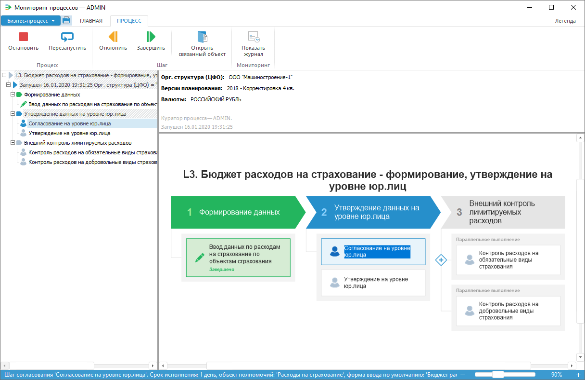
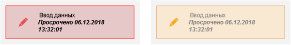
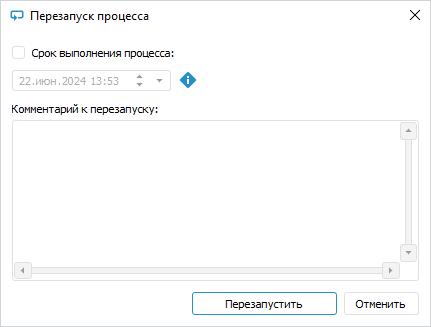

# Мониторинг процесса: Настольное приложение

Мониторинг процесса: Настольное приложение
-

# Мониторинг процесса

Окно «Мониторинг процессов»
 содержит все запущенные экземпляры процессов, доступные пользователю.
 Под экземпляром процесса понимается
 процесс, запущенный с определёнными значениями параметров. Количество
 запущенных экземпляров не ограничено.

Набор запущенных экземпляров процесса в мониторинге может отличаться
 в зависимости от доступа пользователей. Если пользователь назначен на
 роль ответственного для выполнения конкретного шага, то этот шаг будет
 отображаться при выполнении в мониторинге процессов.

Примечание.
 Администратору репозитория доступно отображение всех запущенных экземпляров
 процесса.

Для мониторинга и выполнения процесса:

	- Убедитесь, что процесс запущен.

	- Откройте окно мониторинга процессов. Для этого в [навигаторе
	 объектов](GetStarted.chm::/Interface/Interface_Navigator.htm) выделите процесс и выполните одно из действий:

		- нажмите кнопку  «Открыть»
		 в группе «Открыть» на
		 вкладке «Главная» ленты
		 инструментов;

		- выполните команду «Открыть»
		 в контекстном меню процесса;

		- дважды щёлкните по процессу;

Также окно мониторинга процессов можно открыть
 в [окне
 настройки бизнес-процесса](Starting.htm#setting_business_process), нажав кнопку  «Перейти к мониторингу» на вкладке
 «Процесс» ленты инструментов.

После выполнения одного из действий будет
 открыто [окно мониторинга
 процессов](Starting.htm#setting_business_process):

	- Выполните шаги процесса в зависимости от способа исполнения
	 шагов:

		- [автоматический](../MonitoringProcess/Auto_mode.htm).
		 Шаг запускается и выполняется автоматически. Шаги процесса с автоматическим
		 способом исполнения обозначаются пиктограммой ;

		- [ручной](../MonitoringProcess/Manual_mode.htm).
		 Шаг выполняется пользователем вручную. При выполнении шага на
		 редактирование и просмотр доступны связанные объекты, которые
		 задаются при создании шага на странице мастера «Описание
		 шага».

При выполнении шагов процесса доступно [отклонение активного шага
 процесса](../MonitoringProcess/Reject_step.htm).

	- Посмотрите [журнал
	 выполнения](../MonitoringProcess/Log_Stages_Steps_Pprocess.htm) этапов/шагов процесса при необходимости.

## Индикация статусов выполнения этапов и шагов

В рабочей области мониторинга процесса:

	- каждый этап или шаг обозначается цветом;

	- шагу присваивается статус.

[Возможные варианты
 цветовой индикации состояния выполнения](javascript:TextPopup(this))

	Для индикация этапа/шага используются следующие цвета:

		- синий фон. Этап
		 или шаг выполняется в данный момент;

		- зелёный фон. Этап
		 или шаг выполнен в срок;

		- красный фон. Этап
		 или шаг на выполнение был просрочен;

		- жёлтый фон. Этап
		 или шаг:

			- отклонён и не был просрочен.

			- выполнен и просрочен.

		- белый фон. Шаг не
		 начат;

		- серый фон. Этап
		 не начат или шаг отключён.

	Примечание.
	 Для просмотра цветовой индикации статусов выполнения процесса воспользуйтесь
	 командой «[Легенда](Starting.htm#legend)»
	 главного меню. Доступно только в настольном приложении.

[Возможные варианты
 статусов шага](javascript:TextPopup(this))

		- Просрочено. Шаг
		 на выполнение был просрочен с указанием плановой даты выполнения:

	

		- Отклонено.
		 Шаг отклонён и не был просрочен;

		- Пропуск. Шаг при
		 [редактировании
		 процесса](../Process/BPM_Edit_Process.htm#step_on_off) был отключён, то после выполнения текущего шага произойдёт
		 запуск шага, следующего после пропущенного шага, а статус пропущенного
		 шага статус изменится на «Пропущено»:

	

		- Завершено. Шаг выполнен
		 в срок.

Шаги процесса с автоматическим способом исполнения обозначаются пиктограммой .

## Дополнительные возможности

При мониторинге процесса доступны дополнительные возможности:

[Перезапуск процесса](javascript:TextPopup(this))

	Примечание.
	 Возможность доступна для [куратора
	 процесса](../Process/Basic_properties.htm#role_of_the_curator) и [администратора](../Process/Basic_properties.htm#role_of_admin),
	 при условии установленного у администратора полного доступа к процессу.

	Для перезапуска процесса:

		- Выберите экземпляр процесса
		 в [дереве процессов](Starting.htm#legend_monitoring);

		- Нажмите кнопку  «Перезапустить».
		 Откроется окно «Перезапуск процесса»:

	

		- При необходимости задайте:

			- срок выполнения процесса, установив флажок «Срок
			 выполнения процесса» и указав дату и время;

			- пояснения в поле «Комментарий
			 к перезапуску».

	В результате выполнения действий все активные
	 и завершённые шаги будут отклонены, выполнение экземпляра процесса
	 начнется с первого шага.

[Остановка выполнения
 процесса](javascript:TextPopup(this))

	Примечание.
	 Возможность доступна для [куратора
	 процесса](../Process/Basic_properties.htm#role_of_the_curator) и [администратора](../Process/Basic_properties.htm#role_of_admin),
	 при условии установленного у администратора полного доступа к процессу.

	Для остановки выполнения процесса:

		- Выберите экземпляр процесса в [дереве
		 процессов](Starting.htm#legend_monitoring).

	Примечание.
	 Для остановки всех запущенных экземпляров процесса выберите процесс в
	 [дереве процессов](Starting.htm#legend_monitoring).

		- Нажмите кнопку  «Остановить».
		 Откроется окно «Подтверждение»:

	

		- При необходимости укажите пояснения в поле «Комментарий».

	В результате индикация выполненных шагов
	 всех или отдельного экземпляра процесса сбросится, будут удалены все
	 или отдельный запущенный экземпляр. При остановке всех экземпляров
	 процесса окно с мониторингом будет полностью очищено.

См. также:

[Начало работы
 с расширением «Управление бизнес-процессами»](Starting.htm) | [Выполнение
 шагов процесса в автоматическом режиме](../MonitoringProcess/Auto_mode.htm) | [Выполнение
 шагов процесса в ручном режиме](../MonitoringProcess/Manual_mode.htm)

		Справочная
		 система на версию 10.9
		 от 18/08/2025,
		 © ООО «ФОРСАЙТ»,
