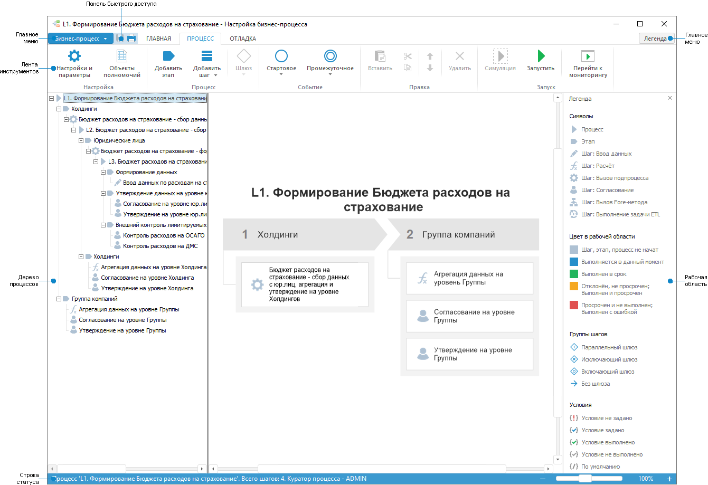
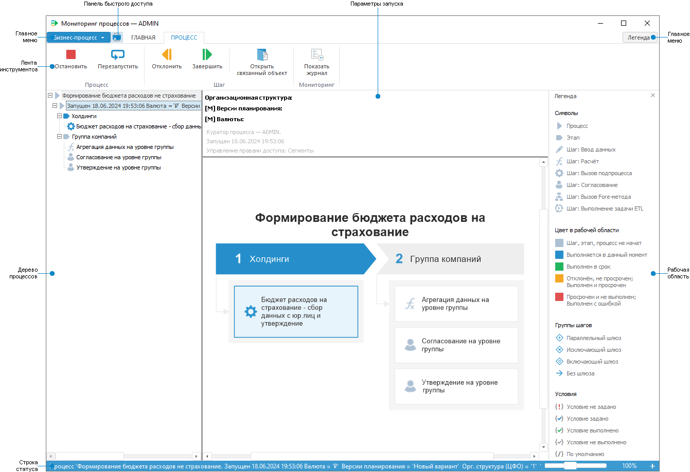

# Начало работы с расширением «Управление бизнес-процессами» в настольном приложении

Начало работы с расширением «Управление бизнес-процессами» в настольном приложении
-

# Начало работы с расширением «Управление
 бизнес-процессами» в настольном приложении

Для начала работы с расширением создайте новый или откройте готовый
 процесс.

[Создание
 нового процесса](javascript:TextPopup(this))

	Для создания нового процесса в [навигаторе
	 объектов](GetStarted.chm::/Interface/Interface_Navigator.htm) выполните одно из действий:

		- нажмите кнопку «Новый объект
		 > Пользовательские объекты > Процесс» в группе «Создать» на вкладке «Главная»
		 ленты инструментов;

		- выполните команду «Создать
		 > Пользовательские объекты > Процесс» в контекстном
		 меню навигатора объектов.

	После выполнения одного из действий будет
	 открыто окно «Вставка объекта - параметры
	 - Процесс». Введите наименование создаваемого процесса и измените
	 автоматически сформированный идентификатор при необходимости.

	Новый процесс будет открыт в [окне
	 настройки бизнес-процесса](Starting.htm#setting_business_process) в режиме редактирования.

[Открытие
 готового процесса](javascript:TextPopup(this))

	Для открытия готового процесса на редактирование в [навигаторе
	 объектов](GetStarted.chm::/Interface/Interface_Navigator.htm) выделите процесс и выполните одно из действий:

		- нажмите кнопку  «Редактировать»
		 в группе «Открыть» на
		 вкладке «Главная» ленты
		 инструментов;

		- выполните команду «Редактировать»
		 в контекстном меню процесса;

		- нажмите клавишу F4.

	После выполнения одного из действий будет открыто окно настройки
	 бизнес-процесса.

	Для открытия готового процесса на просмотр и мониторинга шагов процесса:

		- в [навигаторе
		 объектов](GetStarted.chm::/Interface/Interface_Navigator.htm) выделите процесс и выполните одно
		 из действий:

			- нажмите кнопку 
			 «Открыть» в группе
			 «Открыть» на вкладке
			 «Главная» ленты инструментов;

			- выполните команду «Открыть»
			 в контекстном меню процесса;

		- в [окне
		 настройки бизнес-процесса](Starting.htm#setting_business_process) нажмите кнопку  «Перейти к мониторингу» на вкладке
		 «Процесс» ленты инструментов.

	После выполнения одного из действий будет открыто окно мониторинга
	 процессов.

Для построения нового процесса смотрите
 статью «[Построение
 процесса](../Process/Create_process_screenshot.htm)».

Для работы с готовым процессом смотрите
 статью «[Мониторинг
 процесса](Monitoring_process_execution.htm)».

Основные окна расширения «Управление
 бизнес-процессами»:

	- Настройка бизнес-процесса.
	 Позволяет настроить последовательность этапов/шагов процесса, назначить
	 ответственных за выполнение шагов и запустить процесс;

	- Мониторинг процесса.
	 Позволяет завершать или отклонять шаги процесса, останавливать или
	 перезапускать процесс в целом, а также наглядно отображает цветовой
	 индикацией статус выполнения этапов/шагов процесса и параметры запуска
	 экземпляров процесса.

Основное окно расширения «Управление бизнес-процессами»:

	 В режиме настройки бизнес-процесса В режиме мониторинга

		

		

[Элементы
 окна настройки бизнес-процесса в настольном приложении](javascript:TextPopup(this))

		- Главное меню. Содержит
		 команды для сохранения, печати графической схемы процесса и закрытия
		 окна расширения, а также кнопку «Легенда»
		 для открытия панели легенды. При нажатии на кнопку «Легенда»
		 в рабочей области отображается панель легенды используемых символов,
		 цветовой индикации статусов выполнения шагов процесса, типов связей
		 между группами шагов и статусы условий. По умолчанию кнопка переведена
		 в ненажатое состоянии и панель не отображается;

		- Панель быстрого доступа.
		 Содержит набор часто используемых команд: 
		 «Сохранить»,
		  «Печать»;

		- Лента инструментов.
		 Содержит кнопки, размещенные на вкладках:

			- Главная. Предназначена
			 для визуальной настройки рабочей области;

			- Процесс. Предназначена
			 для настройки и запуска процесса;

			- Отладка. Используется
			 для [отключения
			 шагов](../Process/BPM_Edit_Process.htm#step_on_off) процесса, в том числе шагов расчёта и согласования;

		- Дерево
		 процессов. Содержит этапы и шаги процесса, а также вложенные
		 подпроцессы в виде дерева;

		- Рабочая
		 область. Предназначена для визуального отображения элементов
		 процесса, подпроцесса или этапа процесса, выбранного в дереве
		 процессов;

		- Строка статуса.
		 Содержит информацию о наименовании и количестве шагов процесса,
		 подпроцесса или этапа процесса, выбранного в дереве процессов.
		 Для шага процесса отображаются значения параметров.

[Элементы
 окна мониторинга бизнес-процесса в настольном приложении](javascript:TextPopup(this))

		- Главное меню. Содержит
		 команды для печати графической схемы процесса и закрытия окна
		 мониторинга;

		- Панель быстрого доступа.
		 Содержит набор часто используемых команд:
		  «Печать»;

		- Лента инструментов.
		 Содержит кнопки, размещенные на вкладках:

			- Главная. Предназначена
			 для визуальной настройки рабочей области;

			- Процесс. Предназначена
			 для завершения или отклонения шагов процесса, остановки или
			 перезапуска процесса в целом;

		- Дерево процессов.
		 Содержит все запущенные экземпляры процесса. Под экземпляром
		 процесса понимается процесс, запущенный с определёнными значениями
		 параметров.

	В дереве процессов с помощью символов
	 и цветовой индикации отображается тип и статус выполнения этапов/шагов
	 экземпляров процесса. [Отображение
	 дерева процессов](../Process/Parameters_setting.htm#tree) может быть настроено: отображать/скрывать параметры
	 запуска процесса, шаги подпроцессов и выполненные шаги подпроцессов;

		- Рабочая
		 область. Предназначена для визуального отображения элементов
		 процесса, подпроцесса или этапа процесса, выбранного в дереве
		 процессов. С помощью цветовой индикации отображается статус выполнения
		 этапов/шагов выделенного в дереве экземпляра процесса, тип шлюза
		 и статус условия группы шагов.

	При нажатии на кнопку  «Показать
	 журнал» в рабочей области отображается [журнал
	 выполнения этапов/шагов](../MonitoringProcess/Log_Stages_Steps_Pprocess.htm) выделенного в дереве экземпляра процесса.
	 Доступно только в настольном приложении;

		- Параметры
		 запуска. Область содержит значения параметров запуска,
		 имя куратора, запустившего процесс, дату и время запуска;

	Примечание.
	 Если параметры запуска не были выбраны или отключены, то запускается
	 один процесс без параметров.

		- Строка статуса.
		 Содержит информацию о наименовании и количестве шагов процесса,
		 подпроцесса или этапа процесса, выбранного в дереве процессов.
		 Для шага процесса отображаются значения параметров.

См. также:

[Построение
 процесса](../Process/Create_process_screenshot.htm) | [Мониторинг
 процесса](Monitoring_process_execution.htm)

		Справочная
		 система на версию 10.9
		 от 18/08/2025,
		 © ООО «ФОРСАЙТ»,
