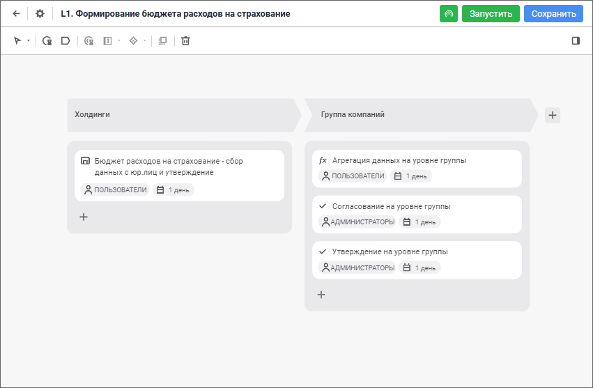

# Моделирование бизнес-процессов

Моделирование бизнес-процессов
-

# Моделирование бизнес-процессов и их выполнение

Для моделирования бизнес-процессов и их выполнения используйте [расширение](setup.chm::/Extensions/install_or_update_extensions.htm)
 «Управление бизнес-процессами»:

Расширение «Управление бизнес-процессами»
 предназначено для визуального моделирования бизнес-процессов, их выполнения
 и мониторинга.

Ключевые возможности:

	- создание процесса, его [этапов](Web/Process/Create_Stage.htm)
	 и [шагов](Web/Process/StepsProcess/CreateStepsProcess.htm),
	 определение их последовательности и [условий
	 выполнения](Web/Process/Setting_up_steps_conditions.htm);

	- настройка сроков выполнения шагов, их [параметров](Web/Process/Setting_Process_Parameters.htm),
	 выбор объектов для ввода, согласования и расчёта данных;

	- назначение [ответственных
	 за процесс и за выполнение шагов](Web/Facility_Agreement/Role_model.htm);

	- формирование [сегментов
	 данных](Web/Facility_Agreement/Role_model.htm), к которым будет предоставляться доступ;

	- автоматический запуск выполнения [подпроцессов](Web/MonitoringProcess/Executing_Subprocess.htm)
	 и шагов расчёта;

	- выполнение процессов с заданными параметрами;

	- [визуальный
	 мониторинг](Web/Starting/Monitoring_process_execution.htm) хода выполнения процесса.

Для начала работы с расширением
 в веб-приложении смотрите статью «[Начало
 работы с расширением «Управление бизнес-процессами» в веб-приложении](Web/Starting/Starting.htm)».

Для начала работы с расширением
 в настольном приложении смотрите статью «[Начало
 работы с расширением «Управление бизнес-процессами» в настольном приложении](Desktop/Starting/Starting.htm)».

См. также:

[Начало
 работы с расширением «Управление бизнес-процессами» в веб-приложении](Web/Starting/Starting.htm) |
 [Начало работы с расширением «Управление
 бизнес-процессами» в настольном приложении](Desktop/Starting/Starting.htm)

		Справочная
		 система на версию 10.9
		 от 18/08/2025,
		 © ООО «ФОРСАЙТ»,
