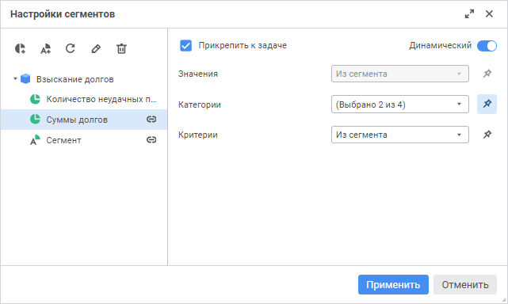
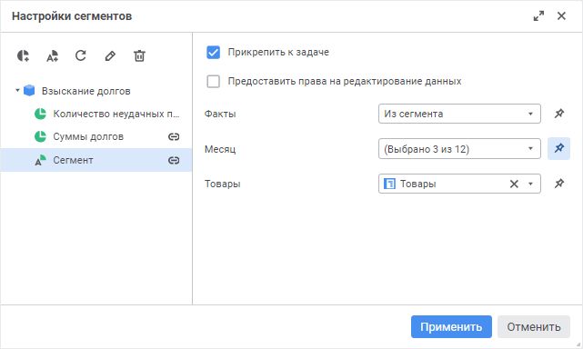

# Управление сегментами данных: Веб-приложение

Управление сегментами данных: Веб-приложение
-

# Управление сегментами данных

Сегмент данных, представляющий собой срез куба, зафиксированный по минимум
 одному измерению, является наименьшей информационной единицей, для которой
 могут быть определены права доступа.

Сегменты данных позволяют разграничить права доступа пользователей или
 групп пользователей к отдельным срезам данных куба при [запуске
 процесса](../Process/Start_Process.htm). Сегменты данных создаются на уровне куба в [мастере сегментов
 данных куба](uinavobj.chm::/Cube/segments/segments.htm).

Для упрощения разграничения прав доступа используйте автоматические
 сегменты. Автоматические сегменты - набор метаданных сегмента, по которым
 в момент запуска процесса будет построен сегмент данных с [динамическим
 способом управления](Setting_Segments.htm#type). Автоматические сегменты создаются, настраиваются
 и хранятся на уровне процесса, могут использоваться в других процессах,
 если источники данных, используемые в процессах форм ввода, совпадают.

При работе с настроенными сегментами доступно отображение подсветки
 данных в форме ввода при выполнении шага в мониторинге процесса. Подсветка
 отображается, если отметка табличной области формы ввода полностью содержит
 отметку по измерениям соответствующего сегмента. Пример настройки отображения
 подсветки данных описан в статье «[Настройка
 отображения подсветки данных в форме ввода при выполнении шага](highlight_data.htm)».

Примечание.
 Управление сегментами данных доступно только для шагов «[Ввод данных](../Process/StepsProcess/Data_Entry.htm)»
 и «[Согласование](../Process/StepsProcess/Agreement.htm)».

Для управления сегментами данных нажмите кнопку 
 «Редактировать», расположенную
 справа от параметра «[Сегмент
 данных](../Process/StepsProcess/Data_Entry.htm)» на боковой панели настроек шага. После чего будет открыто
 окно «Настройки сегментов» со
 следующими настройками:

	 Сегменты

	 Автоматические
	 сегменты

		

		

В левой части окна содержится список существующих сегментов данных куба,
 который используется в качестве источника данных выбранной формы ввода
 для параметра «[Форма
 ввода](../Process/StepsProcess/Data_Entry.htm)» на боковой панели. В правой части окна содержатся настройки
 взаимодействия процесса с выбранным сегментом данных.

## Операции с сегментами

При работе с сегментами данных доступны следующие операции:

[Добавление сегмента](javascript:TextPopup(this))

	Для добавления сегмента нажмите кнопку  «Добавить сегмент» на панели инструментов.
	 После чего будет открыт [мастер сегментов
	 данных куба](uinavobj.chm::/Cube/segments/segments.htm). Также открытие мастера доступно в
	 [навигаторе
	 объектов](getstarted.chm::/Interface/Interface_Navigator.htm) с помощью команды «Сегменты»
	 в контекстном меню стандартного куба. Для получения подробной информации
	 о работе с сегментами обратитесь к разделу «[Сегменты куба](UiNavObj.chm::/Cube/segments/segments.htm)».

	Для отображения добавленного сегмента и обновления списка существующих
	 сегментов нажмите кнопку  «Обновить».

[Добавление автоматического
 сегмента](javascript:TextPopup(this))

	Для добавления автоматического сегмента нажмите кнопку  «Добавить
	 автоматический сегмент» на панели инструментов. В результате
	 будет добавлен новый автоматический сегмент, который отобразится в
	 списке существующих сегментов данных куба.

[Прикрепление
 сегмента к шагу](javascript:TextPopup(this))

	Для прикрепления выделенного сегмента к шагу установите флажок «Прикрепить к задаче». После чего
	 будет отображена пиктограмма , обозначающая связь
	 сегмента с шагом. Доступно прикрепление нескольких сегментов к одному
	 шагу. При [запуске процесса](../Process/Start_Process.htm)
	 в форме ввода выполняется разграничение прав доступа пользователей
	 или групп пользователей по сегментам данных, прикреплённым к шагу.

	Если для параметра «Сегменты данных»
	 на боковой панели выбран один или несколько сегментов данных, то для
	 этих сегментов будет установлен флажок «Прикрепить
	 к задаче», и наоборот, если изменено состояние флажка для сегментов
	 в окне «Настройки сегментов»,
	 то отметка сегментов для параметра «Сегменты
	 данных» на боковой панели будет изменена.

[Предоставление
 прав на редактирование данных](javascript:TextPopup(this))

	Примечание.
	 Доступно только для автоматических сегментов данных.

	Установите флажок «Предоставление
	 прав на редактирование данных» для предоставления прав [пользователю](../Process/StepsProcess/CreateStepsProcess.htm#steps_process_firs_page),
	 ответственному за исполнение шага процесса, на изменение данных соответствующего
	 сегмента данных. Если флажок снят, то [пользователю](../Process/StepsProcess/CreateStepsProcess.htm#steps_process_firs_page),
	 ответственному за исполнение шага процесса, доступен только просмотр
	 данных соответствующего сегмента данных.

[Определение
 способа управления сегментом](javascript:TextPopup(this))

	Допустимые способы управления сегментом:

		- Статический. Активность
		 сегмента устанавливается вручную с помощью флажка, расположенного
		 напротив сегмента в столбце «Включить»
		 в [мастере
		 сегментов данных куба](uinavobj.chm::/Cube/segments/segments.htm);

		- Динамический. Активность
		 сегмента устанавливается процессом автоматически: при выполнении
		 шага сегмент будет включён, при завершении шага - выключен.

	Примечание.
	 Определение способа управления сегментом доступно только для сегментов
	 данных.

	Для определения способа управления сегментом, прикреплённого к шагу,
	 выполните одно из действий:

		- в окне «Настройки сегментов»
		 переведите переключатель «Динамический»
		 в активное состояние, если для конкретного сегмента предполагается
		 использование динамического способа управления. Если переключатель
		 переведён в неактивное состояние, то используется статический
		 способ управления;

	Примечание.
	 При переводе переключателя «Динамический»
	 в активное состояние доступна настройка связей измерений сегмента.

		- на боковой панели настроек шага установите флажок «[Динамический](../Process/StepsProcess/Data_Entry.htm)»,
		 если для всех существующих сегментов предполагается использование
		 динамического способа управления. Если флажок снят, то для сегментов
		 используется статический способ управления. Если в процессе используются
		 разные способы управления сегментами, определённые в окне «Настройки сегментов», то флажок
		 принимает следующий вид:

	

[Настройка связей
 измерений сегмента и параметров процесса](javascript:TextPopup(this))

	Для настройки связей измерений сегмента и параметров процесса в
	 окне «Настройки сегментов»
	 выполните следующие действия:

		- [Прикрепите сегмент к
		 шагу](Setting_Segments.htm#pin).

		- Установите переключатель «[Динамический](Setting_Segments.htm#type)» в активное
		 состояние. Для автоматического сегмента данных не требуется.

		- Установите связи измерений сегмента и параметров процесса.
		 Для этого выполните для каждого статичного поля, в котором отображается
		 наименование измерения сегмента, одно из действий:

			- выберите из раскрывающегося списка соответствующий параметр
			 процесса. В этом случае при запуске процесса отметка элементов
			 измерений сегмента будет изменяться в зависимости от значений
			 параметров, с которыми запущен процесс. Связь устанавливается
			 по ключам элементов справочников.

	Если параметр не выбран, то устанавливается
	 значение по умолчанию «Из сегмента».
	 В этом случае при запуске процесса отметка элементов измерений сегмента
	 соответствует отметке, установленной в [мастере сегментов
	 данных куба](uinavobj.chm::/Cube/segments/segments.htm).

			- зафиксируйте значения измерений сегмента. Для этого:

				- Нажмите кнопку  «Зафиксировать».
				 В раскрывающемся списке будут доступны элементы измерения
				 сегмента.

				- Выберите значение измерения сегмента. Доступна множественная
				 отметка. В этом случае при запуске процесса сегмент будет
				 строиться по заданным значениям не зависимо от параметров
				 процесса.

	Если значение измерения сегмента не
	 выбрано, то в измерении сегмента отметка будет отсутствовать. В
	 этом случае при запуске процесса данные по измерению сегмента будут
	 недоступны.

	Примечание.
	 Для настройки связи измерений сегмента и параметров процесса доступны
	 только те измерения, которые включены в сегмент.

	Изменение сегмента в соответствии с настроенными связями возможно
	 [при серверном
	 исполнении](../Process/Setting_Server_Process_Execution.htm), если планировщик запущен от имени одного из следующих
	 пользователей:

		-  пользователя из [группы](Admin.chm::/03_Admin/Groups/Admin_Groups.htm)
		 «Администраторы»;

		- пользователя, обладающего правами на изменение контейнера
		 сегментов, а также привилегиями: вход в систему, право чтения
		 и открытие всех объектов, вход в навигатор объектов, просмотр
		 протокола доступа.

[Переименование
 сегмента](javascript:TextPopup(this))

	Для переименования выделенного сегмента данных нажмите кнопку 
	 «Переименовать сегмент» на
	 панели инструментов. Чтобы изменения применились щелкните за пределами
	 редактора наименования.

[Удаление сегмента](javascript:TextPopup(this))

	Для удаления выделенного сегмента данных нажмите кнопку  «Удалить
	 сегмент» на панели инструментов. После подтверждения сегмент
	 будет удален.

См. также:

[Настройка
 ролевой модели](Role_model.htm) | [Создание
 шага «Ввод данных»](../Process/StepsProcess/Data_Entry.htm) | [Создание
 шага «Согласование»](../Process/StepsProcess/Agreement.htm)

		Справочная
		 система на версию 10.9
		 от 18/08/2025,
		 © ООО «ФОРСАЙТ»,
