# Настройка отображения подсветки данных в форме ввода при выполнении шага

Настройка отображения подсветки данных в форме ввода при выполнении шага
-

# Настройка отображения подсветки данных в форме ввода при выполнении
 шага

Для удобства работы с данными формы ввода, доступными для просмотра
 или редактирования при выполнении шага в мониторинге процесса, используется
 подсветка данных.

При отображении подсветки данных в форме ввода:

	- отметка по измерениям табличной области формы ввода должна полностью
	 включать в себя отметку по измерениям сегмента;

	- расширенный фильтр в измерениях боковика и шапки не влияет на
	 отображение подсветки данных;

	- если форма ввода построена на кубе-представлении, то фиксированные
	 измерения не влияют на отображение подсветки.

## Пример настройки подсветки данных табличной области формы ввода, источником
 которой является стандартный куб

Настройку подсветки данных рассмотрим на примере процесса, содержащего
 шаг «[Ввод
 данных](../Process/StepsProcess/Data_Entry.htm)»/«[Согласование](../Process/StepsProcess/Agreement.htm)».
 Форма ввода шага содержит табличную область, источником которой является
 [стандартный
 куб](uinavobj.chm::/Cube/CreateCube/Master_Standart/UiMd_Cube_CreateCube_Master_Standart.htm) «Данные по заболеваниям»,
 содержащий четыре измерения: «Календарь»,
 «Страны», «Пол»,
 «Факты». Форма ввода и процесс
 связаны по параметрам «Факты»
 и «Пол».

[Построение табличной
 области](javascript:TextPopup(this))

		- Создайте [параметры](dataentryforms.chm::/Web/Parameters/Parameters.htm)
		 формы ввода «Факты», «Пол», связанные с соответствующими
		 справочниками НСИ «Факты»,
		 «Пол», с единичным типом
		 отметки:

	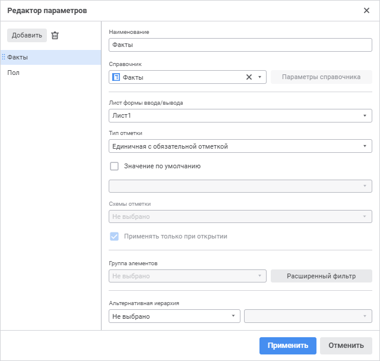

		- Задайте [структуру
		 табличной области](dataentryforms.chm::/Web/Table/Table_Area_Structure.htm):

	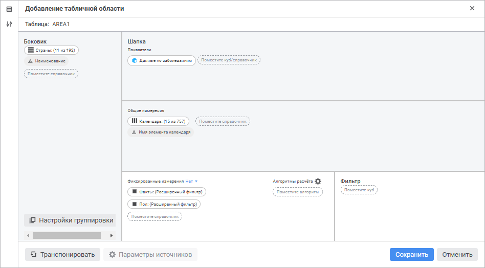

		- Настройте [расширенный
		 фильтр](dataentryforms.chm::/Web/Table/Select_dimension_elements.htm) у фиксированных измерений «Факты»,
		 «Пол» для связи с параметрами
		 формы ввода. Пример настройки расширенного фильтра для измерения
		 «Факты»:

	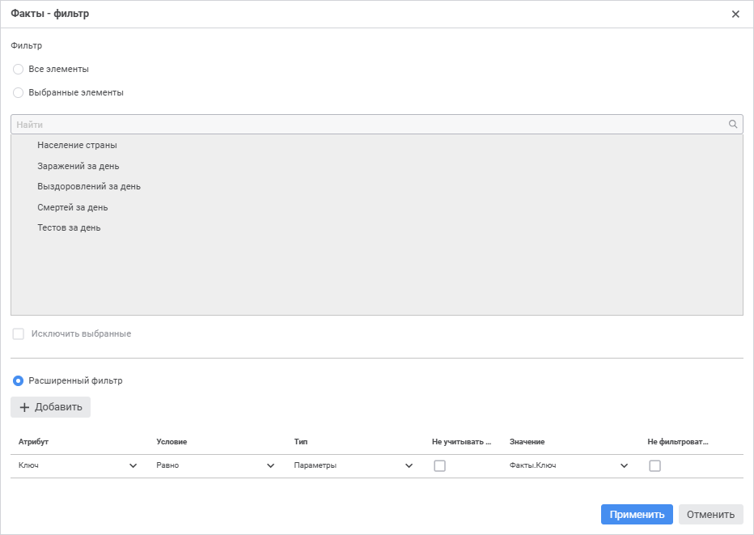

	Аналогично настройте расширенный фильтр
	 измерения «Пол», задав связь
	 измерения с параметром «Пол»
	 формы ввода.

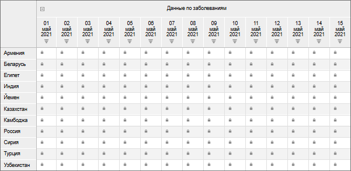

Примечание.
 Для [параметров
 процесса](../Process/StepsProcess/Data_Entry.htm#parameters) настроены связи с параметрами формы ввода.

Для отображения подсветки данных в форме ввода в мониторинге процесса
 выполните одно из действий:

	- с использованием [сегмента](uinavobj.chm::/Cube/segments/segments.htm)
	 куба предоставьте пользователю доступ к данным для элемента «Россия» измерения «Страны»
	 за период с 1 по 15 мая 2021, отметив соответствующие элементы в измерении
	 «Календарь»:

		- Настройте сегмент куба, задав отметку
		 сегмента:

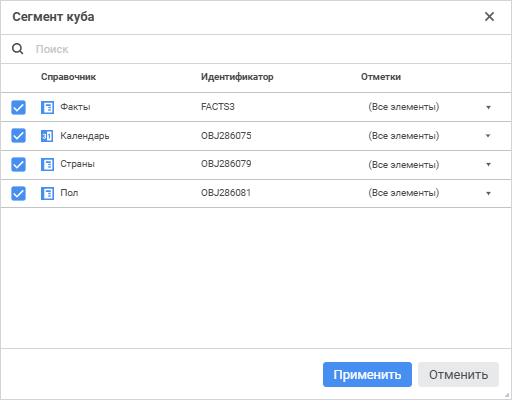

Примечание.
 Для пользователя, ответственного за выполнение шага, назначьте соответствующие
 [права
 доступа для сегмента](uinavobj.chm::/Cube/segments/seg_list.htm).

		- Настройте связи измерений сегмента и параметров процесса
		 для шага, содержащего данную форму ввода:

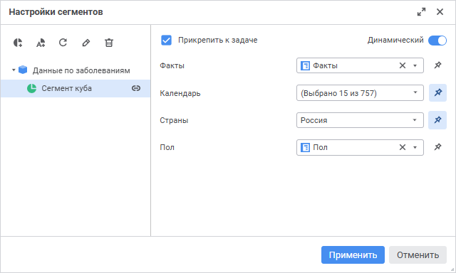

		- [Запустите процесс](../Process/Start_Process.htm).

Примечание.
 После настройки связи измерения и сегмента, отметка измерения будет зависеть
 от значений соответствующих параметров, определяющих экземпляр процесса.
 Поэтому при одних и тех же настройках сегмента для одного экземпляра может
 отображаться подсветка среза, а для другого может не отображаться.

При выполнении шага в мониторинге процесса:

			- подсветка данных отобразится в табличной области формы
			 ввода для экземпляра процесса, содержащего в отметке параметров
			 по одному элементу. Например, экземпляр процесса «Факты
			 - Выздоровлений за день; Пол - Женщины»:

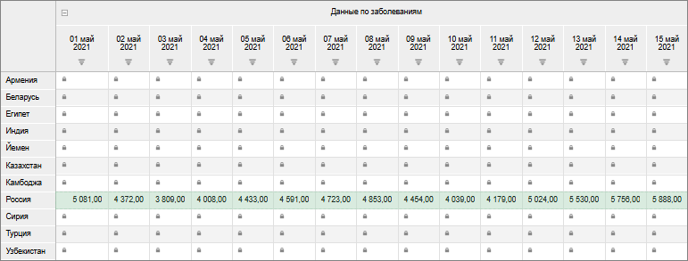

В данном случае подсветка отображается,
 так как отметка по всем измерениям табличной области полностью включает
 в себя отметку по измерениям сегмента.

			- подсветка данных не отобразится в табличной области
			 формы ввода для экземпляра процесса, определённого множественной
			 отметкой в параметре. Например, экземпляр процесса «Факты - Выздоровлений за день,
			 Смертей за день; Пол - Женщины, Мужчины»:

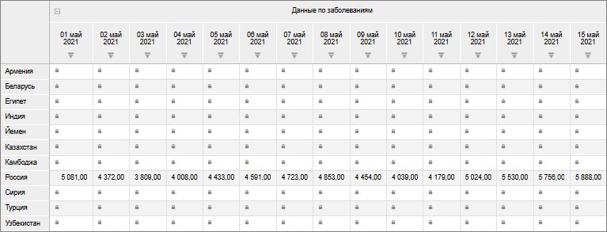

В данном случае подсветка не отображается,
 так как отметка по измерениям табличной области не включает в себя отметку
 по измерениям соответствующего сегмента:

				- В табличной области у фиксированных измерений зафиксировано
				 одно значение;

				- В сегменте соответствующее измерение включает множество
				 значений.

	- с использованием [автоматического
	 сегмента](Setting_Segments.htm) предоставьте пользователю доступ к данным табличной области
	 для всех элементов измерений «Страны»
	 и «Календарь». Для этого
	 настройте связи измерений автоматического сегмента и параметров процесса
	 для шага, содержащего данную форму ввода:

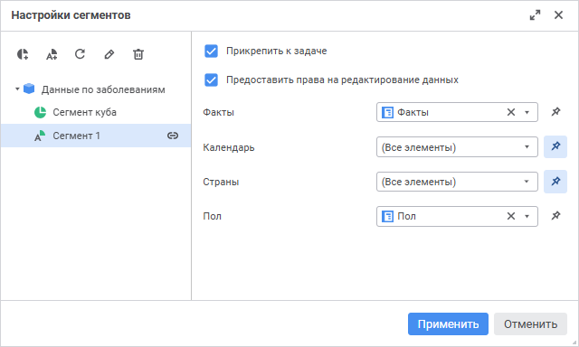

Примечание.
 После настройки связи измерения и сегмента, отметка измерения будет зависеть
 от значений соответствующих параметров, определяющих экземпляр процесса.
 Поэтому при одних и тех же настройках сегмента для одного экземпляра может
 отображаться подсветка среза, а для другого может не отображаться.

После запуска процесса в мониторинге отобразится
 подсветка всех доступных данных в табличной области формы ввода для экземпляра
 процесса, содержащего в отметке параметров по одному элементу, при выполнении
 шага. Например, экземпляр процесса «Факты
 - Выздоровлений за день; Пол - Женщины»:

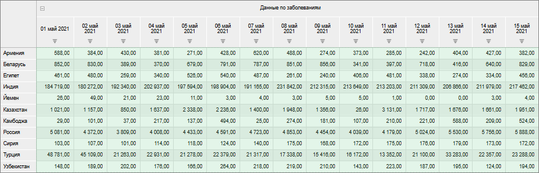

В данном случае расширенный фильтр в измерениях
 «Страны» и «Календарь»
 табличной области не влияет на отображение подсветки данных, поэтому в
 измерениях сегмента «Страны»
 и «Календарь» необязательно выставлять
 определённую отметку.

## Пример настройки подсветки данных табличной области формы ввода, источником
 которой является представление-куб

Настройку подсветки данных рассмотрим на примере процесса, содержащего
 шаг «[Ввод
 данных](../Process/StepsProcess/Data_Entry.htm)»/«Согласование».
 Форма ввода шага содержит табличную область, источником которой является
 [представление-куб](uinavobj.chm::/Cube/CreateCube/Master_Conception/UiMd_Cube_CreateCube_Master_Conception.htm),
 содержащий три измерения: «Календарь»,
 «Страны», «Факты».
 Элемент «Женщины» измерения «Пол» исходного куба зафиксирован.
 Форма ввода и процесс связаны по параметру «Факты».
 [Сегмент данных](highlight_data.htm#segment) наследуется от
 стандартного куба, на котором построен представление-куб.

[Построение
 табличной области](javascript:TextPopup(this))

		- Создайте [параметр](dataentryforms.chm::/Web/Parameters/Parameters.htm)
		 формы ввода «Факты» с
		 единичным типом отметки:

	

		- Задайте [структуру
		 табличной области](dataentryforms.chm::/Web/Table/Table_Area_Structure.htm):

	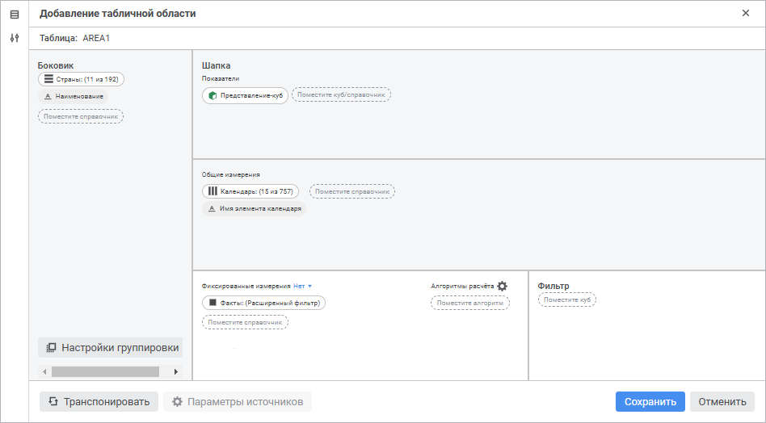

		- Настройте [расширенный
		 фильтр](dataentryforms.chm::/Web/Table/Select_dimension_elements.htm) у фиксированного измерения «Факты»
		 для связи с параметром формы ввода:

	

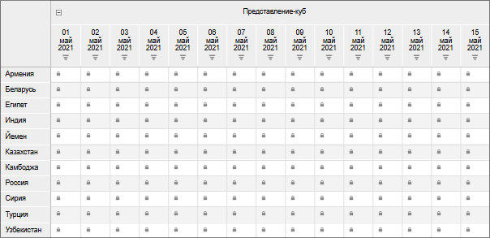

Примечание.
 Для [параметра
 процесса](../Process/StepsProcess/Data_Entry.htm#parameters) настроена связь с параметром формы ввода.

Для отображения подсветки в форме ввода при выполнении шага предоставьте
 пользователю доступ к данным табличной области для элементов «Россия»,
 «Беларусь» и «Турция»
 за период с 1 по 15 мая 2021, отметив соответствующие элементы в измерении
 «Календарь». Для этого настройте
 связь измерения сегмента и параметра процесса для шага, содержащего данную
 форму ввода:

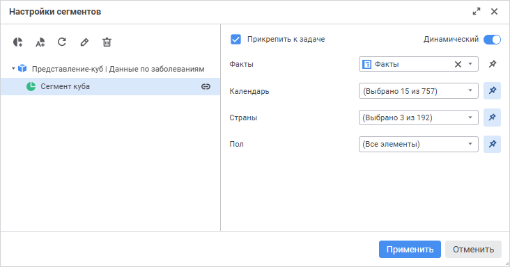

После запуска процесса в мониторинге отобразится подсветка данных в
 табличной области формы ввода для экземпляра процесса, содержащего в отметке
 параметра один элемент, при выполнении шага. Например, экземпляр процесса
 «Факты - Выздоровлений за день»:

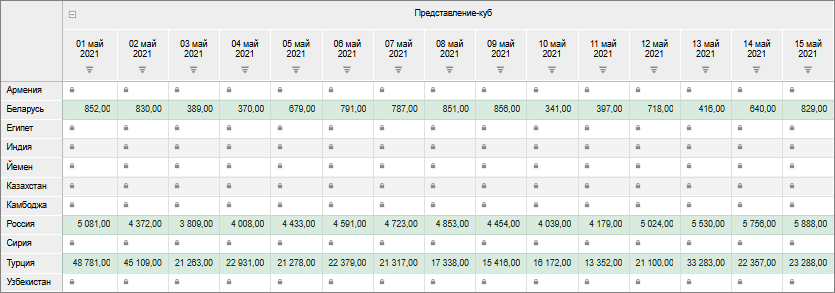

В данном случае отметка в фиксированном измерении «Пол»
 представления-куба не влияет на отображение подсветки, поэтому в измерении
 сегмента «Пол» необязательно
 выставлять определённую отметку.

См. также:

[Настройка
 ролевой модели](Role_model.htm) | [Управление сегментами
 данных](Setting_Segments.htm)

		Справочная
		 система на версию 10.9
		 от 18/08/2025,
		 © ООО «ФОРСАЙТ»,
