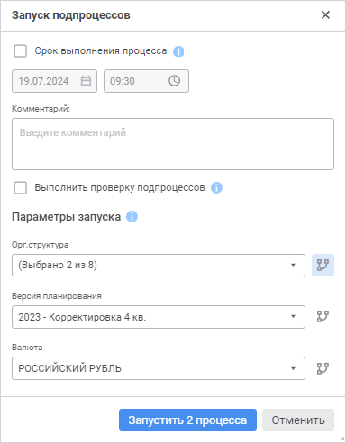

# Выполнение шагов подпроцесса: Веб-приложение

Выполнение шагов подпроцесса: Веб-приложение
-

# Выполнение шагов подпроцесса

Выполнение шага «[Вызов
 подпроцесса](../Process/StepsProcess/Subprocess.htm)» при установленном параметре «[Групповой
 вызов](../Process/StepsProcess/Subprocess.htm#parameters)» подразумевает, что при исполнении подпроцесса будут
 запускаться несколько [экземпляров](../Starting/Monitoring_process_execution.htm)
 подпроцесса в соответствии с заданным [параметром
 разбивки](../Process/StepsProcess/Subprocess.htm). Подпроцессы могут запускаться в [ручном
 или автоматическом режиме](../Process/StepsProcess/CreateStepsProcess.htm#method_of_execution) в зависимости от настроек шага.

Для выполнения шага «Вызов подпроцесса» в ручном режиме
 выполните следующие шаги:

	- Для выбранного экземпляра процесса выполните одно из действий:

		- при отображении схемы процесса выделите в рабочей области
		 шаг «Вызов подпроцесса»
		 с ручным способом запуска и нажмите на кнопку  «Завершить» на панели инструментов;

		- при отображении списка назначенных шагов процесса выполните
		 команду  «Завершить»
		 из раскрывающегося меню кнопки 
		 «Действие» шага «Вызов подпроцесса». Доступно
		 только в [пользовательском
		 мониторинге](../Starting/Monitoring_process_execution.htm#monitoring_simple);

Для задания параметров запуска подпроцесса
 будет открыто окно «Запуск подпроцессов»:

В области «Параметры
 запуска» автоматически заданы
 значения параметров, для которых будут запущены подпроцессы, в соответствии
 с настройками [связей
 процесса и подпроцесса](../Process/StepsProcess/Subprocess.htm#parameters).

Изменение значения доступно для [параметра](../Process/StepsProcess/Subprocess.htm#splitting_parameter_web),
 по которому выполняется разбиение подпроцесса, для остальных параметров
 доступен только просмотр значений. Напротив параметра разбивки подпроцесса
 отображается нажатая кнопка  «Разбивка
 экземпляров по параметру».

	- Нажмите кнопку «Запустить N
	 процесса», где N –
	 количество запускаемых экземпляров подпроцесса. Количество экземпляров
	 подпроцесса:

		- определяется отметкой в параметре разбивки, если настроен
		 [групповой
		 вызов](../Process/StepsProcess/Subprocess.htm#group_call). В результате для каждого отмеченного элемента
		 параметра разбивки будет запущен отдельный экземпляр подпроцесса;

		- не зависит от отметки в параметрах, если не настроен[
		 групповой вызов](../Process/StepsProcess/Subprocess.htm#group_call). В результате будет запущен один экземпляр
		 подпроцесса.

Для подпроцесса с автоматическим способом исполнения экземпляры вложенных
 подпроцессов запустятся автоматически.

В окне мониторинга список запущенных процессов/подпроцессов отображается
 на [боковой панели](../Starting/Starting.htm#legend_monitoring_web).
 Список запущенных экземпляров выбранного процесса/подпроцесса отображается
 в [рабочей области](../Starting/Starting.htm#legend_monitoring_web);

Примечание.
 Для отображения в рабочей области экземпляров процесса, относящихся к
 выбранному шагу подпроцесса, откройте его, как [вложенный
 объект](Manual_mode.htm#open_linked_object).

Выполненный экземпляр подпроцесса удаляется из окна с мониторингом после
 выполнения всех шагов.

При необходимости [перезапустите
 экземпляры подпроцесса](Restarting_subprocess_instances.htm).

См. также:

[Мониторинг
 процесса](../Starting/Monitoring_process_execution.htm) | [Выполнение шагов процесса в ручном
 режиме](Manual_mode.htm) | [Отклонение шага процесса](Reject_step.htm) |
 [Журнал выполнения этапов/шагов
 процесса](Log_Stages_Steps_Pprocess.htm)

		Справочная
		 система на версию 10.9
		 от 18/08/2025,
		 © ООО «ФОРСАЙТ»,
