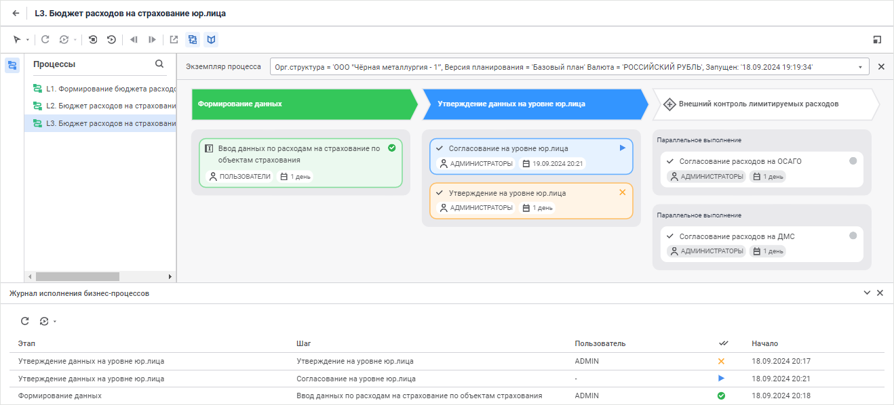
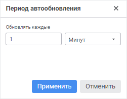

# Журнал исполнения бизнес-процессов: Веб-приложение

Журнал исполнения бизнес-процессов: Веб-приложение
-

# Журнал исполнения бизнес-процессов

Для просмотра расширенной информации о выполнении шагов экземпляра процесса
 используйте панель «Журнал исполнения
 бизнес-процессов».

[Для открытия/скрытия
 панели](javascript:TextPopup(this))

	Для открытия панели нажмите кнопку  «Журнал»
	 на панели инструментов, переведя её в активное состояние.

	Для скрытия панели:

		- нажмите кнопку  «Журнал»
		 на панели инструментов, переведя ее в неактивное состояние;

		- нажмите кнопку  «Закрыть»
		 на панели «Журнал исполнения
		 бизнес-процессов».

Примечание.
 Доступно при отображении в рабочей области [схемы
 экземпляра процесса](../Starting/Starting.htm#legend_monitoring_web).

Примечание.
 Для отображения панели в свёрнутом/развёрнутом виде нажмите кнопку  «Свернуть»/ 
 «Развернуть».

На панели «Журнал исполнения бизнес-процессов»
 отображается список с основными сведениями по выполнению шагов [экземпляра
 процесса](../Starting/Monitoring_process_execution.htm):

	- Этап. Содержит наименование
	 этапа;

	- Шаг. Содержит наименование
	 шага;

	- Статус. Содержит пиктограмму
	 [статуса
	 выполнения шага и цветовую индикацию](../Starting/Monitoring_process_execution.htm#status).

	- Начало. Содержит время
	 начала операции по изменению статуса шага;

	- Окончание. Содержит
	 время окончания операции по изменению статуса шага;

	- Пользователь. Содержит
	 имя пользователя, [завершившего](Executing_Subprocess.htm)
	 или [отклонившего](Reject_step.htm) выполнение шага;

	- Комментарий. Содержит
	 комментарий, оставленный пользователем при [завершении](Executing_Subprocess.htm)
	 или [отклонении](Reject_step.htm) шага.

## Обновление журнала исполнения бизнес-процессов

Для журнала исполнения бизнес-процессов доступно:

	- разовое обновление списка с основными сведениями по выполнению
	 шагов выбранного экземпляра процесса. Для этого нажмите кнопку  «Обновить»;

	- обновление списка с основными сведениями по выполнению шагов
	 выбранного экземпляра процесса с заданной периодичностью. Для этого
	 нажмите кнопку  «Автообновление».
	 Будет включено автоматическое обновление каждую 1 минуту.

Для изменения периода автоматического обновления
 выполните команду «Задать период»
 в раскрывающемся меню кнопку  «Автообновление».
 Будет открыт диалог «Период автообновления»:

В диалоге задайте период обновления списка
 с основными сведениями по выполнению шагов выбранного экземпляра процесса
 и нажмите кнопку «Применить».
 Обновление может выполняться каждые N
 секунд, минут или часов.

При выборе на [панели
 экземпляров процесса](../Starting/Starting.htm#legend_monitoring_web) другого запущенного экземпляра список с основными
 сведениями по выполнению шагов выбранного экземпляра процесса на панели
 «Журнал исполнения бизнес-процессов»
 обновится.

См. также:

[Мониторинг
 процесса](../Starting/Monitoring_process_execution.htm)

		Справочная
		 система на версию 10.9
		 от 18/08/2025,
		 © ООО «ФОРСАЙТ»,
