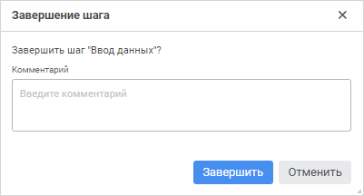
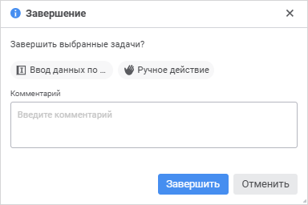

# Выполнение шагов процесса в ручном режиме: Веб-приложение

Выполнение шагов процесса в ручном режиме: Веб-приложение
-

# Выполнение шагов процесса в ручном режиме

Ручной способ исполнения доступен для шагов:

	- [Ввод данных](../Process/StepsProcess/Data_Entry.htm);

	- [Согласование](../Process/StepsProcess/Agreement.htm);

	- [Ручное действие](../Process/StepsProcess/Manual_Task.htm);

	- [Расчёт](../Process/StepsProcess/Calculation.htm);

	- [Вызов подпроцесса](../Process/StepsProcess/Subprocess.htm).

Шаги [ввода
 данных](../Process/StepsProcess/Data_Entry.htm#parameters), [согласования](../Process/StepsProcess/Agreement.htm#parameters),
 [расчёта](../Process/StepsProcess/Calculation.htm#parameters)
 и [вызова подпроцесса](../Process/StepsProcess/Subprocess.htm#parameters)
 запускаются в соответствии с настройками связей параметров процесса и
 конкретного шага.

Для выполнения активного шага процесса
 в ручном режиме:

	- Откройте связанный объект. Для этого выполните одно из действий:

		- при отображении в рабочей области [схемы
		 процесса](../Starting/Starting.htm#legend_monitoring_web):

			- нажмите кнопку  «Открыть связанный объект»
			 на панели инструментов выбранного шага;

			- дважды щёлкните по выбранному шагу при отображении в
			 рабочей области [схемы
			 процесса](../Starting/Starting.htm#legend_monitoring_web).

		- при отображении в рабочей области [списка
		 назначенных шагов](../Starting/Monitoring_process_execution.htm#web_monitoring) процесса щелкните по наименованию связанного
		 объекта в столбце «Связанный
		 объект» выбранного шага. Доступно только в [пользовательском
		 мониторинге](../Starting/Monitoring_process_execution.htm#monitoring_simple);

В открывшемся окне, которое зависит от типа
 выбранного шага, выполните необходимые действия:

		- в форме ввода – [введите данные](DataEntryForms.chm::/Web/Work/Agreement.htm);

		- в форме ввода для шага согласования – [согласуйте
		 данные](DataEntryForms.chm::/Web/Work/Agreement.htm);

		- в алгоритме расчёта – [выполните
		 расчёт](CalculationAlgorithm.chm::/Web/Work/Perform_calculations.htm).

	- Завершите шаг, выполнив одно из действий:

		- в мониторинге процессов:

			- нажмите кнопку  «Завершить» на панели инструментов
			 при отображении в рабочей области [схемы
			 процесса](../Starting/Starting.htm#legend_monitoring_web);

			- выполните команду 
			 «Завершить» из раскрывающегося
			 меню кнопки  «Действие»
			 выбранного шага в [списке
			 назначенных шагов](../Starting/Starting.htm#legend_monitoring_web) выбранного экземпляра процесса. Доступно
			 только в [пользовательском
			 мониторинге](../Starting/Monitoring_process_execution.htm#monitoring_simple);

Если шаг «[Вызов
 подпроцесса](../Process/StepsProcess/Subprocess.htm)» выполняется в ручном режиме, то после завершения шага
 будет открыто окно «[Запуск
 подпроцессов](Executing_Subprocess.htm)» для запуска подпроцессов.

		- в связанном объекте нажмите кнопку 
		 «Завершить» на панели
		 инструментов. Доступно для [форм ввода](DataEntryForms.chm::/desktop/Work/Agreement.htm) в шагах «Ввод
		 данных» и «Согласование».

Примечание.
 При завершении/[отклонении](Reject_step.htm) шага процесса
 из связанного объекта, в котором используется [форма ввода](DataEntryForms.chm::/desktop/Work/Agreement.htm),
 будут завершены активные шаги, использующие данную форму ввода, а также
 шаги, в которых пользователь назначен ответственным и используется данная
 форма ввода.

Откроется окно подтверждения завершения шага,
 в котором при необходимости введите пояснения в поле «Комментарий»:

В пользовательском мониторинге процессов для [исполнителя](../Facility_Agreement/Role_model.htm#user)
 доступно одновременное завершение нескольких активных шагов процесса одного
 экземпляра процесса. Для этого при отображении в рабочей области [списка
 назначенных шагов процесса](../Starting/Starting.htm#legend_monitoring_web) нажмите кнопку  «Завершить» на панели инструментов
 для выделенных шагов одного экземпляра процесса. Откроется окно подтверждения
 завершения шагов, в котором при необходимости введите пояснения в поле
 «Комментарий»:

После завершения шага доступно [отклонение](Reject_step.htm)
 следующего шага на предыдущий. Если шаг был отклонен, то для дальнейшего
 завершения отклоненного шага повторите завершение предыдущего шага.

См. также:

[Мониторинг
 процесса](../Starting/Monitoring_process_execution.htm)

		Справочная
		 система на версию 10.9
		 от 18/08/2025,
		 © ООО «ФОРСАЙТ»,
