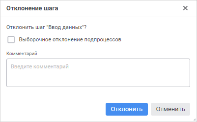
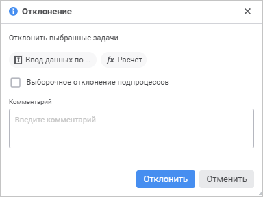

# Отклонение шага процесса: Веб-приложение

Отклонение шага процесса: Веб-приложение
-

# Отклонение шага процесса

Для отклонения активного шага процесса на предыдущий:

	- Выполните одно из действий:

		- в мониторинге процессов:

			- нажмите кнопку 
			 «Отклонить» на панели
			 инструментов при отображении в рабочей области [схемы
			 процесса](../Starting/Starting.htm#legend_monitoring_web).

			- выполните команду  «Отклонить»
			 из раскрывающегося меню кнопки  «Действие»
			 шага в [списке
			 назначенных шагов](../Starting/Starting.htm#legend_monitoring_web) выбранного экземпляра процесса. Доступно
			 только в [пользовательском
			 мониторинге](../Starting/Monitoring_process_execution.htm#monitoring_simple);

		- в связанном объекте 
		 «Отклонить» на панели
		 инструментов. Доступно для [форм ввода](DataEntryForms.chm::/desktop/Work/Agreement.htm) в шагах «Ввод
		 данных» и «Согласование».

После выполнения одного из действий будет
 открыто окно подтверждения отклонения шага:

	- При необходимости в окне отклонения шага:

		- установите флажок «Выборочное
		 отклонение подпроцессов» для отклонения выбранных экземпляров
		 подпроцесса. При снятом флажке шаг процесса будет отклонен до
		 ручного шага вместе с экземплярами подпроцесса автоматического
		 шага;

Примечание.
 После установки флажка «Выборочное отклонение
 подпроцессов» [способ
 исполнения](../Process/StepsProcess/Subprocess.htm#method_of_execution) будет изменен с автоматичекого на ручной.

		- введите комментарий в поле «Комментарий»
		 для пояснения отклонения шага процесса.

В пользовательском мониторинге процессов для [исполнителя](../Facility_Agreement/Role_model.htm#user)
 доступно одновременное отклонение нескольких активных шагов процесса одного
 экземпляра процесса. Для этого при отображении в рабочей области [списка
 назначенных шагов процесса](../Starting/Starting.htm#legend_monitoring_web) нажмите кнопку  «Отклонить» на панели инструментов
 для выделенных шагов одного экземпляра процесса. Откроется окно подтверждения
 отклонения шагов:

См. также:

[Мониторинг
 процесса](../Starting/Monitoring_process_execution.htm) | [Выполнение шагов процесса в автоматическом
 режиме](Auto_mode.htm) | [Выполнение шагов процесса в ручном
 режиме](Manual_mode.htm) | [Выполнение шагов подпроцесса](Executing_Subprocess.htm)
 | [Журнал выполнения этапов/шагов
 процесса](Log_Stages_Steps_Pprocess.htm)

		Справочная
		 система на версию 10.9
		 от 18/08/2025,
		 © ООО «ФОРСАЙТ»,
