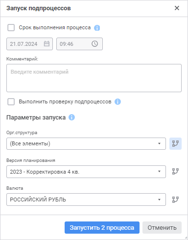

# Перезапуск экземпляров подпроцесса: Веб-приложение

Перезапуск экземпляров подпроцесса: Веб-приложение
-

# Перезапуск экземпляров подпроцесса

Действия, которые нужно выполнить для перезапуска экземпляров подпроцесса,
 отличаются в зависимости от способа исполнения подпроцесса: [ручной](Manual_mode.htm)
 или [автоматический](Auto_mode.htm). Способ исполнения определяется
 при настройке [шага
 «Вызов подпроцесса»](../Process/StepsProcess/Subprocess.htm#step_parametrs).

При перезапуске экземпляров подпроцесса в [ручном](#restarting_subprocess_in_manual_mode)
 и [автоматическом режиме](#restarting_subprocess_in_automatic_mode)
 есть возможность перезапустить как все экземпляры подпроцесса, так и отдельные.
 Выбранные экземпляры подпроцесса будут перезапущены с первого или последнего
 шага, в зависимости от [заданных
 настроек шага «Вызов подпроцесса»](../Process/StepsProcess/Subprocess.htm#step_parametrs).

## Перезапуск экземпляров
 подпроцесса в ручном режиме

Если шаг «[Вызов
 подпроцесса](../Process/StepsProcess/Subprocess.htm)» при установленном параметре «[Групповой
 вызов](../Process/StepsProcess/Subprocess.htm#parameters)» был выполнен в ручном режиме, то для перезапуска экземпляров
 подпроцесса:

	- [Отклоните](Reject_step.htm) выполнение текущего
	 шага на шаг «Вызов подпроцесса».

	- Выполните одно из действий:

		- при отображении схемы процесса выделите в рабочей области
		 шаг «Вызов подпроцесса»
		 с ручным способом запуска и нажмите на кнопку  «Завершить» на панели инструментов;

		- при отображении списка назначенных шагов процесса выполните
		 команду  «Завершить»
		 из раскрывающегося меню кнопки 
		 «Действие» шага «Вызов подпроцесса». Доступно
		 только в [пользовательском
		 мониторинге](../Starting/Monitoring_process_execution.htm#monitoring_simple);

Для задания параметров запуска подпроцесса
 будет открыто окно «Запуск подпроцессов».
 В области «Параметры запуска»
 по умолчанию выбраны значения [параметра
 разбивки](../Process/StepsProcess/Subprocess.htm#splitting_parameter_web), для которых были запущены экземпляры подпроцесса:

	- Выберите значения параметра разбивки, по которым нужно перезапустить
	 экземпляры подпроцесса, и нажмите кнопку «Запустить».
	 В параметре разбивки для выбора будут доступны только те значения,
	 для которых были запущены подпроцессы.

В результате для каждого выбранного элемента
 параметра разбивки будут перезапущены экземпляры подпроцесса с первого
 или последнего шага, в зависимости от заданных [настроек
 шага «Вызов подпроцесса»](../Process/StepsProcess/Subprocess.htm#step_parametrs).

Примечание.
 При ручном перезапуске подпроцесса, для которого не задан [групповой
 вызов](../Process/StepsProcess/Subprocess.htm#group_call), в окне «Запуск подпроцессов»
 доступен только просмотр значений параметров. Перезапуск выполняется с
 исходными значениями параметров.

## Перезапуск экземпляров
 подпроцесса в автоматическом режиме

Процесс перезапуска [всех экземпляров](#restarting_all_instances)
 и [отдельных экземпляров](#restarting_chosen_instances) будет
 отличаться, если шаг «Вызов подпроцесса»
 был выполнен в автоматическом режиме.

Для перезапуска всех ранее выполненных
 экземпляров подпроцесса:

	- [Отклоните](Reject_step.htm) выполнение текущего
	 шага на шаг «Вызов подпроцесса».
	 Отклонение произойдет до последнего шага, выполненного в ручном режиме.

Примечание.
 Если до шага «Вызов подпроцесса»
 отсутствуют шаги в ручном режиме, то есть шаг подпроцесса является первым
 шагом экземпляра процесса/подпроцесса, то он будет перезапущен автоматически
 после отклонения.

	- Выполните шаги в [ручном режиме](Manual_mode.htm)
	 до шага подпроцесса.

В результате
 все экземпляры подпроцесса будут автоматически перезапущены с первого
 или последнего шага, в зависимости от [настроек](../Process/StepsProcess/Subprocess.htm#reject),
 заданных в мастере шага «Вызов подпроцесса».

Для перезапуска отдельных
 экземпляров подпроцесса:

	- [Отклоните](Reject_step.htm) выполнение текущего
	 шага на шаг «Вызов подпроцесса».

	- Установите флажок «Выборочное
	 отклонение подпроцессов» при [отклонении](Reject_step.htm).
	 Способ исполнения шага изменится на ручной.

	- Выполните одно из действий:

		- при отображении схемы процесса выделите в рабочей области
		 шаг «Вызов подпроцесса»
		 с ручным способом запуска и нажмите на кнопку  «Завершить» на панели инструментов;

		- при отображении списка назначенных шагов процесса выполните
		 команду  «Завершить»
		 из раскрывающегося меню кнопки 
		 «Действие» шага «Вызов подпроцесса». Доступно
		 только в [пользовательском
		 мониторинге](../Starting/Monitoring_process_execution.htm#monitoring_simple);

Для выбора экземпляров подпроцесса будет
 открыто окно «Запуск подпроцессов».
 В области «Параметры запуска»
 по умолчанию выбраны значения параметра разбивки, для которых были запущены
 экземпляры подпроцессов:

	- Выберите значения параметра разбивки, по которым нужно перезапустить
	 экземпляры подпроцесса, и нажмите кнопку «Запустить».
	 В параметре разбивки для выбора будут доступны только те значения,
	 для которых были запущены подпроцессы.

В результате соответствующие экземпляры подпроцесса будут перезапущены
 с первого или последнего шага, в зависимости от [заданных
 настроек шага «Вызов подпроцесса»](../Process/StepsProcess/Subprocess.htm#step_parametrs).

См. также:

[Выполнение
 шагов подпроцесса](Executing_Subprocess.htm) | [Выполнение шагов процесса
 в ручном режиме](Manual_mode.htm) | [Отклонение шага процесса](Reject_step.htm)

		Справочная
		 система на версию 10.9
		 от 18/08/2025,
		 © ООО «ФОРСАЙТ»,
