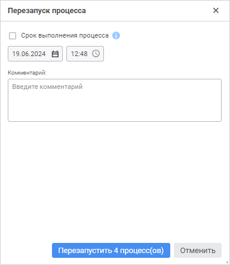
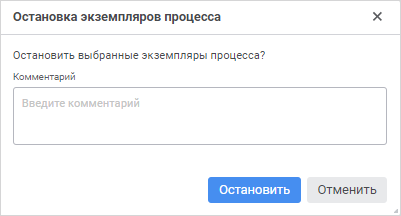
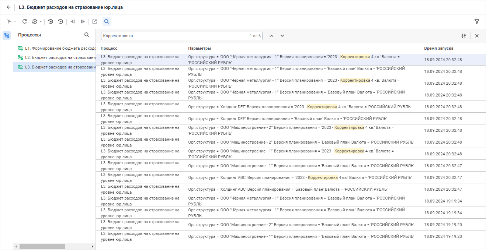
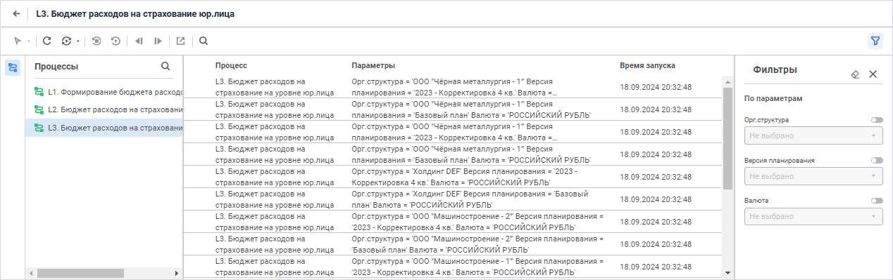
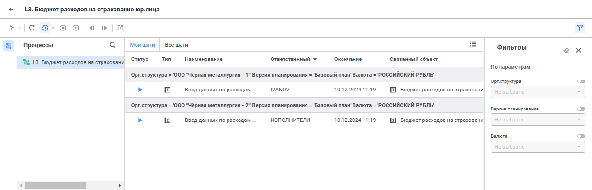
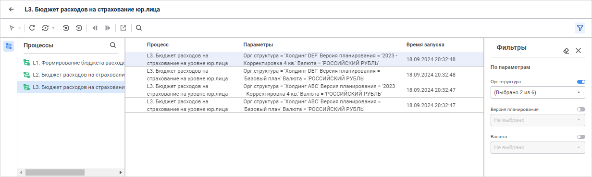
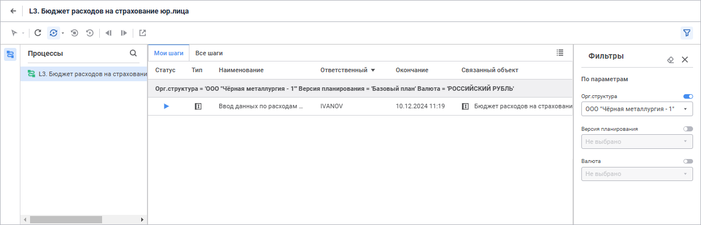

# Управление экземплярами процесса: Веб-приложение

Управление экземплярами процесса: Веб-приложение
-

# Управление экземплярами процесса

	Для управления экземпляром процесса в [мониторинге
	 процесса](../Starting/Monitoring_process_execution.htm) доступна следующая функциональность:

		- [перезапуск
		 экземпляра процесса](process_instance_management.htm#restart);

		- [остановка
		 экземпляра процесса](process_instance_management.htm#stop);

		- [поиск экземпляров
		 процесса](process_instance_management.htm#search);

		- [фильтрация
		 списка экземпляров процесса по параметрам](process_instance_management.htm#filter).

## Перезапуск экземпляра процесса

	Перезапуск экземпляра процесса
	 доступен в [полном
	 мониторинге](../Starting/Monitoring_process_execution.htm#monitoring):

		- Для [ответственного
		 за процесс](../Facility_Agreement/Role_model.htm#curator) и [администратора](../Facility_Agreement/Role_model.htm#admin).

		- Для экземпляров процессов первого уровня иерархии.

	Для перезапуска:

		- Выполните одно из действий:

			- при отображении в рабочей области [списка
			 запущенных экземпляров](../Starting/Starting.htm#legend_monitoring_web) процесса/подпроцесса:

				- Выделите экземпляр процесса, щёлкнув по нему. Доступен
				 множественный выбор экземпляров процесса:

					- для выделения нескольких экземпляров процесса
					 зажмите клавишу CTRL и щёлкайте по требуемым экземплярам
					 процесса;

					- для выделения диапазона экземпляров процесса
					 щёлкните сначала по требуемому экземпляру процесса
					 в начале диапазона и, удерживая зажатой клавишу SHIFT,
					 щёлкните по желаемому экземпляру процесса в конце
					 диапазона.

				- Нажмите кнопку  «Перезапустить»
				 на панели инструментов;

			- при отображении в рабочей области [схемы
			 процесса](../Starting/Starting.htm#legend_monitoring_web) нажмите кнопку  «Перезапустить»
			 на панели инструментов. Перезапуск выполняется для отображаемого
			 экземпляра процесса в рабочей области.

	После выполнения одного из действий будет
	 открыто окно «Перезапуск процесса»:

	

		- При необходимости задайте:

			- срок выполнения процесса, установив флажок «Срок
			 выполнения процесса» и указав дату и время;

			- пояснения в поле «Комментарий
			 к перезапуску».

		- Нажмите кнопку «Перезапустить
		 N процессов», где N - количество перезапускаемых процессов.

	В результате выполнения действий все активные и завершённые шаги
	 будут отклонены, выполнение экземпляра процесса начнется с первого
	 шага.

## Остановка экземпляра процесса

	Остановка выполнения экземпляра процесса доступна в [полном
	 мониторинге](../Starting/Monitoring_process_execution.htm#monitoring):

		- Для [ответственного
		 за процесс](../Facility_Agreement/Role_model.htm#curator) и [администратора](../Facility_Agreement/Role_model.htm#admin).

		- Для экземпляров процессов первого уровня иерархии.

	Для остановки:

		- Выполните одно из действий:

			- при отображении в рабочей
			 области [списка
			 запущенных экземпляров](../Starting/Starting.htm#legend_monitoring_web) процесса/подпроцесса:

				- Выделите экземпляр процесса, щёлкнув по нему. Доступен
				 множественный выбор экземпляров процесса:

					- для выделения нескольких экземпляров процесса
					 зажмите клавишу CTRL и щёлкайте по требуемым экземплярам
					 процесса;

					- для выделения диапазона экземпляров процесса
					 щёлкните сначала по требуемому экземпляру процесса
					 в начале диапазона и, удерживая зажатой клавишу SHIFT,
					 щёлкните по желаемому экземпляру процесса в конце
					 диапазона.

				- Нажмите кнопку  «Остановить» на панели
				 инструментов;

			- при отображении в рабочей
			 области [схемы
			 процесса](../Starting/Starting.htm#legend_monitoring_web) нажмите кнопку  «Остановить» на панели инструментов.
			 Остановка выполняется для отображаемого экземпляра процесса
			 в рабочей области.

	После выполнения одного из действий будет
	 открыто окно «Остановка экземпляров
	 процесса»:

	

		- При необходимости укажите пояснения в поле «Комментарий».

		- Нажмите кнопку «Остановить».

## Поиск экземпляров процесса

	Поиск экземпляров процесса доступен в [полном
	 мониторинге](../Starting/Monitoring_process_execution.htm#monitoring) :

		- При отображении в рабочей области [списка
		 запущенных экземпляров](../Starting/Starting.htm#legend_monitoring_web) процесса/подпроцесса.

		- Выполняется только по отображаемым экземплярам процессов.

	Для поиска экземпляров процесса используйте панель поиска. Для её
	 открытия:

		- нажмите кнопку  «Поиск»
		 на панели инструментов окна мониторинга в [рабочей
		 области при отображении списка экземпляров процесса/подпроцесса](../Starting/Starting.htm#legend_monitoring_web);

		- нажмите сочетание клавиш CTRL+F.

	

	Введите в строку поиска искомый текст. Экземпляры процесса, область
	 поиска которых содержит заданную подстроку, будут иметь цветовую индикацию,
	 а в строке поиска будут отображены порядковый номер найденного соответствия
	 и общее количество найденных соответствий. Первый экземпляр процесса,
	 удовлетворяющий поиску, будет автоматически выбран:

	

	Примечание.
	 При отсутствии соответствия заданной подстроки поиска и экземпляров
	 процесса будет отображено соответствующее сообщение.

	Для настройки параметров поиска:

		- Нажмите кнопку 
		 «Параметры поиска».

		- В раскрывающемся меню задайте настройки:

			- Область
			 поиска. Для выбора области поиска установите флажок:

				- По параметрам.
				 Поиск осуществляется по значениям параметров. По умолчанию
				 флажок установлен;

				- По времени запуска.
				 Поиск осуществляется по дате и времени запуска экземпляра
				 процесса;

			- Дополнительные
			 настройки. Для уточнения поискового запроса установите
			 флажок:

				- Поиск по слову
				 целиком. Поиск осуществляется только по параметрам. При поиске будет учтён
				 регистр введенного текста в строку поиска;

				- Поиск по слову
				 целиком. Поиск осуществляется только по параметрам.

	Примечание.
	 При задании настроек поиска доступна множественная отметка.

	Для перемещения по результатам поиска построчно используйте кнопки
	  «Найти далее»/ 
	 «Найти предыдущее» или клавишу
	 ENTER. Перемещение выполняется циклично.

	Для закрытия панели поиска:

		- нажмите кнопку 
		 «Закрыть»;

		- нажмите кнопку  «Поиск»
		 на панели инструментов окна мониторинга при [отображении
		 в рабочей области списка экземпляров процесса/подпроцесса](../Starting/Starting.htm#legend_monitoring_web);

		- нажмите сочетание клавиш CTRL+F.

	Для сброса результатов поиска:

		- закройте панель поиска;

		- нажмите сочетание клавиш CTRL+А и далее клавишу BACKSPACE;

		- перейдите в [навигатор
		 объектов](GetStarted.chm::/Interface/Interface_Navigator.htm).

## Фильтрация списка экземпляров процесса по
	 параметрам

	Фильтрация списка экземпляров процесса по параметрам доступна:

		- В [полном
		 мониторинге](../Starting/Monitoring_process_execution.htm#monitoring):

			- При отображении в рабочей области [списка
			 запущенных экземпляров](../Starting/Starting.htm#legend_monitoring_web) процесса/подпроцесса.

			- Выполняется по параметрам процесса первого уровня иерархии,
			 параметры второго уровня иерархии в фильтрации не участвуют.

		- В [пользовательском
		 мониторинге](../Starting/Monitoring_process_execution.htm#monitoring_simple) при отображении в рабочей области списка шагов
		 процесса, назначенных пользователю для выполнения, на вкладках
		 «Мои шаги» и «Все
		 шаги» .

	Для фильтрации экземпляров процесса по параметрам:

		- Нажмите кнопку  «Фильтрация»
		 на панели инструментов. Откроется панель «Фильтры»:

		 Полный
		 мониторинг

		 Пользовательский
		 мониторинг

			Окно полного мониторинга со списком запущенных экземпляров
			 процесса:

			

			Окно пользовательского мониторинга со списком шагов процесса,
			 назначенных пользователю для выполнения:

			

		- Выберите параметр, по которому будет выполняться фильтрация.
		 Для этого у выбранного параметра переведите переключатель в активное
		 состояние. Доступна фильтрация по нескольким параметрам.

	При выборе нескольких параметров фильтрация
	 выполняется только для сочетания параметров в экземпляре процесса.

		- Выберите из раскрывающегося списка значение параметра. Доступна
		 множественная отметка значений параметра.

	При выборе нескольких значений в параметре
	 фильтрация выполняется для каждого значения по отдельности, а также
	 для их сочетаний.

	Для быстрого выбора значения параметра
	 воспользуйтесь поиском. Введите текст в поле для поиска. Поиск будет
	 выполняться автоматически по мере ввода текста. В списке будут только
	 те элементы, значения которых содержат вводимый текст.

	В результате применения фильтрации по параметрам в списке экземпляров
	 процесса будут отображаться экземпляры процесса, удовлетворяющие условиям
	 фильтрации:

		 Полный
		 мониторинг

		 Пользовательский
		 мониторинг

			

			

			При переключении между вкладками «Мои
			 шаги» и «Все шаги»
			 настроенные фильтры сохраняются.

	Примечание.
	 При отсутствии экземпляров процесса, соответствующих условиям фильтрации
	 по параметрам, будет отображено соответствующее сообщение.

	При открытой/скрытой панели «Фильтры»
	 для настроенной фильтрации, кнопка «Фильтрация»
	 примет вид: .

	Для исключения параметра из фильтрации переведите переключатель
	 в неактивное состояние.

	Для сброса фильтрации нажмите кнопку  «Очистить
	 фильтры». После чего будут сброшены значения параметров и параметры
	 станут неактивны.

	Для закрытия панели «Фильтры»:

		- нажмите на кнопку  «Закрыть»;

		- нажмите на кнопку  «Фильтрация»
		 на панели инструментов.

	При закрытии панели «Фильтры»
	 настроенная фильтрация экземпляров процесса по параметрам не изменяется.

См. также:

[Мониторинг
 процесса](../Starting/Monitoring_process_execution.htm)

		Справочная
		 система на версию 10.9
		 от 18/08/2025,
		 © ООО «ФОРСАЙТ»,
