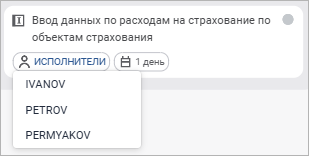

# Назначение ответственного на шаг процесса

Назначение ответственного на шаг процесса
-

# Назначение ответственного на шаг процесса

Назначение [исполнителя](../Facility_Agreement/Role_model.htm#user)
 на выбранный шаг процесса в [полном
 мониторинге](../Starting/Monitoring_process_execution.htm#monitoring) доступно:

	- Для [ответственного
	 за процесс](../Facility_Agreement/Role_model.htm#curator) и [администратора](../Facility_Agreement/Role_model.htm#admin).

	- Если шаг имеет одно из [состояний
	 выполнения](../Starting/Monitoring_process_execution.htm#status): доступен для выполнения, не начат, просрочен, отклонен.

	- Если выбрана группа пользователей в поле «[Ответственный](../Process/StepsProcess/CreateStepsProcess.htm#owner)»
	 на панели параметров шага.

Для назначения ответственного за выполнение шага:

	- Выберите экземпляр процесса в списке запущенных экземпляров
	 в рабочей области полного мониторинга процессов. Отобразится [схема
	 процесса](../Starting/Starting.htm#legend_monitoring_web).

	- Назначьте ответственного на шаг, выбрав его из раскрывающегося
	 списка ответственных за выполнение шага:

Доступен выбор только одного пользователя
 из списка ответственных за выполнение шага.

Примечание.
 Назначение ответственного за выполнение шага выполняется только в открытом
 экземпляре процесса.

После выполнения действий в мониторинге процессов шаг будет доступен
 для выполнения только назначенному пользователю. Если на выполнение шага
 не будет выбран конкретный пользователь, то выполнение шага будет доступно
 любому пользователю из группы ответственных за выполнение шага.

Для очистки поля выбора исполнителя нажмите повторно по выбранному пользователю
 в списке. После чего выполнение шага будет доступно любому пользователю
 из группы, заданной в поле «[Ответственный](../Process/StepsProcess/CreateStepsProcess.htm#owner)»
 на панели параметров выбранного шага, и ответственному за процесс.

См. также:

[Мониторинг
 процесса](../Starting/Monitoring_process_execution.htm)

		Справочная
		 система на версию 10.9
		 от 18/08/2025,
		 © ООО «ФОРСАЙТ»,
