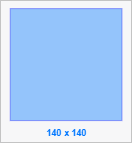

# Редактирование процесса: Веб-приложение

Редактирование процесса: Веб-приложение
-

# Редактирование процесса

Редактирование процесса осуществляется в окне [настройки
 бизнес-процесса](../Starting/Starting.htm#setting_business_process). При редактировании процесса в его состав добавляются
 или удаляются этапы/шаги, а также изменяется последовательность их выполнения.

Для редактирования отдельного шага используйте [панель
 параметров](../Starting/Starting.htm#legend_web) шага.

При редактировании процесса доступны следующие действия:

[Выделение
 элементов процесса](javascript:TextPopup(this))

	Для выделения одного элемента на рабочей области щелкните по нему
	 мышью.

	Для выделения всех элементов на рабочей области используйте сочетание
	 клавиш CTRL+А.

	Для выделения нескольких элементов на рабочей области:

		- зажмите клавишу CTRL и последовательно щёлкните по каждому
		 выделяемому элементу;

		- выберите режим  «Курсор»
		 на панели инструментов и используйте рамку для выделения элементов:

			- Определите группу элементов, которые требуется выделить.

			- Щёлкните и зажмите кнопку мыши за пределами группы выделяемых
			 элементов.

			- Начните перемещать указатель мыши. Будет отображена
			 прямоугольная рамка:

	

			- Перемещайте указатель до тех пор, пока все требуемые
			 элементы не будут помещены в рамку.

			- Отпустите указатель мыши. Все элементы, полностью или
			 частично помещенные в рамку, будут выделены.

[Изменение
 названия процесса](javascript:TextPopup(this))

	Для изменения названия процесса отредактируйте наименование процесса
	 в [главном меню](../Starting/Starting.htm#legend_web).

[Изменение
 названия этапа/шага](javascript:TextPopup(this))

	Для изменения названия этапа/шага дважды щёлкните по наименованию
	 этапа/шага в рабочей области и задайте новое наименование этапа/шага.

	Примечание.
	 Изменение наименования шага возможно также при [редактировании
	 шага](BPM_Edit_Process.htm#editing_step).

[Редактирование
 шага](javascript:TextPopup(this))

	Для редактирования шага [выделите](BPM_Edit_Process.htm#selection)
	 шаг на рабочей области и нажмите кнопку  «Настройки» на панели инструментов.
	 Будет открыта панель параметров, на которой внесите требуемые изменения.

[Изменение
 способа запуска шага: ручной/автоматический](javascript:TextPopup(this))

	Для изменения способа запуска шага:

		- [Выделите](BPM_Edit_Process.htm#selection) шаг
		 на рабочей области и нажмите кнопку  «Настройки» на панели инструментов.
		 Будет открыта панель параметров.

		- На вкладке «Настройки»
		 установите способ запуска шага.

[Копирование
 и вставка шага/этапа](javascript:TextPopup(this))

	Копирование/вставка шага выполняется со всеми [настройками](StepsProcess/CreateStepsProcess.htm#steps_process_firs_page),
	 этапа - со всеми дочерними элементами процесса и их настройками.

	Для копирования и последующей вставки шага/этапа процесса:

		- Выделите шаг/этап в рабочей области, щёлкнув по нему. Доступно
		 [выделение нескольких
		 элементов процесса](BPM_Edit_Process.htm#selection).

	Примечание.
	 Копирование нескольких элементов процесса доступно только для элементов
	 одного типа «Шаг» или «Этап».

		- Выполните команду «Копировать»
		 контекстного меню.

		- Выделите в рабочей области шаг/этап, после которого необходимо
		 вставить скопированный шаг/этап.

		- Выполните команду «Вставить»
		 контекстного меню.

	Примечание.
	 Для операций копирования/вставки доступны стандартные сочетания клавиш:
	 CTRL+C/CTRL+V.

[Изменение
 последовательности этапов/шагов](javascript:TextPopup(this))

	Для изменения последовательности выполнения этапов или шагов процесса
	 [выделите](BPM_Edit_Process.htm#selection) один или несколько
	 этапов/шагов в рабочей области и с помощью механизма Drag&Drop
	 переместите в нужную позицию.

[Удаление
 этапа/шага](javascript:TextPopup(this))

	Для удаления этапа/шага:

		- [Выделите](BPM_Edit_Process.htm#selection) этап/шаг
		 в рабочей области или дереве процессов;

		- Выполните одно из действий:

			- нажмите клавишу DELETE;

			- нажмите кнопку  «Удалить»
			 панели инструментов;

			- выполните команду «Удалить» контекстного меню.

[Включение/отключение
 шага](javascript:TextPopup(this))

	Для включения/отключения шага из выполнения процесса:

		- [Выделите](BPM_Edit_Process.htm#selection) шаг
		 на рабочей области и нажмите кнопку  «Настройки» на панели инструментов.
		 Будет открыта панель параметров.

		- На вкладке «Настройки»
		 снимите/установите флажок «Ислючить
		 из выполнения».

	Фон блока отключенного шага выделяется серым цветом.

См. также:

[Построение
 процесса](Create_process_screenshot.htm) | [Запуск процесса](Start_Process.htm)

		Справочная
		 система на версию 10.9
		 от 18/08/2025,
		 © ООО «ФОРСАЙТ»,
