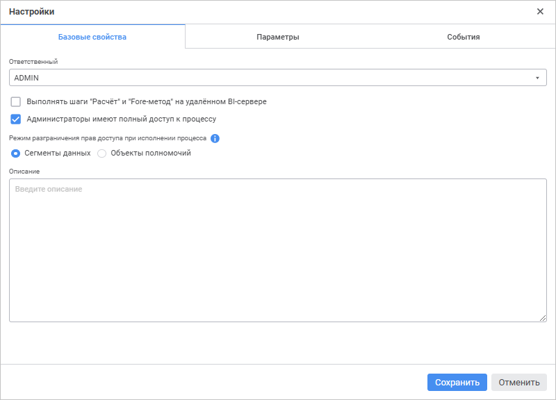

# Настройка базовых свойств: Процесс, веб-приложение

Настройка базовых свойств: Процесс, веб-приложение
-

# Настройка базовых свойств

Настройка базовых свойств процесса выполняется на вкладке «Базовые
 свойства» окна «[Настройки](Setting_Process_Parameters.htm)»:

Задайте параметры:

	- Ответственный.
	 Выберите пользователя/группу пользователей, [ответственного
	 за процесс](../Facility_Agreement/Role_model.htm#curator), в раскрывающемся списке субъектов [менеджера
	 безопасности](admin.chm::/01_RunSecManager/Admin_Organizational_Starting.htm) продукта «Форсайт. Аналитическая платформа».
	 По умолчанию выбран пользователь, являющийся создателем
	 процесса.

Для поиска субъекта в списке субъектов менеджера
 безопасности введите искомый текст в поле. Поиск будет выполняться автоматически
 по мере ввода искомого текста. В списке будут только те субъекты, наименования
 которых содержат вводимый текст. Для очистки строки нажмите клавишу BACKSPACE
 или переоткройте список субъектов менеджера безопасности;

	- Выполнять
	 шаги "Расчёт" и "Fore-метод" на удалённом BI-сервере.
	 Установите флажок для выполнения ресурсоёмких шагов «[Расчёт](StepsProcess/Calculation.htm)»
	 и «[Вызов
	 Fore-метода](StepsProcess/Fore.htm)» на [BI-сервере](Setup.chm::/UiWebSetup/UiWebSetup_TitlePage.htm).
	 По умолчанию флажок снят.

Примечание.
 Адрес BI-сервера задается с помощью флажка «Выполнять
 шаги "Расчёт" и "Fore-метод" на удалённом BI-сервере»
 на странице «[Планировщик](Setting_planner.htm)».

При настройке выполнения ресурсоёмких шагов
 убедитесь, что на [BI-сервере](Setup.chm::/UiWebSetup/UiWebSetup_TitlePage.htm)
 размещён файл [registry.reg](Setup.chm::/UiWebSetup/03_Setup_Web/config_and_setting.htm)
 или [Metabases.xml](Setup.chm::/06_AK_Client_Config/Configuring_repository_list_in_the_system_registry.htm)
 с настройками подключения к репозиториям;

	- Администраторы
	 имеют полный доступ к процессу. Установите флажок для выдачи
	 прав полного доступа пользователям из встроенной группы администраторов
	 на запуск процесса, завершение и отклонение шагов, даже если они не
	 являются ответственными за процесс и/или шаги. При снятом флажке доступ
	 к процессу для пользователей из встроенной группы администраторов
	 запрещён. По умолчанию флажок установлен;

	- Режим
	 разграничения прав доступа при исполнении процесса. Установите
	 переключатель для разграничения прав доступа пользователей или групп
	 пользователей при [запуске процесса](Start_Process.htm)
	 одним из способов:

		- Сегменты данных.
		 Права доступа субъектов безопасности раздаются на отдельные срезы
		 данных куба. Добавление сегментов данных выполняется в [мастере сегментов
		 данных куба](uinavobj.chm::/Cube/segments/segments.htm), настройка взаимодействия процесса
		 с сегментами данных куба - в окне «[Настройки сегментов](../Facility_Agreement/Setting_Segments.htm)»;

		- Объекты полномочий.
		 Используется для поддержки процессов, использующих существующие
		 объекты полномочий, которые были созданы в настольном приложении.

В веб-приложении для разграничения прав доступа
 субъектов безопасности рекомендуется использовать сегменты данных.

Для получения подробной информации о способах
 разграничения прав доступа обратитесь к разделу «[Настройка
 ролевой модели](../Facility_Agreement/Role_model.htm)».

Примечание.
 Выбранный способ разграничения прав доступа применяется только для шагов
 «[Ввод
 данных](StepsProcess/Data_Entry.htm)» и «[Согласование](StepsProcess/Agreement.htm)».

	- Описание. Введите дополнительную
	 информацию о процессе при необходимости.

После настройки базовых свойств процесса выберите справочники в качестве
 параметров процесса на вкладке «[Параметры](Params_control.htm)».

См. также:

[Настройка
 параметров процесса](Setting_Process_Parameters.htm) | [Управление
 параметрами](Params_control.htm) | [Настройка событий](Events.htm)

		Справочная
		 система на версию 10.9
		 от 18/08/2025,
		 © ООО «ФОРСАЙТ»,
