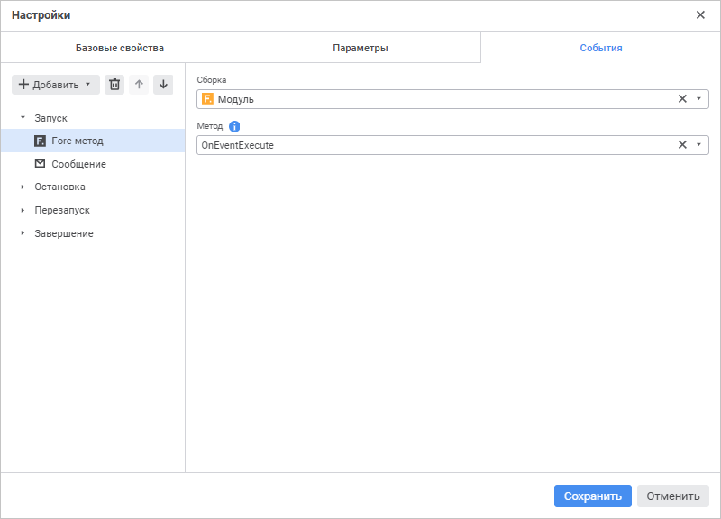
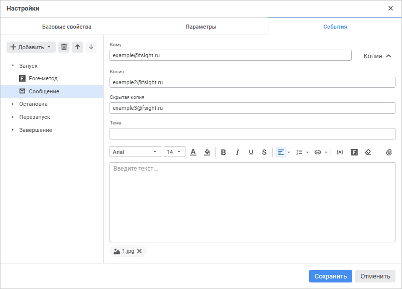

# Настройка событий: Процесс, веб-приложение

Настройка событий: Процесс, веб-приложение
-

# Настройка событий

Настройка событий процесса с автоматически выполняемыми действиями осуществляется
 на вкладке «События» окна «[Настройки](Setting_Process_Parameters.htm)».

Для формирования списка выполняемых действий:

	- Выберите соответствующее событие:

		- Запуск. Список действий
		 будет запускаться при [запуске процесса](Start_Process.htm);

		- Остановка. Список
		 действий будет запускаться при [остановке
		 выполнения шагов процесса](../MonitoringProcess/process_instance_management.htm#stop);

		- Перезапуск. Список
		 действий будет запускаться при [перезапуске
		 шагов процесса](../MonitoringProcess/process_instance_management.htm#restart);

		- Завершение. Список
		 действий будет запускаться при [завершении
		 выполнения процесса](../MonitoringProcess/Manual_mode.htm).

	- Из раскрывающегося меню кнопки  «Добавить»
	 на панели инструментов выберите добавляемое действие:

		-  Fore-метод. Выполнение Fore-метода;

		-  Сообщение. Отправка e-mail сообщения.

Примечание.
 Доступно добавление нескольких действий.

	- Выполните настройку действия.

	 Fore-метод

	 Сообщениие

		

		Задайте обязательные параметры:

			- Сборка. Обязательный
			 параметр для заполнения. В раскрывающемся списке выберите
			 модуль, написанный на языке Fore, список содержит все модули
			 в репозитории и папки, в которых есть модули.

Для быстрого выбора объекта в поле для поиска введите его название/идентификатор/ключ,
 в зависимости от настроек отображения. Поиск будет выполняться автоматически
 по мере ввода текста. Список будет содержать объекты, наименования/идентификаторы/ключи
 которых содержат вводимый текст.

Для настройки отображения объектов репозитория в списке объектов нажмите
 кнопку  «Отображение
 объекта» и выберите в раскрывающемся меню вариант отображения:

	- Наименование. Объекты
	 отображаются под своими наименованиями. Вариант по умолчанию;

	- Идентификатор. Объекты
	 отображаются под своими идентификаторами;

	- Ключ. Объекты отображаются
	 под своими ключами.

Выбрать можно несколько вариантов. Идентификатор и ключ будут указаны
 в скобках;

			- Метод. Обязательный
			 параметр для заполнения. В раскрывающемся списке выберите
			 метод. Список содержит все методы модуля, соответствующие
			 сигнатуре:

		Sub <Наименование Fore-метода>(Sender: IBProcessInstance; Args: IBProcessStepStateEventArgs);

		Параметр:

		Sender.
		 Экземпляр процесса;

		Args.
		 Информация о событии: шаг, старое состояние шага, новое состояние.

		

		Доступные параметры:

		[Кому](javascript:TextPopup(this))

			Обязательный параметр для заполнения.

			Введите адрес электронной почты одного или нескольких основных
			 получателей сообщения через разделитель «;».

		[Копия](javascript:TextPopup(this))

			Необязательный параметр для заполнения.

			Введите адрес электронной почты одного или нескольких получателей
			 для ознакомления с сообщением через разделитель «;».

			Примечание.
			 Для отображения/скрытия параметров «Копия»
			 и «Скрытая копия»
			 нажмите кнопку «Копия».

		[Скрытая
		 копия](javascript:TextPopup(this))

			Необязательный параметр для заполнения.

			Введите адрес электронной почты одного или нескольких получателей
			 для ознакомления с сообщением через разделитель «;». Адрес
			 будет скрыт от других получателей сообщения.

			Примечание.
			 Для отображения/скрытия параметров «Копия»
			 и «Скрытая копия»
			 нажмите кнопку «Копия».

		[Тема](javascript:TextPopup(this))

			Необязательный параметр для заполнения.

			Введите тему письма.

		[Текст
		 сообщения](javascript:TextPopup(this))

			В редакторе текста введите содержание сообщения. При необходимости
			 настройте оформление текста сообщения.

			При работе с текстом сообщения используйте следующие операции:

				- для копирования выделенного текста нажмите сочетание
				 клавиш CTRL+С;

				- для вставки текста нажмите сочетание клавиш CTRL+V;

				- для вырезания выделенного текста нажмите сочетание
				 клавиш CTRL+X;

				- для удаления выделенного текста нажмите клавишу
				 BACKSPASE или DELETE;

				- для очистки форматирования нажмите кнопку  «Очистить
				 форматирование», предварительно выделив текст сообщения.

		Настройки оформления текста сообщения:

		[Шрифт](javascript:TextPopup(this))

			Для настройки оформления шрифта выполните необходимые настройки:

				- Шрифт. Выберите
				 один из доступных стилей шрифта в раскрывающемся списке;

				- Размер шрифта.
				 Установите требуемый размер шрифта. Размер задаётся в
				 пунктах, его можно выбрать из раскрывающегося списка или
				 ввести вручную. Диапазон допустимых значений: [6; 72];

				- Цвет текста.
				 Выберите цвет текста в раскрывающейся палитре, нажав кнопку
				  «Цвет
				 текста»;

				- Цвет фона текста.
				 Выберите цвет заливки текста в раскрывающейся палитре,
				 нажав кнопку 
				 «Цвет фона текста».

		[Начертание](javascript:TextPopup(this))

			Выберите начертание шрифта, нажав соответствующую кнопку:

				- B. Полужирное
				 начертание. Доступно также по нажатию сочетания клавиш
				 CTRL+B;

				- I.
				 Курсивное начертание. Доступно также по нажатию сочетания
				 клавиш CTRL+I;

				- U.
				 Подчёркивание текста. Доступно также по нажатию сочетания
				 клавиш CTRL+U;

				- S.
				 Зачеркивание текста.

		[Выравнивание](javascript:TextPopup(this))

			Выберите способ расположения текста сообщения по горизонтали
			 из раскрывающегося меню кнопки «По левому краю». Кнопка
			 выбора способа расположения текста имеет вид последнего выбранного
			 способа.

			Для выбора доступны:

				- .
				 По левому краю.
				 Текст сообщения прижимается к левой границе редактора.
				 Используется по умолчанию;

				- .
				 По центру. Текст
				 сообщения размещается на равном расстоянии от левой и
				 правой границ редактора;

				- .
				 По правому краю.
				 Текст сообщения прижимается к правой границе редактора;

				- .
				 По ширине. Текст
				 сообщения размещается по ширине редактора.

		[Форматирование
		 списком](javascript:TextPopup(this))

			Выберите тип списка из раскрывающегося меню кнопки «Нумерованный список». Кнопка
			 выбора формата списка имеет вид последнего выбранного списка.

			Для выбора доступны:

				- .
				 Нумерованный список;

				- .
				 Маркированный список.

			Для создания нового элемента списка используйте клавишу
			 ENTER на строке с символами.

			Для отключения формата списка нажмите кнопку  «Нумерованный
			 список»/  «Маркированный
			 список».

			При работе с многоуровневым списком:

				- для перехода с первого уровня вложенности на следующий
				 используйте клавишу TAB на пустой строке;

				- для перехода на предыдущий уровень вложенности используйте
				 клавишу ENTER или BACKSPASE на пустой строке.

		Операции в редакторе текста:

		[Вставка
		 гиперссылки/ссылки на объект](javascript:TextPopup(this))

				- Выделите текст сообщения.

				- Выберите нужную команду из раскрывающегося меню
				 кнопки  «Вставить
				 ссылку». Кнопка выбора имеет вид последней выбранной
				 команды.

			Для выбора доступны:

					-  «Вставить
					 ссылку». Доступно также по нажатию сочетания
					 клавиш CTRL+K. Предназначена для добавления адреса
					 ссылки на требуемый ресурс или объект репозитория.
					 Для этого в открывшемся модальном окне укажите URL-адрес:

			

			Для добавления ссылки на объект
			 репозитория укажите URL-адрес в формате:

			http[s]://<IP-адрес или DNS-имя сервера>:<номер порта>/#/app/obj?key=<ключ объекта>&mode=view&repo=<идентификатор репозитория>

					-  «Вставить
					 объект репозитория». Доступно также по нажатию
					 сочетания клавиш CTRL+L. Предназначена для добавления
					 ссылки на объект репозитория. Для этого в открывшемся
					 модальном окне выберите объект репозитория из раскрывающегося
					 списка, к которому будет осуществляться переход по
					 гиперссылке:

			

			Список объектов отображается
			 в виде дерева со всеми объектами репозитория, которые доступны
			 для выбора, а также содержит поле для поиска объекта. Выбрать
			 можно только один объект.

			Для быстрого выбора объекта репозитория
			 воспользуйтесь поиском. Введите искомый текст в поле для поиска.
			 Поиск будет выполняться автоматически по мере ввода искомого
			 текста. В списке будут только те объекты, наименования которых
			 содержат вводимый текст. Для очистки поля от выбранного объекта
			 нажмите кнопку  «Очистить».

				- Подтвердите действия, нажав кнопку  «Добавить».

			После выполнения действий к выделенному тексту будет добавлена
			 ссылка, указанная в модальном окне. Ссылка на объект репозитория,
			 добавленная командой 
			 «Вставить объект репозитория»,
			 будет преобразована в URL-адрес:

			

			Для редактирования ссылки нажмите кнопку 
			 «Редактировать» модального
			 окна.

			Для удаления ссылки нажмите кнопку 
			 «Удалить» модального
			 окна.

		[Задание
		 подстановки](javascript:TextPopup(this))

			Выберите подстановку в раскрывающемся списке, нажав кнопку
			  «Подстановка».
			 Значения переменных подстановки формируются в зависимости
			 от уникальных параметров каждого экземпляра процесса:

				- @(STEPROLEBACK). Роль предыдущего шага. Тип: строковый;

				- @(STEPNAMEBACK). Наименование предыдущего шага.
				 Тип: строковый;

				- @(STEPROLENEXT). Роль следующего шага. Тип: строковый;

				- @(STEPNAMENEXT). Наименование следующего шага. Тип:
				 строковый;

				- @(STEPNAME). Наименование шага. Тип: строковый;

				- @(PROCESSNAME). Наименование процесса. Тип: строковый;

				- @(PROCESSCUSTOMER). Куратор процесса. Тип: строковый;

				- @(PROCESSSTARTTIME). Время запуска процесса. Тип:
				 дата и время;

				- @(STEPDEADLINE). Крайний срок выполнения шага. Тип:
				 дата и время;

				- @(STEPBACKFINISHUSER). Пользователь, выполнивший
				 предыдущий ручной шаг. Тип: строковый;

				- @(STEPBACKFINISHCOMMENT). Комментарий при выполнении
				 предыдущего ручного шага. Тип: строковый;

				- @(STEPDECLINEUSER). Пользователь, отклонивший ручной
				 шаг. Тип: строковый;

				- @(STEPDECLINECOMMENT). Комментарий при отклонении
				 с ручного шага. Тип: строковый.

		[Прикрепление
		 Fore-обработчика](javascript:TextPopup(this))

				- Нажмите кнопку  «Прикрепить
				 Fore-обработчик». Откроется окно «Прикрепить
				 Fore-обработчик»:

			

				- В открывшемся окне укажите параметры:

					- Сборка.
					 В раскрывающемся списке выберите модуль, написанный
					 на языке Fore. Список содержит все модули в репозитории
					 и папки, в которых есть модули. Доступен поиск по
					 наименованию модуля.

					- Метод.
					 В раскрывающемся списке выберите метод. Список содержит
					 все методы модуля, соответствующие сигнатуре:

			Sub <Наименование Fore-метода>(Sender: IBProcessInstance; Args: IBProcessEmailEventArgs);

			Параметр:

			Sender.
			 Экземпляр процесса;

			Args.
			 Информация о событии: шаг, старое состояние шага, новое
			 состояние.

			Примечание.
			 Если метод в модуле только один, то он автоматически отображается,
			 если методов несколько, то отображается первый метод модуля.

					- Нажмите кнопку «Применить».

		[Прикрепление
		 файла](javascript:TextPopup(this))

			Нажмите кнопку 
			 «Прикрепить». Будет
			 открыто стандартное окно выбора файла.

			Каждый прикрепленный файл отображается ниже поля выбора/редактора
			 текста. Для удаления файла нажмите кнопку 
			 «Удалить», расположенную
			 справа от наименования прикрепленного файла.

Для изменения очерёдности выполнения действий используйте кнопки  «Переместить вверх»
 и  «Переместить вниз»
 на панели инструментов на вкладке «События»,
 для удаления - кнопку 
 «Удалить».

Список автоматически выполняемых действий может быть пустым.

См. также:

[Настройка
 параметров процесса](Setting_Process_Parameters.htm) | [Настройка
 базовых свойств](Basic_properties.htm) | [Управление параметрами](Params_control.htm)

		Справочная
		 система на версию 10.9
		 от 18/08/2025,
		 © ООО «ФОРСАЙТ»,
