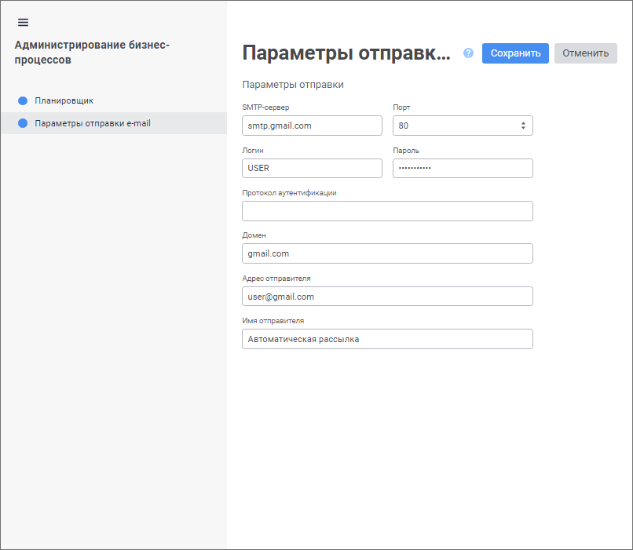

# Настройка параметров отправки e-mail оповещений: Веб-приложение

Настройка параметров отправки e-mail оповещений: Веб-приложение
-

# Настройка параметров отправки e-mail оповещений

Для настройки параметров отправки e-mail оповещений используйте страницу
 «Параметры отправки e-mail» [в мастере
 администрирования бизнес-процессов](Setting_and_administrating_process_parameters.htm).

[Для открытия
 страницы «Параметры отправки e-mail»](javascript:TextPopup(this))

	- Выполните команду 
	 «Администрирование» в контекстном
	 меню компонента «Бизнес-процессы».
	 Будет открыт мастер администрирования бизнес-процессов.

		- Перейдите на страницу «Параметры
		 отправки e-mail».

Задайте параметры отправки e-mail оповещений:

	- SMTP-сервер. Укажите
	 DNS-имя, по которому доступен SMTP-сервер. Поле обязательно для заполнения;

	- Порт. Укажите TCP-порт,
	 по которому доступен SMTP-сервер. Поле обязательно для заполнения;

	- Логин. Введите имя пользователя
	 учётной записи для доступа к SMTP-серверу. Поле обязательно для заполнения;

	- Пароль. Введите пароль
	 пользователя. Поле обязательно для заполнения;

	- Протокол аутентификации.
	 Укажите протокол, используемый для аутентификации пользователя на
	 SMTP-сервере, например: Basic, Digest, NTLM, Kerberos, PLAIN и другие.
	 Список поддерживаемых протоколов можно получить изучив параметры конкретного
	 SMTP-сервера. Если протокол неизвестен, то оставьте поле пустым. В
	 этом случае SMTP-сервер автоматически определит, каким образом будет
	 осуществляться аутентификация пользователя;

	- Домен. Укажите доменное
	 имя SMTP-сервера. Поле обязательно для заполнения;

	- Адрес отправителя. Введите
	 адрес электронной почты для отправки сообщений. Поле обязательно для
	 заполнения;

	- Имя отправителя. Введите
	 имя отправителя оповещения;

После настройки параметров бизнес-процессов нажмите кнопку «Сохранить».

См. также:

[Администрирование
 бизнес-процессов](Setting_and_administrating_process_parameters.htm) | [Настройка
 параметров процесса](Setting_Process_Parameters.htm)

		Справочная
		 система на версию 10.9
		 от 18/08/2025,
		 © ООО «ФОРСАЙТ»,
