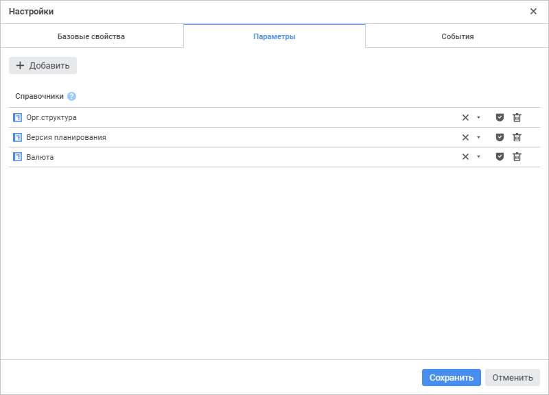

# Настройка параметров: Процесс, веб-приложение

Настройка параметров: Процесс, веб-приложение
-

# Настройка параметров

Формирование параметров процесса выполняется на вкладке «Параметры»
 окна «[Настройки](Setting_Process_Parameters.htm)»:

Сформируйте параметры процесса из справочников, которые будут использоваться
 в качестве параметров. Доступные операции:

[Добавление
 параметров](javascript:TextPopup(this))

	Для добавления справочника в качестве параметра процесса:

		- Нажмите кнопку  «Добавить».
		 В списке параметров появится новая строка.

		- Выберите из раскрывающегося
		 списка «Справочники» требуемый
		 справочник. Поле автоматически заполняется наименованием выбранного
		 справочника.

Для быстрого выбора объекта в поле для поиска введите его название/идентификатор/ключ,
 в зависимости от настроек отображения. Поиск будет выполняться автоматически
 по мере ввода текста. Список будет содержать объекты, наименования/идентификаторы/ключи
 которых содержат вводимый текст.

Для настройки отображения объектов репозитория в списке нажмите кнопку
  «Отображение
 объекта» и выберите в раскрывающемся меню вариант отображения:

	- Наименование. Объекты
	 отображаются под своими наименованиями. Вариант по умолчанию;

	- Идентификатор. Объекты
	 отображаются под своими идентификаторами;

	- Ключ. Объекты отображаются
	 под своими ключами.

Выбрать можно несколько вариантов. Идентификатор и ключ будут указаны
 в скобках.

	После выполнения действий выбранный справочник будет добавлен в
	 список параметров процесса.

	Если при выполнении бизнес-процесса предполагается внесение изменений
	 в справочник, добавленный в бизнес-процесс в качестве параметра, то
	 для корректной работы бизнес-процесса рекомендуется настроить в справочнике
	 режим кеширования по временной отметке. Для этого свойству [IMetabaseObject.CachingMode](kesom.chm::/interface/imetabaseobject/imetabaseobject.cachingmode.htm)
	 справочника требуется установить значение [MetabaseObjectCachingMode.FlushCacheByTimestamp](kesom.chm::/enums/metabaseobjectcachingmode.htm).

	Во избежание порчи данных в справочнике не рекомендуется параллельно
	 запускать несколько бизнес-процессов, при выполнении которых в указанный
	 справочник вносятся изменения.

[Выбор
 ключевого параметра](javascript:TextPopup(this))

	При необходимости разграничения доступа пользователей к экземплярам
	 одного процесса в мониторинге процессов определите ключевой параметр
	 процесса.

	Для задания ключевого параметра процесса нажмите кнопку  «Учитывать
	 права доступа» около требуемого параметра из списка параметров
	 процесса. Только один параметр может быть назначен ключевым.

	Примечание.
	 В качестве ключевого параметра может быть назначен только [справочник
	 НСИ](uinavobj.chm::/reference_book/Master_RDS_reference_book/Master_RDS.htm).

	Если в процессе ключевой параметр задан, то доступ к экземплярам
	 процесса в мониторинге процесса определяется с учётом [роли
	 пользователя](../Facility_Agreement/Role_model.htm#role) и [дискреционных
	 прав](admin.chm::/04_SecurityPolicy/Admin_PermSep_D.htm) на элементы соответствующего справочника,
	 определяющие экземпляры процесса:

		- для предоставления доступа к экземпляру процесса пользователь
		 должен обладать правами [на
		 чтение](admin.chm::/03_admin/admin_adminobjects_discretionary.htm) соответствующего элемента справочника
		 ключевого параметра;

		- если экземпляр процесса определен множественной отметкой
		 ключевого параметра, то для доступа к экземпляру пользователь
		 должен обладать правами [на
		 чтение](admin.chm::/03_admin/admin_adminobjects_discretionary.htm) на все соответствующие элементы справочника-параметра;

		- если экземпляр процесса определяется нулевой отметкой ключевого
		 параметра, то проверка прав доступа по правам на элементы справочника-параметра
		 не выполняется.

	Примечание.
	 Доступ к элементам справочника-параметра выполняется при [настройке
	 справочника НСИ](UiNavObj.chm::/reference_book/Work/Access_Elements.htm).

	Если в процессе ключевой параметр не задан, то экземпляр процесса
	 доступен пользователю[/](../Facility_Agreement/Role_model.htm)группе
	 пользователей, заданному в поле «[Ответственный](StepsProcess/CreateStepsProcess.htm#owner)»
	 на панели параметров активного шага.

[Удаление
 параметров](javascript:TextPopup(this))

	Для удаления параметра процесса нажмите кнопку  «Удалить» в строке требуемого параметра.

После формирования параметров настройте события процесса на странице
 «[События](Events.htm)»
 в настольном приложении при необходимости.

См. также:

[Настройка
 параметров процесса](Setting_Process_Parameters.htm) | [Настройка
 базовых свойств](Basic_properties.htm) | [Настройка событий](Events.htm)

		Справочная
		 система на версию 10.9
		 от 18/08/2025,
		 © ООО «ФОРСАЙТ»,
