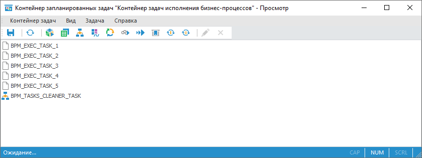
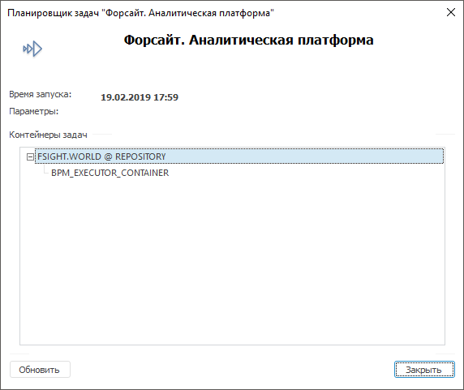

# Настройка серверного исполнения процессов: Веб-приложение

Настройка серверного исполнения процессов: Веб-приложение
-

# Настройка серверного исполнения процессов

Настройка серверного исполнения процессов осуществляется с помощью:

	- инструмента «[Планировщик задач](uiappsrv.chm::/UiAppSrv_purpose.htm)» продукта «Форсайт. Аналитическая платформа»;

	- [мастера
	 администрирования бизнес-процессов](Setting_and_administrating_process_parameters.htm).

Для настройки серверного исполнения:

	- Откройте [мастер
	 администрирования бизнес-процессов](Setting_and_administrating_process_parameters.htm). На странице «[Планировщик](Setting_planner.htm)» установите переключатель
	 «Серверное исполнение» и задайте
	 необходимые параметры.

	- В навигаторе объектов запустите [контейнер запланированных
	 задач](uiappsrv.chm::/Getting_Started.htm) с идентификатором BPM_EXECUTOR_CONTAINER:

Примечание.
 Если контейнер запланированных задач с идентификатором BPM_EXECUTOR_CONTAINER
 отсутствует или пуст, выполните команду «Инициализировать
 контейнер задач» на странице «Отладка»
 диалога «[Настройка
 параметров и администрирование бизнес-процессов](../../Desktop/Process/Setting_and_administrating_process_parameters.htm)» в настольном
 приложении.

	- [Создайте
	 конфигурационный файл](uiappsrv.chm::/1_Work_AppSrv/UiAppSrv_Work_AppSrvXml.htm) для планировщика задач, выполнив
	 команду главного меню «Контейнер
	 задач > Сохранить настройки для планировщика», и разместите
	 сформированный файл:

		- в папке /opt/foresight/fp10.x-biserver/etc
		 в ОС Linux;

		- рядом с исполняемым файлом планировщика на сервере в ОС
		 Windows.

	- Настройте запуск планировщика задач
	 в виде [службы](uiappsrv.chm::/1_Work_AppSrv/UiAppSrv_Work_AppSrv_Service.htm).
	 Если сервер основан на OC Windows, то планировщик задач можно запустить
	 вручную с помощью файла Scheduler.exe из папки с установленным продуктом
	 «Форсайт. Аналитическая платформа».

Важно.
 При [запуске
 нескольких планировщиков задач](uiappsrv.chm::/3_Work_Tasks/UiAppSrv_Run_Parametrs.htm) на разных компьютерах
 или виртуальных машинах убедитесь, что контейнер запланированных задач
 настроен на запуск только в одном планировщике задач. Если в одном планировщике
 задач указаны настройки запуска [нескольких
 контейнеров](uiappsrv.chm::/1_Work_AppSrv/configure_file_manual_extend.htm#config_structure), то запуск данных контейнеров должен выполняться
 в рамках одной базы данных.

В результате будет запущен новый экземпляр
 планировщика задач, настроенный на конфигурационный файл Scheduler.xml.
 Проверьте, что в окне планировщика задач отображается сервер, репозиторий,
 процессы которого будут выполняться на сервере, и контейнер с идентификатором
 BPM_EXECUTOR_CONTAINER:

Примечание.
 В ОС Linux нет поддержки визуального интерфейса просмотра задач.

После выполнения действий будет настроено серверное исполнение процессов.
 Для обеспечения надёжности и автономности исполнения рекомендуется указать
 [планировщик
 задач в качестве службы ОС](uiappsrv.chm::/1_work_appsrv/uiappsrv_work_appsrv_service.htm).

См. также:

[Запуск
 процесса](Start_Process.htm) | [Администрирование
 бизнес-процессов](Setting_and_administrating_process_parameters.htm) | [Настройка планировщика
 бизнес-процессов](Setting_planner.htm)

		Справочная
		 система на версию 10.9
		 от 18/08/2025,
		 © ООО «ФОРСАЙТ»,
