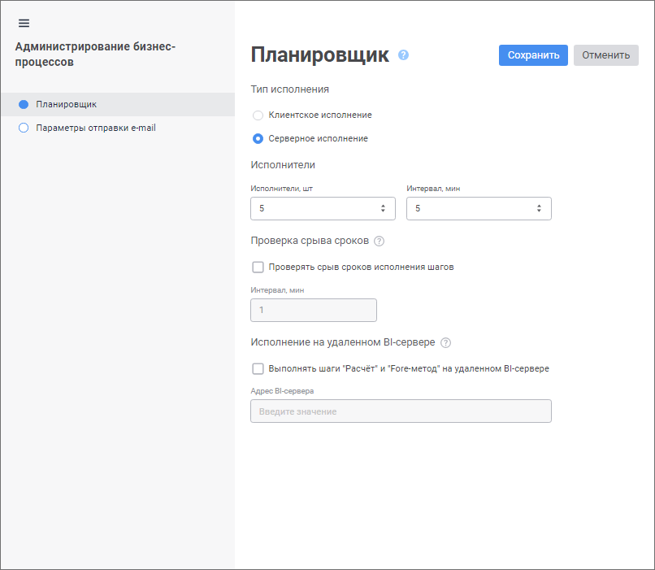

# Администрирование бизнес-процессов: Веб-приложение

Администрирование бизнес-процессов: Веб-приложение
-

# Администрирование бизнес-процессов

Для настройки параметров и администрирования бизнес-процессов используйте
 окно «Администрирование бизнесс процессов».

[Для открытия
 окна](javascript:TextPopup(this))

	Выполните команду  «Администрирование»
	 в контекстном меню компонента «Бизнес-процессы».
	 После выполнения действия будет открыт мастер администрирования бизнес-процессов.

Задайте настройки на страницах:

	- [Планировщик](Setting_planner.htm).
	 Определяется тип исполнения бизнес-процессов, а также задаётся адрес
	 BI-сервера;

	- [Параметры
	 отправки e-mail](Parameters_setting.htm). Задаются параметры отправки e-mail оповещений.

Примечание.
 Настройка параметров на страницах «Планировщик»
 и «Параметры отправки e-mail»
 доступна только пользователям из [группы](Admin.chm::/03_Admin/Groups/Admin_Groups.htm)
 «Администраторы».

После настройки параметров и администрирования бизнес-процессов перейдите
 к [настройке ролевой
 модели](../Facility_Agreement/Role_model.htm).

См. также:

[Настройка
 параметров процесса](Setting_Process_Parameters.htm) | [Настройка параметров
 бизнес-процессов](Parameters_setting.htm) | [Настройка планировщика
 бизнес-процессов](Setting_planner.htm)

		Справочная
		 система на версию 10.9
		 от 18/08/2025,
		 © ООО «ФОРСАЙТ»,
