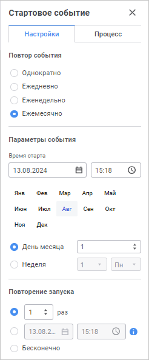
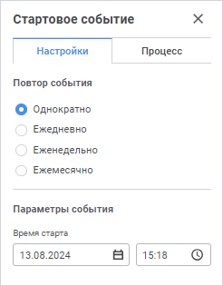
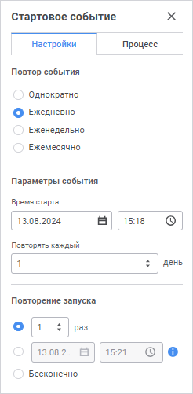
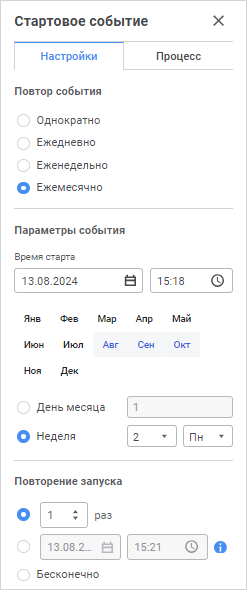
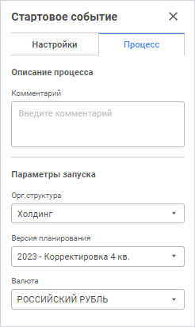

# Настройка стартового события по времени: Веб-приложение

Настройка стартового события по времени: Веб-приложение
-

# Настройка стартового события по времени

Во время построения процесса есть возможность настроить стартовое событие
 по времени, которое позволит автоматически запустить выполнение процесса
 в указанный период. Настроить запуск процесса можно один раз в определенный
 срок, задать временной интервал запуска или период, с которым будет повторяться
 запуск процесса. По наступлении заданного периода времени процесс запускается
 с указанными параметрами и стартовое событие успешно завершается.

Примечание.
 Для выполнения событий убедитесь, что настроено [серверное
 исполнение процессов](Setting_Server_Process_Execution.htm).

Для добавления стартового события в окне «[Настройка
 бизнес-процесса](../Starting/Starting.htm#setting_business_process)» выполните следующие действия:

	- В [рабочей
	 области](../Starting/Starting.htm#legend_web) выделите этап или шаг процесса.

	- На [панели
	 инструментов](../Starting/Starting.htm#legend_web) нажмите кнопку 
	 «Стартовое событие». На рабочую
	 область будет добавлено «Стартовое
	 событие».

Примечание.
 Для настройки стартового события нажмите кнопку  «Настройки» на панели инструментов,
 предварительно выделив его. Будет открыта панель параметров «Стартовое
 событие».

## Запуск процесса по таймеру

Для настройки автоматического запуска процесса по таймеру на панели
 параметров «Стартовое событие»:

	- на вкладке «Настройки»
	 задайте время начала автоматического запуска процесса и определите
	 дополнительные параметры:

Для этого:

		- Задайте дату и время запуска процесса в группе параметров
		 «Параметры событий» в
		 поле «Время старта». Для
		 изменения даты выберите дату в раскрывающемся календаре. Для изменения
		 времени запуска установите значение с клавиатуры.

Примечание.
 При нажатии на кнопку «Сегодня»
 устанавливается текущая дата и время.

		- Определите тип автоматического запуска процесса:

			-  «Однократно».
			 Для запуска процесса на выполнение только один раз задайте
			 дату и время в поле «Время
			 старта»/«Начать»:

			- «Ежедневно».
			 Для запуска процесса на выполнение с периодом один раз в несколько
			 дней:

				- Задайте дату и время запуска процесса в поле «Время старта»/«Начать».

				- В поле «Повторять
				 каждый» выберите интервал в днях, через который
				 будет запускаться процесс.

			-  «Еженедельно».
			 Для запуска процесса на выполнение в определенные дни недели
			 с интервалом в каждые несколько недель:

				- Задайте дату и время запуска процесса в поле «Время старта»/«Начать».

				- В поле «Повторять
				 каждый» выберите интервал в неделях, через который
				 будет запускаться процесс.

				- Отметьте дни недели, в которые будет запускаться
				 процесс.

			-  «Ежемесячно».
			 Для запуска процесса на выполнение с периодом один раз в месяц:

				- Задайте дату и время запуска процесса в поле «Время старта»/«Начать».

				- Выберите месяцы, в
				 которые будет запускаться процесс.

				- Установите один из переключателей:

					- По
					 дням. Выберите день запуска. Процесс будет
					 запускаться в указанный день каждого месяца;

					- По
					 неделям. Выберите порядковый номер недели в
					 месяце и день недели, в который будет запускаться
					 процесс.

		- Установите условие повторного запуска
		 процесса с помощью переключателей:

			- Повторить. Укажите
			 количество раз, которое необходимо запустить процесс;

			- Повторять до.
			 Укажите дату и время остановки выполнения процесса;

			- Повторять бесконечно.
			 Процесс будет повторно запускаться в соответствие с заданными
			 условиями.

Примечание.
 Условия повторного запуска процесса не доступны при выборе типа автоматического
 запуска «Однократно».

	- на вкладке «Процесс»
	 укажите комментарий к процессу и задайте параметры запуска:

		- Комментарий.
		 Вводится при необходимости;

		- Параметры
		 запуска. В области «Параметры
		 запуска» выберите значения каждого из параметров путём
		 отметки элементов в раскрывающихся списках. Множественная отметка
		 которых определяет параметры запускаемого экземпляра. Перечень
		 параметров запуска устанавливается при [настройке
		 параметров процесса](Setting_Process_Parameters.htm).

Примечание.
 Если параметры запуска были отключены, то запускается один экземпляр без
 параметров. Если был отключён параметр запуска, который является [параметром
 разбивки](StepsProcess/Subprocess.htm#splitting_parameter_web) для шага «[Вызов
 подпроцесса](StepsProcess/Subprocess.htm)», то при выполнении процесса шаг будет завершаться без
 запуска подпроцессов.

Стартовое событие появится в самом начале процесса:

Примечание.
 Если для события было настроено [повторение запуска процесса](#repeat)
 более одного раза, до определенного срока или бесконечно, то в правой
 части блока стартового события отобразится значок 
 после запуска процесса.

После сохранения процесс будет запущен в заданный срок с указанными
 параметрами.

См. также:

[Построение
 процесса](Create_process_screenshot.htm) | [Создание
 шагов этапа](StepsProcess/CreateStepsProcess.htm) | [Настройка
 условий выполнения шагов этапа](Setting_up_steps_conditions.htm)

		Справочная
		 система на версию 10.9
		 от 18/08/2025,
		 © ООО «ФОРСАЙТ»,
