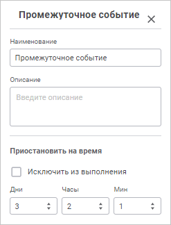

# Настройка промежуточных событий по времени: Веб-приложение

Настройка промежуточных событий по времени: Веб-приложение
-

# Настройка промежуточных событий по времени

Во время построения процесса есть возможность настроить промежуточное
 событие по времени, которое позволит прервать выполнение процесса до истечения
 времени, указанного в настройках события. При активации промежуточного
 события исполнение текущей ветки процесса приостанавливается до истечения
 указанного в событии времени.

Для добавления промежуточного события в окне «[Настройка
 бизнес-процесса](../Starting/Starting.htm#setting_business_process)»:

	- В [рабочей
	 области](../Starting/Starting.htm#legend_web) выделите шаг или этап процесса.

	- На [панели
	 инструментов](../Starting/Starting.htm#legend_web) нажмите кнопку  «Промежуточное
	 событие». На рабочую область будет добавлено «Промежуточное
	 событие».

Для настройки промежуточного события нажмите кнопку  «Настройки» на панели инструментов,
 предварительно выделив его. Будет открыта [панель
 параметров](../Starting/Starting.htm#legend_web) «Промежуточное событие»:

Задайте параметры:

	- Наименование. Введите
	 наименование события;

	- Описание. Вводится при
	 необходимости;

	- Приостановить на время.
	 Введите значение временного интервала, в течение которого выполнение
	 процесса должно быть приостановлено. Интервал может быть задан в днях
	 и/или часах и/или минутах.

Промежуточное событие появится в рабочей области в виде блока аналогичного
 шагам процесса.

В рабочей области мониторинга процессов каждое событие обозначается
 цветом, соответствующем его текущему статусу.

Возможные варианты индикации статусов выполнения:

	- серый фон. Выполнение не начато;

	- синий фон. Таймер события активирован;

	- зелёный фон. Выполнено успешно.

См. также:

[Построение
 процесса](Create_process_screenshot.htm) | [Создание
 шагов этапа](StepsProcess/CreateStepsProcess.htm) | [Настройка
 условий выполнения шагов этапа](Setting_up_steps_conditions.htm)

		Справочная
		 система на версию 10.9
		 от 18/08/2025,
		 © ООО «ФОРСАЙТ»,
