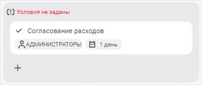
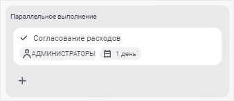
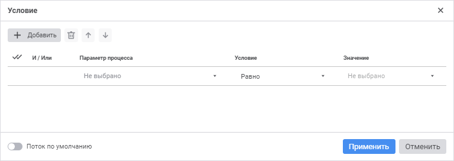
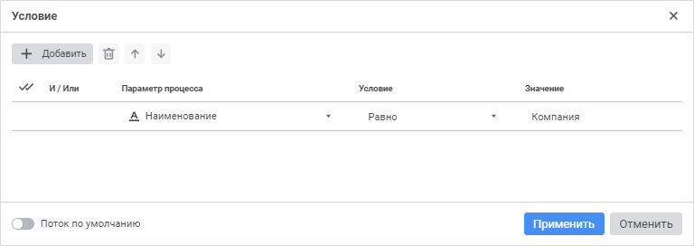

# Настройка условий выполнения шагов этапа: Процесс, веб-приложение

Настройка условий выполнения шагов этапа: Процесс, веб-приложение
-

# Настройка условий выполнения шагов этапа

	После создания шагов этапа можно настроить условия выполнения шагов
	 с помощью шлюза. Шлюз используется для автоматического объединения
	 шагов этапа в группы, состоящие из одного и более шагов. Если
	 этап содержит только один шаг, то шлюз не может быть использован.
	 Для одного этапа можно выбрать только один тип шлюза.

	Для настройки условий выполнения шагов этапа:

		- Выделите шаг.

		- Добавьте [шлюз](#gateway) требуемого типа. При
		 добавлении шлюза автоматически создаются группы шагов.

	Для перемещения шагов из одной группы
	 в другую в рабочей области выделите один или несколько шагов одной
	 из групп этапа со шлюзом и с помощью механизма Drag&Drop переместите
	 в другую группу этого же этапа.

		- При необходимости добавьте [группы
		 шагов](Setting_up_steps_conditions.htm#group).

		- Добавьте [условия](Setting_up_steps_conditions.htm#add)
		 выполнения для группы шагов.

		- [Переименуйте](Setting_up_steps_conditions.htm#rename)
		 условия для описания порядка исполнения процесса.

	В результате для шагов этапа будут настроены условия выполнения.

## Добавление шлюза

	Для использования шлюза выделите шаг процесса в рабочей области
	 [окна настройки
	 бизнес-процесса](../Starting/Starting.htm#setting_business_process) и выберите требуемый тип шлюза из раскрывающегося
	 меню кнопки  «Исключающий шлюз» на панели инструментов.
	 Кнопка выбора шлюза имеет вид последнего выбранного шлюза.

	Доступные типы шлюза:

		-  «Исключающий шлюз». Выполняется
		 последовательная проверка [условий](Setting_up_steps_conditions.htm#add)
		 групп шагов:

			- если условие выполняется, то только одна группа шагов
			 выполняется и процесс переходит к следующему этапу;

			- если условие не выполняется, то проверяется условие
			 следующей группы шагов;

			- если ни одно условие группы шагов не выполняется, то
			 выполняется группа шагов по умолчанию. Если группа шагов по
			 умолчанию не задана, выполнение процесса переходит к следующему
			 этапу.

	При выборе шлюза условие для группы шагов
	 не задано. Группа шагов принимает вид:

	

		-  «Параллельный
		 шлюз». Группы шагов выполняются параллельно.

	При выборе шлюза группа шагов принимает
	 вид:

	

		-  «Включающий шлюз». Выполняется
		 параллельная проверка [условий](Setting_up_steps_conditions.htm#add)
		 групп шагов. Если выполнены несколько условий, то группы шагов
		 выполняются одновременно.

	При выборе шлюза условие для группы шагов
	 не задано. Группа шагов принимает вид:

	

	При создании шлюза «Исключающий
	 шлюз» или «Включающий
	 шлюз» добавьте [условия](Setting_up_steps_conditions.htm#add)
	 для каждой группы шагов. Возможные варианты статусов условий:

		-  «Условия
		 не заданы». Используется при [настройке
		 бизнес-процесса](../Starting/Starting.htm). Условие не задано, запуск процесса невозможен.
		 В настольном приложении при попытке сохранения процесса будет
		 выведено сообщение об ошибке;

	Примечание.
	 Для сохранения промежуточного результата доступно [сохранение
	 процесса](Create_process_screenshot.htm) с шагами ошибочного и/или неполного заполнения настроек.

		- «Условие N», где
		 N - порядковый номер
		 условия. Используется при [настройке
		 бизнес-процесса](../Starting/Starting.htm). Условие задано, при запуске процесса выполняется
		 проверка заданного условия для группы шагов. При необходимости
		 [переименуйте
		 условие](Setting_up_steps_conditions.htm#rename);

		-  «Условие
		 выполнено». Используется при [мониторинге
		 процессов](../Starting/Monitoring_process_execution.htm). Условие выполнено, процесс выполнения переходит
		 к активации шагов в группах с выполненным условием;

		-  «Условие
		 не выполнено». Используется при [мониторинге
		 процессов](../Starting/Monitoring_process_execution.htm). Условие не выполнено, процесс выполнения переходит
		 к проверке условия следующей группы шагов или этапу;

		- «По умолчанию».
		 Используется при [настройке
		 бизнес-процесса](../Starting/Starting.htm) и при [мониторинге
		 процессов](../Starting/Monitoring_process_execution.htm). Группа шагов выполняется только в том случае, если
		 ни одно из условий других групп шагов этапа не было выполнено.
		 Если для группы шагов добавлено условие, то оно не учитывается
		 при использовании статуса «По
		 умолчанию».

	Примечание.
	 Только для одной группы шагов этапа может быть добавлено условие «По умолчанию».

### Изменение типа шлюза

	Для изменения типа добавленного шлюза выделите шаг с настроенным
	 шлюзом и выберите требуемый тип шлюза из раскрывающегося меню кнопки
	  «Исключающий шлюз» на панели инструментов.
	 Кнопка имеет вид последнего выбранного шлюза.

### Удаление шлюза

	Для удаления добавленного шлюза выделите шлюз и выполните одно из
	 действий:

		- нажмите кнопку  «Удалить»
		 на панели инструментов;

		- нажмите клавишу DELETE.

	При отсутствии шлюза шаги этапа выполняются последовательно.

## Добавление групп шагов

	Для добавления группы шагов:

		- Выделите один или несколько шагов любых групп этапа со шлюзом.

		- Нажмите кнопку  «Группа»
		 на панели инструментов.

	В результате будет добавлена группа, включающая выбранные шаги,
	 в конец списка групп этапа со шлюзом.

## Добавление условий для групп шагов

	Для добавления условия группы шагов:

		- Щелкните по условию. В результате будет открыто окно «Условие»:

	

		- Нажмите кнопку  «Добавить».
		 Появится строка параметров условия:

	

		- Задайте параметры:

			- Параметр процесса.
			 Выберите справочник или атрибут справочника, который будет
			 участвовать в условии;

			- Условие. Выберите условие в раскрывающемся
			 списке:

				- Равно;

				- Не равно;

				- Содержит;

				- Не содержит;

				- Содержится в;

				- Не содержится в;

				- Не пересекаются/Не пересекается с;

	Примечание.
	 Набор отображаемых типов условия зависит [типа
	 данных атрибута](UiNavObj.chm::/reference_book/Master_RDS_reference_book/Attributes/Attribute.htm), выбранного в столбце «Параметр
	 подпроцесса».

			- Значение. Задайте
			 значение, которое будет сравниваться со значением параметра
			 процесса. При выборе элементов справочника с настроенными
			 [схемами
			 отметки](UiNavObj.chm::/reference_book/look-and-feel_Reference_book/UiMd_reference_book_look-and-feel_Scheme.htm) доступна возможность применения
			 настроенных схем с помощью команд в контекстном меню элементов
			 справочника;

			- И/Или. Выберите
			 один из логических операторов в раскрывающемся списке, если
			 добавлено несколько условий:

				- И. Если
				 все условия выполняются, то выполняется группа шагов;

				- Или. По
				 умолчанию. Если выполняется хотя бы одно условие, то выполняется
				 группа шагов.

		- При необходимости используйте статус условия «По
		 умолчанию». Для этого установите флажок «Поток
		 по умолчанию».

	Группа шагов «По
	 умолчанию» выполняется, если ни одно из условий других групп
	 шагов этапа не было выполнено. Если для группы шагов добавлено условие,
	 то оно не учитывается при использовании статуса «По
	 умолчанию».

	В результате для группы шагов будут заданы условия выполнения.

### Изменения последовательности выполнения условий

	Для изменения последовательности выполнения условий используйте
	 кнопки  «Вверх» и  «Вниз».

### Удаление условия

	Для удаления одного из условий выделите условие и нажмите кнопку
	  «Удалить».

	Для удаления всех условий:

		- Нажмите кнопку «Выбрать все».

		- Нажмите кнопку  «Удалить»
		 на панели инструментов.

## Переименование условия

	Для переименования условия выполните следующие действия:

		- Дважды щёлкните по наименованию условия в [рабочей
		 области](../Starting/Starting.htm#legend_web).

		- Введите новое наименование условия.

		- Щёлкните за пределами условия.

	После настройки условий выполнения шагов этапа перейдите к симуляции
	 выполнения шагов.

См. также:

[Построение
 процесса](Create_process_screenshot.htm) | [Создание
 шагов этапа](StepsProcess/CreateStepsProcess.htm)

		Справочная
		 система на версию 10.9
		 от 18/08/2025,
		 © ООО «ФОРСАЙТ»,
