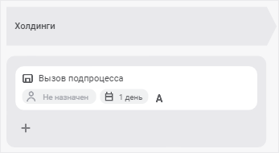
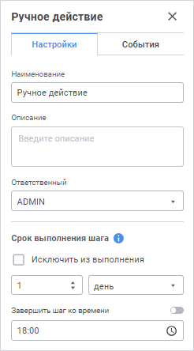
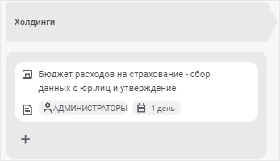

# Создание шагов этапа: Веб-приложение

Создание шагов этапа: Веб-приложение
-

# Создание шагов этапа

Этап процесса может состоять из неограниченного количества последовательных
 или параллельных шагов.

Для добавления шага этапа процесса:

	- в [рабочей области](../../Starting/Starting.htm#legend_web):

		- Нажмите кнопку  «Добавить
		 шаг» под выбранным этапом процесса.

		- В раскрывающемся меню кнопки выберите требуемый тип шага.
		 Новый шаг будет добавлен в конец последовательности шагов этапа:

	- на [панели инструментов](../../Starting/Starting.htm#legend_web)
	 выберите требуемый шаг из раскрывающегося меню кнопки  «Ввод
	 данных» для выделенного этапа процесса или шага этапа. Кнопка
	 выбора шага имеет вид последнего выбранного шага.

Особенности добавления шагов с помощью панели инструментов:

	- если выделен этап процесса, то новый шаг будет добавлен в конец
	 последовательности шагов этапа;

	- если выделен шаг этапа процесса, то новый шаг будет добавлен
	 после выделенного шага этапа.

Для настройки добавленного шага нажмите кнопку  «Настройки» на панели инструментов,
 будет открыта панель параметров, например:

Содержание панели параметров зависит от типа настраиваемого шага. Параметры
 с неполным заполнением настроек, а также с ошибочными данными выделяются
 красным цветом.

Для сохранения промежуточного результата доступно [сохранение
 процесса](../Create_process_screenshot.htm) с шагами ошибочного и/или неполного заполнения настроек.
 Такие шаги в рабочей области выделяются красным цветом.

Примечание.
 [Запуск](../Start_Process.htm) процесса доступен только для
 валидных процессов.

Шаги запускаются на выполнение вручную
 пользователем или автоматически после выполнения предыдущего шага:

	- автоматически: [Вызов
	 Fore-метода](Fore.htm), [Задача
	 ETL](ETL.htm), [Отправка
	 e-mail оповещения](E-mail.htm);

	- вручную: [Ввод
	 данных](Data_Entry.htm), [Согласование](Agreement.htm),
	 [Ручное действие](Manual_Task.htm);

	- способ исполнения устанавливается пользователем при настройке
	 шага или при редактировании процесса через контекстное меню: [Расчёт](Calculation.htm) и [Вызов
	 подпроцесса](Subprocess.htm).

Примечание.
 В рабочей области шаги процесса с автоматическим способом исполнения
 обозначаются пиктограммой .

## Определение базовых свойств шага

Шаги этапа процесса имеют ряд базовых настроек, одинаковых для всех
 типов шагов.

Для определения базовых настроек на панели параметров выделенного шага
 задайте:

	- Наименование. Введите
	 наименование шага;

	- Описание. Введите комментарий,
	 характеризующий шаг, при необходимости. Обозначается пиктограммой
	 .
	 В мониторинге процессов при наведении на пиктограмму  отображается всплывающая
	 подсказка, содержащая текст описания;

	- Ответственный.
	 Поле обязательно для заполнения. Выберите из раскрывающегося списка
	 пользователя/группу пользователей, ответственного за исполнение шага.
	 Для шагов «[Ввод
	 данных](Data_Entry.htm)» и «[Согласование](Agreement.htm)»
	 ответственный должен содержаться в [сегменте
	 данных](../../Facility_Agreement/Setting_Segments.htm) или объекте полномочий, указанном в раскрывающемся списке
	 «Сегмент данных»/«Объект
	 полномочий».

Для быстрого выбора ответственного за исполнение шага используйте фильтрацию
 субъектов в списке субъектов менеджера безопасности. Для этого введите
 искомый текст в поле «Ответственный».
 Поиск будет выполняться автоматически по мере ввода искомого текста. В
 списке будут только те субъекты, наименования которых содержат вводимый
 текст. Для очистки поля нажмите клавишу BACKSPACE или переоткройте список
 субъектов менеджера безопасности;

	Примечание.
	 При составлении списка пользователей для доменных субъектов безопасности
	 будет отображаться описание, если оно имеется. При отсутствии описания
	 отображается наименование доменного субъекта безопасности.  Для
	 корректного отображения описания/наименования может потребоваться
	 [дополнительная
	 настройка](Admin.chm::/03_Admin/communication_with_ad.htm#settings) взаимодействия со службами каталогов:
	 сопоставление атрибута для получения описания descr в файле settings.xml.

	- Срок выполнения шага.
	 Укажите срок, за который должен быть выполнен шаг при исполнении процесса.
	 Срок выполнения отсчитывается с момента активации шага.

Введите числовое значение срока выполнения
 шага и рядом выберите из списка единицу измерения срока: минута, час,
 день (по умолчанию), неделя, месяц, квартал, полугодие, год.

Для исключения шага из выполнения процесса
 установите флажок «Ислючить из выполнения».

Для указания времени, к которому необходимо
 завершить шаг, установите флажок «Завершить
 шаг ко времени». При выборе единиц измерения «минута»
 или «час» поле становится недоступным.

Если шаг не завершён по истечении планового
 срока выполнения, то статус шага становится «Просрочено».

Срок выполнения шагов влияет на срок выполнения
 процесса в целом, который определяется при запуске.

Базовые свойства шага отображаются при добавлении шага в рабочей области
 на схеме процесса:

Примечание.
 Просмотр базовых свойств доступен для [ответственного
 за процесс](../../Facility_Agreement/Role_model.htm#curator) и [администратора](../../Facility_Agreement/Role_model.htm#admin)
 в при отображении схемы процесса в мониторинге.  Для пользователя
 доступна базовая информация только для шага, за исполнение которого является
 [ответственным](../../Facility_Agreement/Role_model.htm#user).

Дальнейшие настройки зависят от выбранного шага:

	- [Ввод данных](Data_Entry.htm);

	- [Расчёт](Calculation.htm);

	- [Согласование](Agreement.htm);

	- [Вызов подпроцесса](Subprocess.htm);

	- [Вызов Fore-метода](Fore.htm);

	- [Задача ETL](ETL.htm);

	- [Отправка e-mail оповещения](E-mail.htm);

	- [Ручное действие](Manual_Task.htm).

После создания шагов процесса перейдите к [настройке
 условий выполнения шагов](../Setting_up_steps_conditions.htm).

См. также:

[Построение
 процесса](../Create_process_screenshot.htm) | Симуляция выполнения шагов процесса

		Справочная
		 система на версию 10.9
		 от 18/08/2025,
		 © ООО «ФОРСАЙТ»,
