# Создание шага «Вызов Fore-метода»: Веб-приложение

Создание шага «Вызов Fore-метода»: Веб-приложение
-

# Создание шага «Вызов Fore-метода»

	Для создания шага по вызову метода Fore:

		- Выделите этап процесса или
		 шаг этапа и выберите шаг  «Fore-метод»
		 из раскрывающегося списка кнопки  «Ввод
		 данных». Кнопка выбора шага имеет вид последнего выбранного
		 шага.

		- В рабочей области выделите
		 созданный шаг «Fore-метод»
		 и нажмите кнопку  «Настройки»
		 на панели инструментов. Будет открыта панель параметров «Вызов Fore-метода»
		 для настройки шага;

	Настройка шага «Fore-метод» состоит
	 из следующих действий:

		- [Настройка базовых свойств
		 и параметров описания шага](Fore.htm#base_settings).

		- [Настройка действий, выполняемых
		 при наступлении события](Fore.htm#events).

	Примечание.
	 Для ускорения выполнения ресурсоёмких расчётов в [настройках
	 процесса](../Basic_properties.htm#calculation_bi_server) установите флажок «Выполнять
	 шаги расчёта и методов Fore на BI-сервере».

После создания
 и настройки шагов процесса перейдите к [настройке
 условий выполнения шагов](../Setting_up_steps_conditions.htm).

## Настройка базовых свойств и параметров
	 описания шага

	Для настройки [базовых
	 свойств](CreateStepsProcess.htm#steps_process_firs_page) и параметров описания шага используйте вкладку «Настройки» панели параметров шага:

	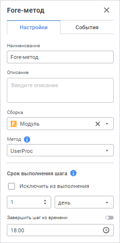

	Задайте параметры:

		- Сборка. Поле обязательно
		 для заполнения. Выберите из раскрывающегося списка Fore-модуль
		 для запуска.

Для быстрого выбора объекта в поле для поиска введите его название/идентификатор/ключ,
 в зависимости от настроек отображения. Поиск будет выполняться автоматически
 по мере ввода текста. Список будет содержать объекты, наименования/идентификаторы/ключи
 которых содержат вводимый текст.

Для настройки отображения объектов репозитория в списке объектов нажмите
 кнопку  «Отображение
 объекта» и выберите в раскрывающемся меню вариант отображения:

	- Наименование. Объекты
	 отображаются под своими наименованиями. Вариант по умолчанию;

	- Идентификатор. Объекты
	 отображаются под своими идентификаторами;

	- Ключ. Объекты отображаются
	 под своими ключами.

Выбрать можно несколько вариантов. Идентификатор и ключ будут указаны
 в скобках;

		- Метод. Поле обязательно
		 для заполнения. Выберите из списка метод Fore-модуля, который
		 требуется выполнить. Список содержит все методы модуля, не содержащие
		 параметры, соответствующие сигнатуре:

	Sub <Наименование Fore-метода>;

## Настройка действий, выполняемых при наступлении
	 события

	Для настройки событий, выполняемых автоматически при запуске выполнения
	 шага или после его завершения, используйте вкладку «События»
	 панели параметров шага:

	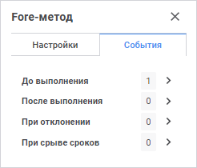

Сформируйте список выполняемых действий:

	- Выберите настраиваемое событие:

		- До
		 выполнения. Список действий будет запускаться перед выполнением
		 текущего шага в указанной последовательности;

		- После
		 выполнения. Список действий будет запускаться после выполнения
		 текущего шага в указанной последовательности;

		- При
		 отклонении. Список действий будет запускаться при отклонении
		 текущего шага. Выбор доступен для шагов с ручным выполнением.
		 Если шаг выполняется автоматически, то вкладка не отображается;

		- При
		 срыве сроков. Список действий будет запускаться при нарушении
		 срока выполнения текущего шага в указанной последовательности.
		 Для выполнения действий:

			- при [серверном
			 исполнении](../../../Desktop/Process/Setting_planner.htm#server) процессов установите флажок «Проверять
			 срыв сроков исполнения шагов» на странице «[Планировщик](../../../Desktop/Process/Setting_planner.htm)»
			 и задайте интервал, с которым будет производиться проверка;

			- при [клиентском
			 исполнении](../../../Desktop/Process/Setting_planner.htm#client) процессов выполните операцию «Проверить
			 срыв сроков» на странице «[Администрирование](../../../Desktop/Process/Administrating.htm)».

	- Из раскрывающегося списка кнопки  «Добавить»
	 на панели инструментов выберите добавляемое действие:

		-  Fore-метод.
		 Выполнение Fore-метода;

		-  Сообщение.
		 Отправка e-mail сообщения.

Примечание.
 Доступно добавление нескольких действий.

	- Выполните настройку действия.

Для изменения очерёдности выполнения действий используйте кнопки  «Переместить вверх»
 и  «Переместить вниз»
 на панели инструментов на вкладке «События»,
 для удаления - кнопку  «Удалить».

Список автоматически выполняемых действий может быть пустым.

### Настройка действия «Fore-метод»

Для настройки выполнения Fore-метода определите обязательные параметры
 на [панели параметров](../../Starting/Starting.htm#legend_web)
 выбранного события:

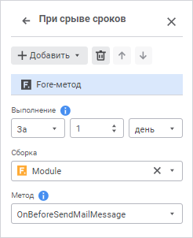

Доступные параметры:

[Выполнение](javascript:TextPopup(this))

	Задайте время выполнения до/после срыва срока. Для этого:

	Примечание.
	 Задание времени выполнения доступно только для события «При
	 срыве срока».

		- В раскрывающемся списке выберите
		 тип выполнения действия:

			- За. Действие
			 будет выполнено за установленный промежуток времени до срыва
			 сроков. Установлено по умолчанию.

			- Через. Действие
			 будет выполнено при истечении установленного временного промежутка
			 после срыва сроков;

		- Укажите временной промежуток.
		 По умолчанию установлено значение 0.

		- В раскрывающемся списке выберите
		 единицы измерения. Список содержит значения: Минута, Час, День,
		 Неделя, Месяц. По умолчанию установлено значение «Минута».

[Сборка](javascript:TextPopup(this))

	Обязательный параметр для заполнения.

	В раскрывающемся списке выберите модуль, написанный на языке Fore,
	 список содержит все модули в репозитории и папки, в которых есть модули.
	 Доступен поиск по наименованию модуля.

[Метод](javascript:TextPopup(this))

	Обязательный параметр для заполнения.

	В раскрывающемся списке выберите метод. Список содержит все методы
	 модуля, соответствующие сигнатуре:

	Sub <Наименование Fore-метода>(Sender: IBProcessInstance; Args: IBProcessStepStateEventArgs);

	Параметр:

	Sender.
	 Экземпляр процесса;

	Args.
	 Информация о событии: шаг, старое состояние шага, новое состояние.

### Настройка действия «Сообщение»

Для настройки отправки e-mail сообщения определите обязательные параметры
 на [панели параметров](../../Starting/Starting.htm#legend_web)
 выбранного события или в окне «Сообщение».
 Используйте окно «Сообщение» для
 создания и редактирования сложноформатированного текста сообщения.

[Для открытия
 окна](javascript:TextPopup(this))

	Нажмите кнопку 
	 «В модальном окне» около добавляемого
	 действия  «Сообщение».

	 Вкладка
	 «События» панели параметров

	 Окно
	 «Сообщение»

		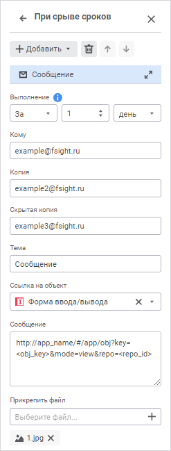

		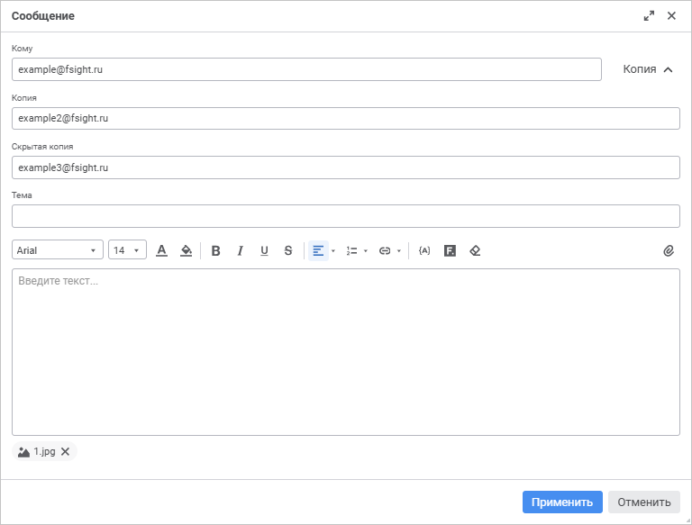

		После определения параметров сообщения нажмите кнопку «Применить».

Доступные параметры:

[Выполнение](javascript:TextPopup(this))

	Задайте время выполнения до/после срыва срока на панели параметров
	 шага. Для этого:

	Примечание.
	 Задание времени выполнения доступно только для события «При
	 срыве срока» на панели параметров.

		- В раскрывающемся списке выберите тип выполнения действия:

			- За. Действие
			 будет выполнено за установленный промежуток времени до срыва
			 сроков. Установлено по умолчанию.

			- Через. Действие
			 будет выполнено при истечении установленного временного промежутка
			 после срыва сроков;

		- Укажите временной промежуток.
		 По умолчанию установлено значение 0.

		- В раскрывающемся списке выберите
		 единицы измерения. Список содержит значения: Минута, Час, День,
		 Неделя, Месяц. По умолчанию установлено значение «Минута».

[Кому](javascript:TextPopup(this))

	Обязательный параметр для заполнения.

	Введите адрес электронной почты одного или нескольких основных получателей
	 сообщения через разделитель «;».

[Копия](javascript:TextPopup(this))

	Необязательный параметр для заполнения.

	Введите адрес электронной почты одного или нескольких получателей
	 для ознакомления с сообщением через разделитель «;».

	Примечание.
	 В окне «Сообщение» для отображения/скрытия
	 параметров «Копия» и «Скрытая копия» нажмите кнопку «Копия».

[Скрытая копия](javascript:TextPopup(this))

	Необязательный параметр для заполнения.

	Введите адрес электронной почты одного или нескольких получателей
	 для ознакомления с сообщением через разделитель «;». Адрес будет скрыт
	 от других получателей сообщения.

	Примечание.
	 В окне «Сообщение» для отображения/скрытия
	 параметров «Копия» и «Скрытая копия» нажмите кнопку «Копия».

[Тема](javascript:TextPopup(this))

	Необязательный параметр для заполнения.

	Введите тему письма.

[Текст сообщения](javascript:TextPopup(this))

	Выполните одно из действий:

		- на [панели
		 параметров](../../Starting/Starting.htm#legend_web) в поле «Сообщение»
		 введите содержание сообщения;

		- в окне «Сообщение»
		 в редакторе текста введите содержание сообщения. При необходимости
		 настройте оформление текста сообщения.

	При работе с текстом сообщения используйте следующие операции:

		- для копирования выделенного текста нажмите сочетание клавиш
		 CTRL+С;

		- для вставки текста нажмите сочетание клавиш CTRL+V;

		- для вырезания выделенного текста нажмите сочетание клавиш
		 CTRL+X;

		- для удаления выделенного текста нажмите клавишу BACKSPASE
		 или DELETE.

Настройки оформления текста:

[Шрифт](javascript:TextPopup(this))

	Для настройки оформления шрифта в окне «Сообщение»
	 выполните необходимые настройки:

		- Шрифт. Выберите
		 один из доступных стилей шрифта в раскрывающемся списке;

		- Размер шрифта. Установите
		 требуемый размер шрифта. Размер задаётся в пунктах, его можно
		 выбрать из раскрывающегося списка или ввести вручную. Диапазон
		 допустимых значений: [6; 72];

		- Цвет текста. Выберите
		 цвет текста в раскрывающейся палитре, нажав кнопку  «Цвет
		 текста»;

		- Цвет фона текста.
		 Выберите цвет заливки текста в раскрывающейся палитре, нажав кнопку
		  «Цвет фона
		 текста».

[Начертание](javascript:TextPopup(this))

	Выберите начертание шрифта в окне «Сообщение»,
	 нажав соответствующую кнопку:

		- B. Полужирное начертание.
		 Доступно также по нажатию сочетания клавиш CTRL+B;

		- I.
		 Курсивное начертание. Доступно также по нажатию сочетания клавиш
		 CTRL+I;

		- U.
		 Подчёркивание текста. Доступно также по нажатию сочетания клавиш
		 CTRL+U;

		- S.
		 Зачеркивание текста.

[Выравнивание](javascript:TextPopup(this))

	Выберите способ расположения текста сообщения по горизонтали из
	 раскрывающегося меню кнопки «По левому краю» в окне «Сообщение».
	 Кнопка выбора способа расположения текста имеет вид последнего выбранного
	 способа.

	Для выбора доступны:

		- . По
		 левому краю. Текст сообщения прижимается к левой границе
		 редактора. Используется по умолчанию;

		- . По
		 центру. Текст сообщения размещается на равном расстоянии
		 от левой и правой границ редактора;

		- . По
		 правому краю. Текст сообщения прижимается к правой границе
		 редактора;

		- . По
		 ширине. Текст сообщения размещается по ширине редактора.

[Форматирование
 списком](javascript:TextPopup(this))

	Выберите тип списка из раскрывающегося меню кнопки 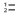«Нумерованный
	 список» в окне «Сообщение».
	 Кнопка выбора формата списка имеет вид последнего выбранного списка.

	Для выбора доступны:

		- . Нумерованный
		 список;

		- . Маркированный
		 список.

	Для создания нового элемента списка используйте клавишу ENTER на
	 строке с символами.

	Для отключения формата списка нажмите кнопку 
	 «Нумерованный список»/  «Маркированный список».

	При работе с многоуровневым списком:

		- для перехода с первого уровня вложенности на следующий используйте
		 клавишу TAB на пустой строке;

		- для перехода на предыдущий уровень вложенности используйте
		 клавишу ENTER или BACKSPASE на пустой строке.

Доступные операции:

[Вставка гиперссылки/ссылки
 на объект](javascript:TextPopup(this))

	Выполните одно из действий:

		- на [панели
		 параметров](../../Starting/Starting.htm#legend_web) шага в раскрывающемся списке «Ссылка
		 на объект» выберите объект репозитория, на который будет
		 добавлена ссылка. Доступны для выбора: алгоритм, регламентный
		 отчёт, форма ввода. Доступен выбор нескольких объектов. При выборе
		 объекта в поле «Сообщение»
		 подставляется URL веб-приложения в формате «https://app_name/#/app/obj?key=<obj_key>&mode=view&repo=<repo_id>»,
		 где app_name - имя открытого
		 веб-приложения, repo_id
		 - идентификатор текущего репозитория, obj_key
		 - ключ выбранного объекта;

		- в окне «Сообщение»:

			- Выделите текст сообщения.

			- Выберите нужную команду из раскрывающегося меню кнопки
			  «Вставить
			 ссылку». Кнопка выбора имеет вид последней выбранной
			 команды.

	Для выбора доступны:

				- 
				 «Вставить ссылку».
				 Доступно также по нажатию сочетания клавиш CTRL+K. Предназначена
				 для добавления адреса ссылки на требуемый ресурс или объект
				 репозитория. Для этого в открывшемся модальном окне укажите
				 URL-адрес:

	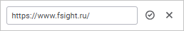

	Для добавления ссылки на объект репозитория
	 укажите URL-адрес в формате:

	http[s]://<IP-адрес или DNS-имя сервера>:<номер порта>/#/app/obj?key=<ключ объекта>&mode=view&repo=<идентификатор репозитория>

				- 
				 «Вставить объект репозитория».
				 Доступно также по нажатию сочетания клавиш CTRL+L. Предназначена
				 для добавления ссылки на объект репозитория. Для этого
				 в открывшемся модальном окне выберите объект репозитория
				 из раскрывающегося списка, к которому будет осуществляться
				 переход по гиперссылке:

	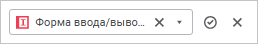

	Список объектов отображается в виде
	 дерева со всеми объектами репозитория, которые доступны для выбора,
	 а также содержит поле для поиска объекта. Выбрать можно только один
	 объект.

	Для быстрого выбора объекта репозитория
	 воспользуйтесь поиском. Введите искомый текст в поле для поиска. Поиск
	 будет выполняться автоматически по мере ввода искомого текста. В списке
	 будут только те объекты, наименования которых содержат вводимый текст.
	 Для очистки поля от выбранного объекта нажмите кнопку  «Очистить».

			- Подтвердите действия, нажав кнопку 
			 «Добавить».

	После выполнения действий к выделенному
	 тексту будет добавлена ссылка, указанная в модальном окне. Ссылка
	 на объект репозитория, добавленная командой 
	 «Вставить объект репозитория»,
	 будет преобразована в URL-адрес:

	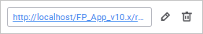

	Для редактирования ссылки нажмите кнопку
	  «Редактировать»
	 модального окна.

	Для удаления ссылки нажмите кнопку 
	 «Удалить» модального окна.

[Задание подстановки](javascript:TextPopup(this))

	Выберите подстановку в раскрывающемся списке, нажав кнопку 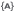 «Подстановка»
	 в окне «Сообщение». Значения
	 переменных подстановки формируются в зависимости от уникальных параметров
	 каждого экземпляра процесса:

		- @(STEPROLEBACK). Роль предыдущего шага. Тип: строковый;

		- @(STEPNAMEBACK). Наименование предыдущего шага. Тип: строковый;

		- @(STEPROLENEXT). Роль следующего шага. Тип: строковый;

		- @(STEPNAMENEXT). Наименование следующего шага. Тип: строковый;

		- @(STEPNAME). Наименование шага. Тип: строковый;

		- @(PROCESSNAME). Наименование процесса. Тип: строковый;

		- @(PROCESSCUSTOMER). Куратор процесса. Тип: строковый;

		- @(PROCESSSTARTTIME). Время запуска процесса. Тип: дата и
		 время;

		- @(STEPDEADLINE). Крайний срок выполнения шага. Тип: дата
		 и время;

		- @(STEPBACKFINISHUSER). Пользователь, выполнивший предыдущий
		 ручной шаг. Тип: строковый;

		- @(STEPBACKFINISHCOMMENT). Комментарий при выполнении предыдущего
		 ручного шага. Тип: строковый;

		- @(STEPDECLINEUSER). Пользователь, отклонивший ручной шаг.
		 Тип: строковый;

		- @(STEPDECLINECOMMENT). Комментарий при отклонении с ручного
		 шага. Тип: строковый.

[Прикрепление
 файла](javascript:TextPopup(this))

	Выполните одно из действий:

		- на панели параметров шага в поле «Прикрепить
		 файл» нажмите кнопку 
		 «Добавить». Будет открыто
		 стандартное окно выбора файла;

		- в окне «Сообщение»
		 нажмите кнопку 
		 «Прикрепить». Будет открыто
		 стандартное окно выбора файла.

	Каждый прикрепленный файл отображается ниже поля выбора/редактора
	 текста. Для удаления файла нажмите кнопку  «Удалить», расположенную справа от
	 наименования прикрепленного файла.

[Прикрепление
 Fore-обработчика](javascript:TextPopup(this))

	В окне «Сообщение» доступно
	 прикрепление Fore-обработчика. Для этого:

		- Нажмите кнопку 
		 «Прикрепить Fore-обработчик».
		 Откроется окно «Прикрепить Fore-обработчик»:

	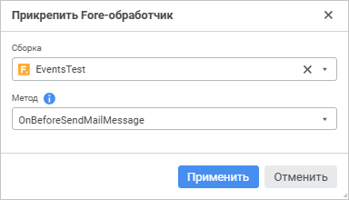

		- В открывшемся окне укажите параметры:

			- Сборка. В раскрывающемся
			 списке выберите модуль, написанный на языке Fore. Список содержит
			 все модули в репозитории и папки, в которых есть модули. Доступен
			 поиск по наименованию модуля.

			- Метод. В раскрывающемся
			 списке выберите метод. Список содержит все методы модуля,
			 соответствующие сигнатуре:

	Sub <Наименование Fore-метода>(Sender: IBProcessInstance; Args: IBProcessEmailEventArgs);

	Параметр:

	Sender.
	 Экземпляр процесса;

	Args.
	 Информация о событии: шаг, старое состояние шага, новое состояние.

	Примечание.
	 Если метод в модуле только один, то он автоматически отображается,
	 если методов несколько, то отображается первый метод модуля.

			- Нажмите кнопку «Применить».

См. также:

[Создание
 шагов этапа](CreateStepsProcess.htm)

		Справочная
		 система на версию 10.9
		 от 18/08/2025,
		 © ООО «ФОРСАЙТ»,
