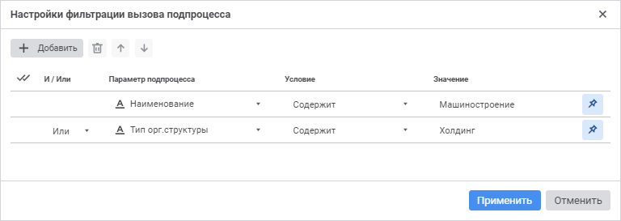

# Настройка условий вызова подпроцессов: Веб-приложение

Настройка условий вызова подпроцессов: Веб-приложение
-

# Настройка условий вызова подпроцессов

Для фильтрации запуска подпроцессов по атрибутам [параметра
 разбивки](Subprocess.htm#splitting_parameter_web) или его отдельным значениям настройте условия вызова подпроцессов.

При изменении [параметра
 разбивки](Subprocess.htm#splitting_parameter_web) условия вызова подпроцесса изменятся:

	- если условия были ранее заданы для выбранного параметра разбивки,
	 то они будут применены;

	- если условия не были заданы для выбранного параметра разбивки,
	 то область будет пустой.

Для создания и настройки условий вызова подпроцессов используйте окно
 «Настройки фильтрации вызова подпроцесса»:

[Для открытия
 окна](javascript:TextPopup(this))

	Для открытия окна «Настройка фильтрации
	 вызова подпроцесса»:

		- В рабочей области выделите шаг «Вызов
		 подпроцесса».

		- Нажмите кнопку  «Настройки»
		 на панели инструментов. Будет открыта панель параметров «Вызов подпроцесса» для настройки
		 шага.

		- Перейдите на вкладку «Связь»
		 панель параметров «Вызов подпроцесса».

		- Нажмите кнопку  «Фильтр».

Для добавления условия вызова подпроцесса нажмите кнопку  «Добавить»
 на панели инструментов.

Для изменения последовательности выполнения условий используйте кнопки
  «Вверх»/ «Вниз» на панели инструментов, выделив
 флажком необходимое условие.

Для удаления одного из условий выделите флажком необходимое условие
 и нажмите кнопку  «Удалить»
 на панели инструментов.

Для удаления всех условий:

	- Нажмите кнопку «Выбрать
	 все».

	- Нажмите кнопку  «Удалить»
	 на панели инструментов.

Для настройки условий вызова подпроцессов задайте следующие параметры:

	- Параметр подпроцесса.
	 Выберите справочник или атрибут справочника, который будет участвовать
	 в условии;

	- Условие.
	 Выберите условие сравнения параметра подпроцесса со значением
	 в раскрывающемся списке:

		- Равно;

		- Не равно;

		- Содержит;

		- Не содержит;

		- Содержится в;

		- Не содержится в;

		- Не пересекается с;

Примечание.
 Набор отображаемых типов условия зависит [типа
 данных атрибута](UiNavObj.chm::/reference_book/Master_RDS_reference_book/Attributes/Attribute.htm), выбранного в столбце «Параметр
 подпроцесса».

	- Значение. Задайте значение
	 или параметр процесса, которые будут сравниваться со значением параметра
	 подпроцесса.

Для ограничения перечня доступных значений
 при задании условия параметра подпроцесса нажмите кнопку «Зафиксировать»:

		- если в поле «Параметр подпроцесса»
		 выбран справочник, то в поле «Значение»
		 для выбора доступен список элементов справочника-параметра подпроцесса.
		 Поле «Значение» не может
		 быть пустым;

		- если в поле «Параметр подпроцесса»
		 выбран атрибут справочника, то в поле «Значение»
		 доступен ввод значений типа, соответствующего атрибуту. Поле «Значение» может быть пустым,
		 если фиксируется значение строкового атрибута.

Примечание.
 По умолчанию кнопка «Зафиксировать»
 нажата.

Для отключения ограничения перечня доступных
 значений при задании условия параметра подпроцесса отожмите кнопку «Зафиксировать».
 Тогда при выборе справочника/атрибута справочника в поле «Параметр
 подпроцесса», в поле «Значение»
 будет доступен список справочников/справочников с атрибутами соответственно;

	- И/Или. Если добавлено
	 несколько условий, выберите один из логических операторов в раскрывающемся
	 списке:

		- И. Запускаются подпроцессы,
		 удовлетворяющие всем условиям фильтрации;

		- Или. Используется
		 по умолчанию. Запускаются подпроцессы, удовлетворяющие одному
		 из условий фильтрации. Проверка условий выполняется последовательно.

Если ни одно условие фильтрации не выполняется,
 то при выполнении процесса шаг будет завершаться без запуска подпроцессов.

См. также:

[Создание
 шага «Вызов подпроцесса»](Subprocess.htm) | [Выполнение
 шагов подпроцесса](../../MonitoringProcess/Executing_Subprocess.htm)

		Справочная
		 система на версию 10.9
		 от 18/08/2025,
		 © ООО «ФОРСАЙТ»,
