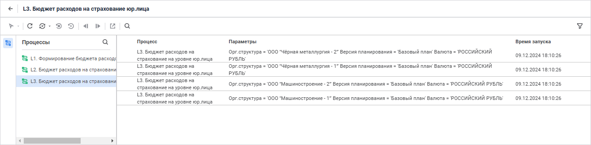
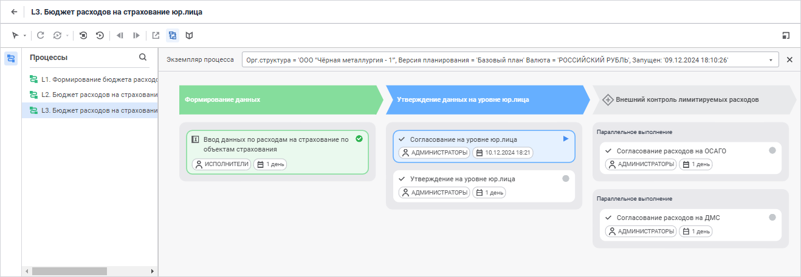
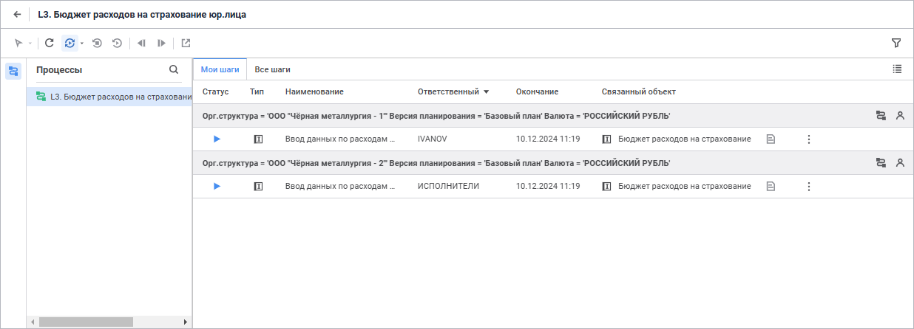
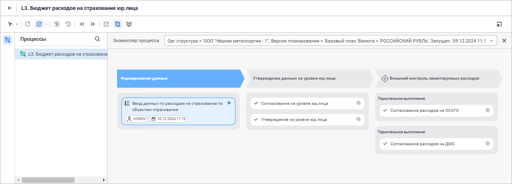

# Мониторинг процесса: Веб-приложение

Мониторинг процесса: Веб-приложение
-

# Мониторинг процесса

Окно мониторинга процессов расширения «Управление
 бизнес-процессами» содержит все запущенные экземпляры процессов,
 доступные пользователю. Под экземпляром
 процесса понимается процесс, запущенный с определёнными значениями параметров.
 Количество запущенных экземпляров не ограничено. Для наглядного отображения
 [статусов выполнения](Monitoring_process_execution.htm#status)
 этапов/шагов экземпляра процесса используется соответствующая цветовая
 индикация.

[Для открытия
 окна мониторинга](javascript:TextPopup(this))

		- в [навигаторе
		 объектов](GetStarted.chm::/Interface/Interface_Navigator.htm) выделите процесс и выполните одно
		 из действий:

			- выполните команду «Открыть»
			 в контекстном меню процесса;

			- выполните команду «Открыть
			 в новой вкладке» в контекстном меню процесса;

			- выполните команду «Открыть
			 в новом окне» в контекстном меню процесса;

			- дважды щёлкните по процессу;

			- нажмите клавишу ENTER;

		- в [окне
		 настройки бизнес-процесса](Starting.htm#setting_business_process) нажмите кнопку 
		 «Перейти к мониторингу»
		 в главном меню.

	Примечание.
	 Мониторинг процесса в веб-интерфейсе также доступен с помощью расширения
	 «[Конструктор бизнес-приложений](Constructor.chm::/Intro/Designer_business_applications.htm)».

[Для
 открытия мониторинга с помощью расширения «Конструктор
 бизнес-приложений» в веб-приложении](javascript:TextPopup(this))

			- в репозитории необходимо наличие созданного [бизнес-приложения](Constructor.chm::/Intro/Designer_business_applications.htm);

			- в поле targetRepo файла настроек бизнес-приложения [DBA.config](Setup.chm::/Extensions/Configuration_Designer_of_Business_Applications.htm#dba_config_json)
			 требуется указать репозиторий, в котором находятся бизнес-процесс
			 и бизнес-приложение. Тот же репозиторий должен быть указан
			 в поле targetRepo файла настроек веб-приложения [config.json](Setup.chm::/UiWebSetup/03_Setup_Web/PP_config_Java.htm#config_json);

			- адреса, указанные в поле serviceUrl файла настроек веб-приложения
			 [config.json](Setup.chm::/UiWebSetup/03_Setup_Web/PP_config_Java.htm#config_json)
			 и в поле ppServiceUrl файла настроек бизнес-приложения [DBA.config](Setup.chm::/Extensions/Configuration_Designer_of_Business_Applications.htm#dba_config_json),
			 должны совпадать;

			- в файле настроек веб-приложения [config.json](Setup.chm::/UiWebSetup/03_Setup_Web/PP_config_Java.htm#config_json)
			 требуется добавить строку:

	"kbpUrl":
	 "http://<IP-адрес бизнес-приложения>:<TCP-порт бизнес-приложения>/dba"

[Вид мониторинга](Monitoring_process_execution.htm#monitoring)
 процесса и набор запущенных экземпляров процесса в нём может отличаться
 в зависимости от [настроек
 ролевой модели процесса](../Facility_Agreement/Role_model.htm):

	- Полный
	 мониторинг. Предоставляет пользователю полную функциональность
	 управления и контроля выполнения процесса. Доступен [ответственному
	 за процесс](../Facility_Agreement/Role_model.htm#curator) и [администратору](../Facility_Agreement/Role_model.htm#admin),
	 а также [ответственному
	 за выполнение шага процесса](../Facility_Agreement/Role_model.htm#user) при работе с репозиторием, созданном
	 на базе СУБД Oracle;

	- Пользовательский
	 мониторинг. Предоставляет пользователю информацию о шагах,
	 которые назначены ему для выполнения, а также возможность работы с
	 ними. Доступен [ответственному
	 за выполнение шага](../Facility_Agreement/Role_model.htm#user) при работе с репозиторием, созданном на базе
	 СУБД Microsoft SQL Server, PostgreSQL/Postrgres Pro.

	 Полный
	 мониторинг

	 Пользовательский
	 мониторинг

		Окно полного мониторинга со списком запущенных
		 экземпляров процесса:

		

		Окно полного мониторинга со схемой бизнес-процесса:

		

		В окне полного мониторинга со схемой бизнес-процесса доступен
		 просмотр [базовых
		 свойств](../Process/StepsProcess/CreateStepsProcess.htm#steps_process_firs_page) всех шагов процесса.

		Для просмотра схемы процесса дважды щёлкните
		 по выбранному экземпляру процесса в списке запущенных экземпляров
		 процесса/подпроцесса. Для возврата к списку запущенных экземпляров
		 нажмите кнопку  «Вернуться к списку экземпляров»
		 на панели инструментов.

		Окно пользовательского мониторинга со списком шагов
		 процесса, назначенных пользователю для выполнения:

		

		[Рабочая область](Starting.htm#legend_monitoring_web)
		 со списком назначенных шагов состоит из вкладок:

		[Мои
		 шаги](javascript:TextPopup(this))

			Вкладка предназначена для отображения информации и работы
			 с шагами, ожидающими выполнения.

		[Все
		 шаги](javascript:TextPopup(this))

			Вкладка предназначена для отображения информации о всех
			 шагах, назначенных пользователю для выполнения, а также доступна
			 работа с шагами, ожидающими выполнения.

		Примечание.
		 Назначенные шаги для выполнения распределены по принадлежности
		 к экземплярам процесса.

		Каждая вкладка содержит:

			- информацию об экземпляре процесса:

				- перечень установленных значений параметров;

				- просмотр шага на схеме процесса. Для этого нажмите
				 кнопку  «Открыть
				 диаграмму экземпляра»;

				- информацию об ответственном за процесс при наведении
				 на пиктограмму ;

			- информацию о назначенных шагах для выполнения в столбцах:

				- Статус.
				 Отображает иконку [статуса](Monitoring_process_execution.htm#status)
				 шага;

				- Тип. Отображает
				 иконку, соответствующую [типу
				 шага](../Process/StepsProcess/CreateStepsProcess.htm);

				- Наименование.
				 Содержит наименование назначенного шага;

				- Ответственный.
				 Отображает назначенного на шаг [исполнителя](../Facility_Agreement/Role_model.htm#role);

				- Окончание.
				 Отображает дату и время срока окончания выполнения шага;

				- Описание.
				 Отображает информацию, характеризующую шаг, указанную
				 при [настройке
				 шага](../Process/StepsProcess/CreateStepsProcess.htm#steps_process_firs_page). Обозначается пиктограммой .
				 При наведении на пиктограмму  отображается
				 всплывающая подсказка, содержащая текст описания;

				- Комментарий.
				 Отображает информацию, указанную пользователем в поле
				 «Комментарий»
				 при [работе
				 с шагом](../MonitoringProcess/Manual_mode.htm#comment). Обозначается пиктограммой .
				 При наведении на пиктограмму  отображается
				 всплывающая подсказка, содержащая текст комментария;

				- Связанный объект.
				 Содержит ссылку на объект, прикрепленный в шаге. Связанный
				 объект зависит от типа выбранного шага.

		Примечание.
		 Для отображения связанного объекта выбранного шага щёлкните по
		 наименованию связанного объекта в столбце «Связанный
		 объект».

		Для столбцов
		 «Статус», «Ответственный» и «Окончание»
		 доступна сортировка нажатием на заголовок столбца. Сортировка
		 выполняется только по одному столбцу.

		При последовательном нажатии в заголовке
		 столбца на любой из значков его вид изменяется, и, соответственно,
		 меняется вид сортировки:

				- . Сортировка
				 по убыванию (в случае с текстовыми значениями - от Я до
				 А);

				- . Сортировка
				 по возрастанию (в случае с текстовыми значениями - от
				 А до Я).

		Примечание.
		 Для столбца «Статус» порядок
		 применения сортировки по убыванию соответствует описанию [статусов
		 выполнения шага](Monitoring_process_execution.htm#status). Сортировка по возрастанию выполняется в обратном
		 порядке.

		Окно пользовательского мониторинга со схемой бизнес-процесса:

		

		В окне пользовательского мониторинга со схемой бизнес-процесса
		 для [ответственного
		 за выполнение шага](../Facility_Agreement/Role_model.htm#user) доступна [базовая
		 информация](../Process/StepsProcess/CreateStepsProcess.htm#steps_process_firs_page) только для шага, за выполнение которого является
		 ответственным.

		Для просмотра схемы процесса, содержащей
		 назначенные шаги процесса, нажмите кнопку 
		 «Открыть диаграмму экземпляра»
		 около выбранного экземпляра процесса. Для возврата к списку назначенных
		 шагов нажмите кнопку 
		 «Вернуться к списку экземпляров»
		 на панели инструментов.

Для выполнения экземпляра процесса:

	- [Обновите мониторинг
	 процесса](../MonitoringProcess/process_update.htm) при необходимости.

	- [Назначьте исполнителя](../MonitoringProcess/user_on_task.htm)
	 для выполнения шага из группы ответственных при необходимости. Доступно
	 только [ответственному
	 за процесс](../Facility_Agreement/Role_model.htm#curator) и [администратору](../Facility_Agreement/Role_model.htm#admin).

	- Выполните шаги процесса в зависимости от
	 способа исполнения шагов:

		- [автоматический](../MonitoringProcess/Auto_mode.htm).
		 Шаг запускается и выполняется автоматически. Шаги процесса с автоматическим
		 способом исполнения обозначаются пиктограммой ;

		- [ручной](../MonitoringProcess/Manual_mode.htm).
		 Шаг выполняется пользователем вручную. При выполнении шага на
		 редактирование и просмотр доступны связанные объекты, которые
		 задаются при создании шага на вкладке «Настройки»
		 панели параметров шага.

При выполнении шагов процесса доступно [отклонение активного шага
 процесса](../MonitoringProcess/Reject_step.htm).

	- Посмотрите [журнал
	 выполнения](../MonitoringProcess/Log_Stages_Steps_Pprocess.htm) этапов/шагов процесса при необходимости.

В таблице указана доступная функциональность в зависимости
 от вида мониторинга:

		 Функциональность
		 Полный мониторинг (ответственный за процесс, администратор)
		 Пользовательский мониторинг (ответственный за выполнение шага)

		 [Обновление
		 мониторинга процесса](../MonitoringProcess/process_update.htm)
		 

		 

		 [Назначение
		 ответственного на шаг процесса](../MonitoringProcess/user_on_task.htm)
		 

		 

		 [Выполнение
		 шагов процесса в ручном режиме](../MonitoringProcess/Manual_mode.htm)
		 

		 

		 [Отклонение
		 шага процесса](../MonitoringProcess/Reject_step.htm)
		 

		 

		 [Перезапуск](../MonitoringProcess/process_instance_management.htm#restart)/[остановка](../MonitoringProcess/process_instance_management.htm#stop)
		 экземпляра процесса
		 

		 

		 [Поиск
		 экземпляров](../MonitoringProcess/process_instance_management.htm#search) процесса
		 

		 

		 [Фильтрация
		 списка экземпляров процесса по параметрам](../MonitoringProcess/process_instance_management.htm#filter)
		 

		 

		 [Настройка
		 рабочей области](../Process/workspace_features.htm)
		 

		 

		 [Просмотр
		 журнала](../MonitoringProcess/Log_Stages_Steps_Pprocess.htm)
		 

		 

При необходимости очистки мониторинга процессов и инициализации контейнера
 задач используйте модуль «[Очистка
 мониторинга](../Process/Clear_Monitoring.htm)». Очистка доступна для администратора ADMIN, который
 является владельцем схемы.

## Индикация статусов выполнения этапов и шагов

В рабочей области мониторинга процесса:

	- шагу присваивается статус;

	- каждый этап или шаг обозначается цветом;

	- каждый шаг отображает [базовые
	 свойства](../Process/StepsProcess/CreateStepsProcess.htm#steps_process_firs_page).

Примечание.
 Просмотр [базовых
 свойств](../Process/StepsProcess/CreateStepsProcess.htm#steps_process_firs_page) всех шагов процесса доступен для ответственного за процесс
 и администратора при отображении [схемы
 процесса](Starting.htm#legend_monitoring_web) в мониторинге. Для [ответственного
 за выполнение шага](../Facility_Agreement/Role_model.htm#user) доступна [базовая
 информация](../Process/StepsProcess/CreateStepsProcess.htm#steps_process_firs_page) только для шага, за выполнение которого является ответственным.

	 Статусы
	 шага

	 Варианты
	 цветовой индикации состояния выполнения

		Каждому статусу шага соответствует пиктограмма:

		 - шаг не начат;

		 - шаг активен и доступен для выполнения;

		 - шаг завершен и выполнен корректно;

		 - шаг отклонен;

		 - шаг активен и просрочен;

		 - шаг выполнен и просрочен;

		 - шаг выполнен, но при его выполнении произошёл
		 сбой. Например:

			- если в шаге «Расчёт»
			 выбран алгоритм, у которого в формуле расчёта допущена ошибка,
			 то такой шаг выполнится, но в окне мониторинга статус шага  будет
			 соответствовать шагу, завершенному с ошибкой;

			- если экземпляры подпроцесса были принудительно остановлены,
			 то в окне мониторинга статус шага «Вызов
			 подпроцесса» будет соответствовать шагу, завершенному
			 с ошибкой.

		Для индикации этапа/шага используются следующие цвета:

			- синий фон. Этап
			 или шаг выполняется в данный момент;

			- зелёный фон.
			 Этап или шаг выполнен в срок;

			- красный фон.
			 Этап или шаг на выполнение был просрочен;

			- жёлтый фон.
			 Этап или шаг:

				- отклонён и не был
				 просрочен.

				- выполнен и просрочен.

			- белый фон. Шаг
			 не начат;

			- серый фон. Этап
			 не начат или шаг отключён.

Для просмотра описания пиктограмм статусов шага в пользовательском мониторинге
 откройте легенду с помощью кнопки 
 «Легенда».

Шаги процесса с автоматическим способом исполнения обозначаются пиктограммой .

См. также:

[Начало работы
 с расширением «Управление бизнес-процессами»](Starting.htm) | [Выполнение
 шагов процесса в автоматическом режиме](../MonitoringProcess/Auto_mode.htm) | [Выполнение
 шагов процесса в ручном режиме](../MonitoringProcess/Manual_mode.htm)

		Справочная
		 система на версию 10.9
		 от 18/08/2025,
		 © ООО «ФОРСАЙТ»,
