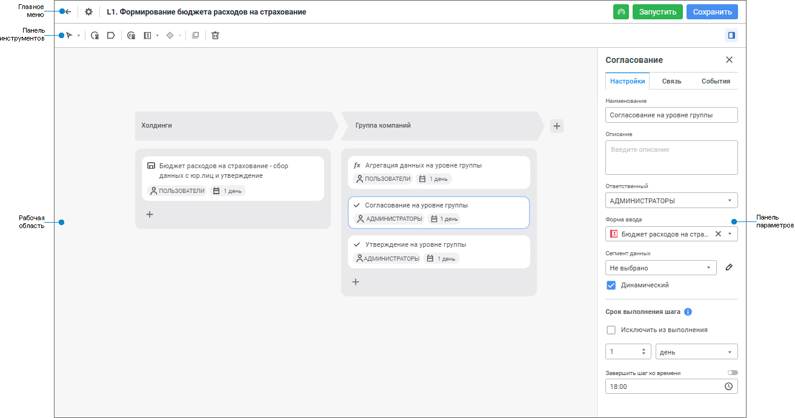
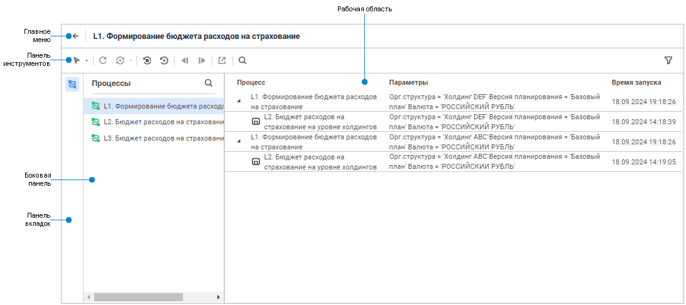
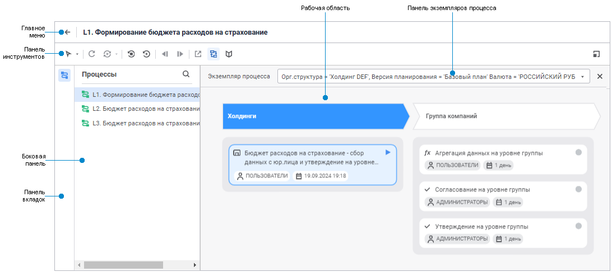
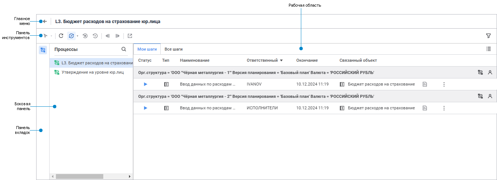
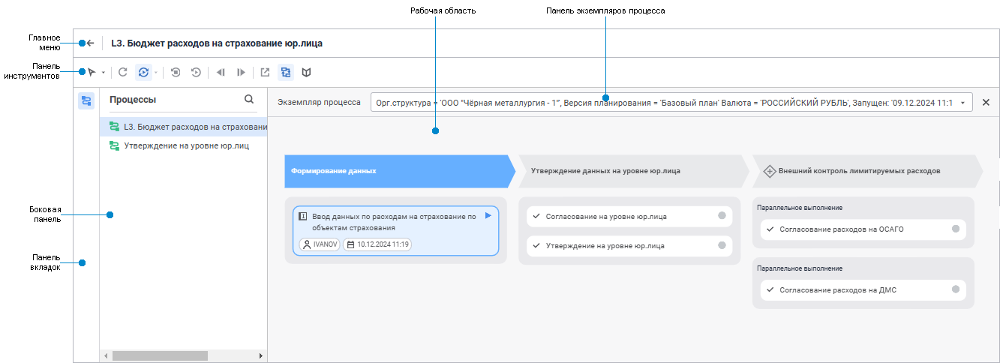

# Начало работы с расширением «Управление бизнес-процессами» в веб-приложении

Начало работы с расширением «Управление бизнес-процессами» в веб-приложении
-

# Начало работы с расширением «Управление
 бизнес-процессами» в веб-приложении

Для начала работы с расширением создайте новый или откройте готовый
 процесс.

[Создание
 нового процесса](javascript:TextPopup(this))

	Для создания нового процесса в [навигаторе
	 объектов](GetStarted.chm::/Interface/Interface_Navigator.htm) нажмите кнопку  «Создать» в главном меню и выберите
	 тип объекта на боковой панели «[Новый объект](UiNav.chm::/02_Navigator/General_Principles_of_Work.htm#add_object)»;

	Новый процесс будет открыт в [окне
	 настройки бизнес-процесса](Starting.htm#setting_business_process) в режиме редактирования.

[Открытие
 готового процесса](javascript:TextPopup(this))

	Для открытия готового процесса на редактирование в [навигаторе
	 объектов](GetStarted.chm::/Interface/Interface_Navigator.htm) выделите процесс и выполните одно из действий:

		- выполните команду «Редактировать»
		 в контекстном меню процесса;

		- выполните команду «Редактировать
		 в новой вкладке» в контекстном меню процесса;

		- выполните команду «Редактировать
		 в новом окне» в контекстном меню процесса;

		- нажмите клавишу F4;

	После выполнения одного из действий будет открыто окно настройки
	 бизнес-процесса.

	Для открытия готового процесса на просмотр и мониторинга шагов процесса:

		- в [навигаторе
		 объектов](GetStarted.chm::/Interface/Interface_Navigator.htm) выделите процесс и выполните одно
		 из действий:

			- выполните команду «Открыть»
			 в контекстном меню процесса;

			- выполните команду «Открыть
			 в новой вкладке» в контекстном меню процесса;

			- выполните команду «Открыть
			 в новом окне» в контекстном меню процесса;

			- дважды щёлкните по процессу;

			- нажмите клавишу ENTER;

		- в [окне
		 настройки бизнес-процесса](Starting.htm#setting_business_process) нажмите кнопку 
		 «Перейти к мониторингу»
		 в главном меню.

	После выполнения одного из действий будет открыто окно мониторинга
	 процессов.

Для построения нового процесса смотрите
 статью «[Построение
 процесса](../Process/Create_process_screenshot.htm)».

Для работы с готовым процессом смотрите
 статью «[Мониторинг
 процесса](Monitoring_process_execution.htm)».

Основные окна расширения «Управление
 бизнес-процессами»:

	- Настройка бизнес-процесса.
	 Позволяет настроить последовательность этапов/шагов процесса, назначить
	 ответственных за процесс/выполнение шагов и запустить процесс;

	- Мониторинг
	 процесса. Позволяет осуществлять
	 выполнение шагов процесса, управление экземплярами процесса и контроль
	 выполнения процесса. Вид окна мониторинга процесса зависит от [настроек
	 ролевой модели](../Facility_Agreement/Role_model.htm):

		- Полный
		 мониторинг. Предоставляет пользователю [полную
		 функциональность](Monitoring_process_execution.htm#func) управления и контроля выполнения процесса.
		 Доступен [ответственному
		 за процесс](../Facility_Agreement/Role_model.htm#curator) и [администратору](../Facility_Agreement/Role_model.htm#admin),
		 а также [ответственному
		 за выполнение шага процесса](../Facility_Agreement/Role_model.htm#user) при работе с репозиторием, созданном
		 на базе СУБД Oracle;

		- Пользовательский
		 мониторинг. Содержит [функциональность
		 ограниченную правами доступа пользователя](Monitoring_process_execution.htm#func) к процессу. Доступен
		 [ответственному
		 за выполнение шага процесса](../Facility_Agreement/Role_model.htm#user) при работе с репозиторием, созданном
		 на базе СУБД Microsoft SQL Server, PostgreSQL/Postrgres Pro.

Основное окно расширения «Управление бизнес-процессами»:

	 Настройка бизнес-процесса
	  Полный мониторинг
	  Пользовательский мониторинг

		

		Окно полного мониторинга со списком запущенных
		 экземпляров процесса:

		

		Окно полного мониторинга со схемой бизнес-процесса:

		

		Окно пользовательского мониторинга со списком шагов
		 процесса, назначенных пользователю для выполнения:

		

		Окно пользовательского мониторинга со схемой бизнес-процесса:

		

[Элементы
 окна настройки бизнес-процесса](javascript:TextPopup(this))

		- Главное меню. Содержит
		 поле для редактирования наименования процесса, а также кнопки
		 для возвращения в навигатор объектов, настройки параметров процесса,
		 сохранения и запуска процесса, перехода в режим мониторинга
		 выполнения процесса;

		- Панель инструментов.
		 Содержит кнопки для [построения
		 процесса](../Process/Create_process_screenshot.htm);

		- Рабочая
		 область. Предназначена для визуального отображения элементов
		 процесса, подпроцесса или этапа процесса, выбранного в дереве
		 процессов;

		- Панель
		 параметров. Предназначена для настройки шагов и событий
		 процесса. Список доступных параметров зависит от выбранного объекта
		 в рабочей области.

[Элементы
 окна мониторинга бизнес-процесса](javascript:TextPopup(this))

		- Главное меню. Содержит
		 поле с наименованием процесса, а также кнопку для возвращения
		 в навигатор объектов;

		- Панель инструментов.
		 Содержит кнопки для завершения или отклонения шагов процесса,
		 остановки или перезапуска процесса в целом, а также для визуальной
		 настройки рабочей области;

		- Панель вкладок.
		 Содержит кнопку для выбора группы настроек, отображаемых на боковой
		 панели, в режиме мониторинга процесса.

		- Боковая панель.
		 Содержит список всех запущенных процессов/подпроцессов.

		- Рабочая область.
		 Вид области отличается в зависимости от способа отображения:

			- Список запущенных экземпляров
			 процесса. Доступен только в [полном
			 мониторинге](Monitoring_process_execution.htm#monitoring). Предназначен для отображения списка запущенных
			 экземпляров процесса/подпроцесса. Под экземпляром
			 процесса/подпроцесса понимается процесс/подпроцесс, запущенный
			 с определёнными значениями параметров. Используется по умолчанию.

	Список запущенных экземпляров процесса
	 содержит двухуровневую иерархию:

				- Экземпляры процесса.

				- Экземпляры подпроцесса.

	При большем количестве вложенности подпроцессов
	 в списке запущенных экземпляров процесса отображаются только первые
	 два уровня иерархии.

	Для каждого экземпляра процесса отображаются
	 наименование, значения параметров и время запуска.

	Примечание.
	 Для отображения в рабочей области экземпляров процесса относящихся
	 к выбранному шагу подпроцесса откройте его, как [связанный
	 объект](../MonitoringProcess/Manual_mode.htm#open_linked_object).

			- Список назначенных
			 шагов процесса. Доступен только в [пользовательском
			 мониторинге](Monitoring_process_execution.htm#monitoring_simple). Предназначен для отображения шагов, назначенных
			 пользователю для выполнения.

			- Схема процесса.
			 Предназначен для визуального отображения элементов выбранного
			 экземпляра процесса/подпроцесса. С помощью цветовой индикации
			 отображается статус выполнения элементов процесса.

	Для изменения способа отображения:

			- со списка запущенных экземпляров на схему процесса дважды
			 щёлкните по выбранному экземпляру процесса в списке запущенных
			 экземпляров процесса/подпроцесса;

			- со списка назначенных шагов на схему процесса нажмите
			 кнопку  «Открыть
			 диаграмму экземпляра» около выбранного экземпляра процесса;

			- со схемы процесса на список запущенных экземпляров или
			 список назначенных шагов нажмите кнопку 
			 «Вернуться к списку экземпляров»
			 на панели инструментов.

		- Панель экземпляров процесса.
		 Содержит значения параметров запуска, дату и время запуска выбранного
		 экземпляра процесса, а также позволяет выполнять переход между
		 визуальными отображениями элементов экземпляров процесса/подпроцесса.
		 Панель отображается, если в рабочей области отображаются элементы
		 выбранного экземпляра процесса/подпроцесса и нажата кнопка  «Список активных
		 экземпляров».

	Примечание.
	 Если параметры запуска не были выбраны или отключены, то запускается
	 один процесс без параметров.

См. также:

[Построение
 процесса](../Process/Create_process_screenshot.htm) | [Мониторинг
 процесса](Monitoring_process_execution.htm)

		Справочная
		 система на версию 10.9
		 от 18/08/2025,
		 © ООО «ФОРСАЙТ»,
