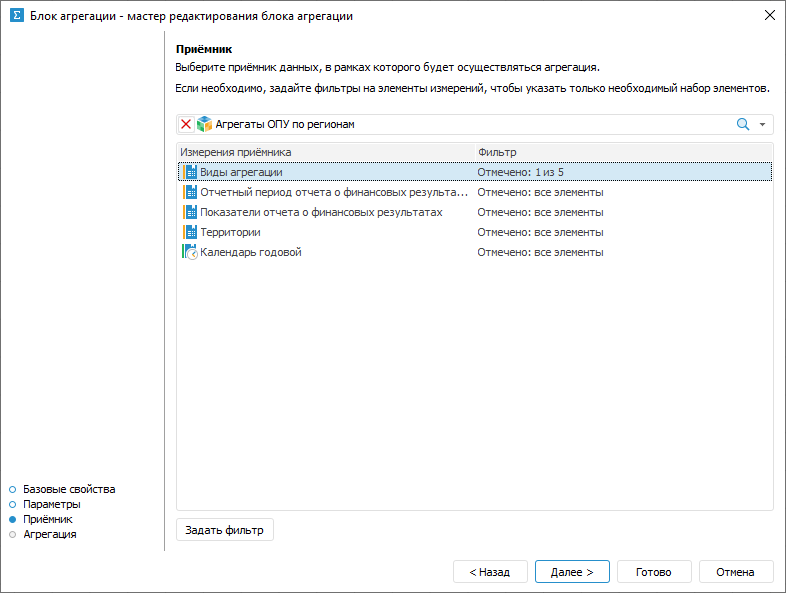
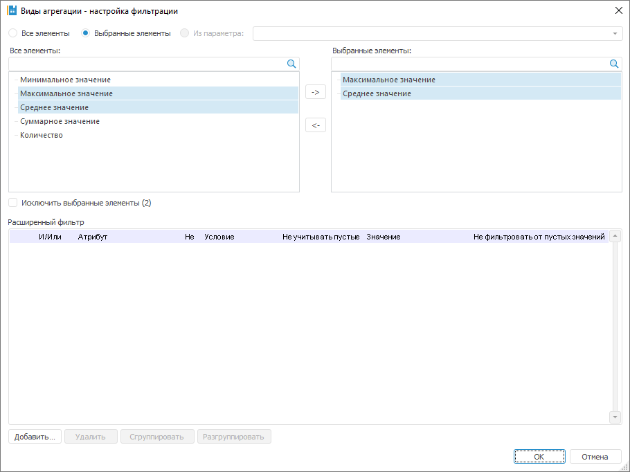

# Выбор и настройка приёмника данных: Блок агрегации, настольное приложение

Выбор и настройка приёмника данных: Блок агрегации, настольное приложение
-

# Выбор и настройка приёмника данных

Приёмник определяет объект, данные которого будут агрегированы и в который
 будут выгружены данные после расчёта блока.

Выбор и настройка приёмника данных выполняется на странице «Приёмник»
 в мастере редактирования блока агрегации:

Для выбора и настройки приёмника данных:

	- В раскрывающемся списке выберите приёмник данных.

	В качестве приёмника могут использоваться следующие объекты репозитория:

		- [стандартный
		 куб](UiNavObj.chm::/Cube/CreateCube/Master_Standart/UiMd_Cube_CreateCube_Master_Standart.htm);

		- [представление-куб](UiNavObj.chm::/Cube/CreateCube/Master_Calculation/UiMd_Cube_CreateCube_Master_Calculation.htm);

		- [виртуальный
		 куб](UiNavObj.chm::/Cube/CreateCube/Master_Virtual_Cube/UiMd_Cube_CreateCube_Master_Virtual.htm);

		- [автоматический
		 куб](UiNavObj.chm::/Cube/CreateCube/Master_Auto/UiMd_Cube_CreateCube_Master_Auto.htm);

		- [база
		 данных временных рядов](UiNavObj.chm::/TimeSeriesDatabase/CreateTimeSeriesDatabase.htm).

	- Настройте фильтрацию выделенного измерения. Для этого:

		- нажмите кнопку «Задать
		 фильтр»;

		- дважды щёлкните по измерению.

Будет открыт диалог «[Настройка фильтрации](#filter)», в котором задайте
 настройки фильтрации измерения приёмника данных.

В результате будет настроен приёмник данных в блоке агрегации.

## Настройка фильтрации измерения приёмника данных

Для выбора элементов измерения, по которым будет рассчитываться блок,
 используйте диалог «Настройка фильтрации»:

Порядок настройки:

	- Выберите элементы, по которым будет рассчитываться блок. Установите
	 один из переключателей:

		- Все элементы. Расчёт
		 блока будет идти по всем элементам измерения;

		- Выбранные элементы.
		 Расчёт блока будет идти только по выбранным элементам измерения.
		 Список элементов формируется в области «Выбранные
		 элементы» с помощью кнопок:

			-  «Выбрать элементы». Добавляет
			 элементы, выделенные в области «Все
			 элементы», в область «Выбранные
			 элементы»;

			-  «Исключить элементы». Удаляет
			 выделенные элементы из области «Выбранные
			 элементы».

Фильтрация будет производиться по всем элементам,
 содержащимся в области «Выбранные элементы».
 При необходимости выполнения расчёта по всем элементам, кроме тех, которые
 содержатся в области «Выбранные элементы»,
 установите флажок «Исключить выбранные
 элементы (N)», где N -
 количество выбранных элементов.

Для работы с [отметкой
 элементов измерения](UiSelection.chm::/Selection/Selection_of_the_dimension_elements.htm#selection) используйте команды контекстного
 меню. Если к элементам, расположенным в области «Все
 элементы», применена [схема
 отметки](UiSelection.chm::/Selection/Selection_of_the_dimension_elements.htm#selection_schemas), то она учитывается при переносе элементов
 в область «Выбранные элементы».

Для поиска элемента в каждой из областей
 начните вводить наименование искомого элемента в строку  «Поиск».
 При вводе наименования частично или полностью в области будет отображаться
 список элементов, наименования которых содержат искомое сочетание символов;

Примечание.
 Если в качестве фильтра используется параметрический куб и для него
 [задана связь параметра
 с параметром алгоритма расчёта](../Work/Manage_cubes_settings.htm), то при изменении значения параметра
 переключатель будет автоматически переведён в положение «Все
 элементы».

		- Из параметра. Расчёт
		 блока будет идти по элементам, заданным параметром типа «Отметка». Способ доступен, если
		 блок содержит параметры типа «Отметка».

Если требуется, чтобы блок рассчитывался
 по всем элементам, кроме отмеченных, то установите флажок «Исключить
 выбранные элементы».

	- Для задания условий, которым должны соответствовать атрибуты
	 элементов, при выполнении расчёта блока, используйте группу параметров
	 «Расширенный фильтр». Работа
	 с данной группой параметров аналогична работе с диалогом «[Расширенный
	 фильтр](uinav.chm::/GUI/UFE/AttributeFiltering.htm)».

После выполнения действий блок будет рассчитываться только по элементам,
 соответствующих фильтру.

См. также:

[Начало
 работы с расширением «Алгоритмы расчёта» в веб-приложении](../../Web/Work/Beginning_of_work.htm) | [Вставка и настройка блоков агрегации](Aggregation_block.htm)

		Справочная
		 система на версию 10.9
		 от 18/08/2025,
		 © ООО «ФОРСАЙТ»,
