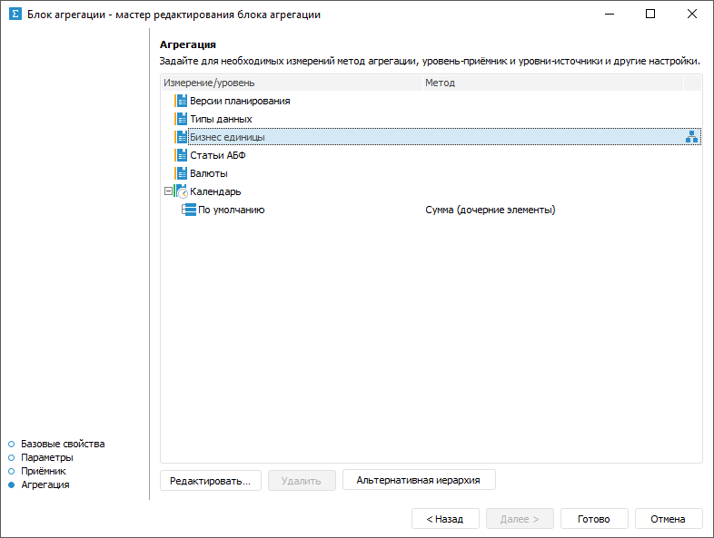
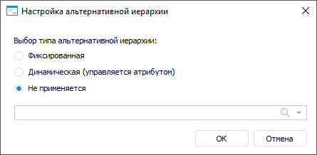
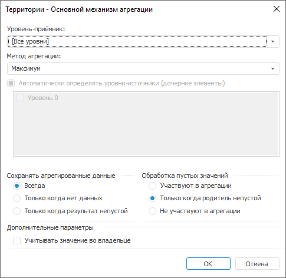
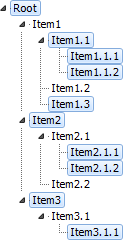

# Настройка агрегации: Блок агрегации, настольное приложение

Настройка агрегации: Блок агрегации, настольное приложение
-

# Настройка агрегации

Настройка агрегации определяет, данные по каким измерениям будут агрегированы
 и каким методом.

Настройка агрегации выполняется на странице «Агрегация»
 в мастере редактирования блока агрегации:

Для настройки агрегации измерения:

	- Выберите агрегируемое измерение.

	- Нажмите кнопку «Редактировать»
	 или дважды щёлкните по измерению. Будет открыт
	 диалог «[Настройка
	 агрегации](#aggrmethod)», в котором задайте параметры агрегации измерения.

	- Если для измерения настроена [альтернативная
	 иерархия](UiNavObj.chm::/reference_book/UiMd_reference_book_Hierarchy.htm#alternativehierarchy), то при необходимости выберите альтернативную
	 иерархию для расчёта по элементам альтернативного справочника вместо
	 элементов исходного справочника или настройте динамический выбор альтернативной
	 иерархии в зависимости от атрибута параметра, указав вариант альтернативной
	 иерархии в окне «Настройка альтернативной
	 иерархии».

[Для
 открытия окна](javascript:TextPopup(this))

			- Выделите измерение, в котором содержатся [альтернативные
			 иерархии](UiNavObj.chm::/reference_book/UiMd_reference_book_Hierarchy.htm#alternativehierarchy).

			- Нажмите кнопку «Альтернативная
			 иерархия».

Задайте параметры:

		- Тип
		 альтернативной иерархии. Выберите один из способов использования
		 альтернативной иерархии с помощью переключателей:

			- Фиксированная.
			 Источником альтернативной иерархии является справочник. Выберите
			 доступный справочник в раскрывающемся списке или нажмите кнопку
			 
			 «Поиск» и начните
			 вводить наименование справочника. Доступен выбор только одного
			 справочника;

			- Динамическая.
			 Источником альтернативной иерархии является параметр. Выберите
			 атрибут [параметра](ParametersArrg.htm) блока агрегации
			 в раскрывающемся списке или нажмите кнопку 
			 «Поиск» и начните
			 вводить наименование атрибута. При динамическом выборе альтернативной
			 иерархии данные в [приёмнике](Aggregation_block_Receiver.htm)
			 будут изменяться в зависимости от выбранного значения атрибута.
			 Если значение атрибута выбранного элемента в параметре не
			 является ключом альтернативной иерархии, то будет выведено
			 соответствующее сообщение;

			- Не применяется.
			 По умолчанию. Альтернативная иерархия не используется.

Также выбор источника фиксированной альтернативной
 иерархии доступен в контекстном меню измерения.

После выполнения действий при выборе фиксированной
 или динамической альтернативной иерархии будет отображена пиктограмма
  напротив
 измерения. Для сброса альтернативной иерархии и возвращения к стандартной
 иерархии измерения выполните команду «Сбросить»
 в контекстном меню измерения.

В результате будет настроена агрегация измерения. Если требуется, то
 аналогичным образом настройте агрегацию для следующего измерения.

Для удаления выделенных настроек агрегации нажмите кнопку «Удалить».

## Настройка агрегации измерения

Для настройки параметров агрегации измерения используйте диалог «Основной механизм агрегации»:

Порядок настройки:

	- Выберите уровень-приёмник в измерении, для которого настраивается
	 агрегация. Используйте раскрывающийся список «Уровень-приёмник».
	 Если в качестве уровня выбран элемент «[Все
	 уровни]», то агрегация будет настроена для всех уровней, в
	 том числе и для тех, которые могут появиться позже.

	- Задайте метод агрегации в раскрывающемся списке «Метод
	 агрегации». Для подробного описания доступных методов агрегации
	 обратитесь к разделу «[Методы агрегации](#methods)».

	- Задайте уровни-источники для агрегации.

Для автоматического определения уровней-источников
 установите флажок «Автоматически определять
 уровни-источники (дочерние элементы)».

Для определения уровней-источников вручную
 убедитесь, что флажок «Автоматически
 определять уровни-источники (дочерние элементы)» снят и отметьте
 флажками все необходимые уровни.

Если настройка агрегации выполняется для
 всех уровней, то уровни-источники всегда определяются автоматически.

	- Определите метод сохранения агрегированных данных на уровне-приёмнике.
	 Используйте группу переключателей «Сохранять
	 агрегированные данные»:

		- Всегда. Агрегированные
		 данные всегда будут записываться на уровень-приёмник;

		- Только когда нет данных.
		 Агрегированные данные будут записаны на уровень-приёмник, если
		 на уровне-приёмнике нет данных;

		- Только когда результат
		 непустой. Агрегированные данные будут записаны на уровень-приёмник,
		 только если результат агрегации непустой.

	- Определите метод обработки пустых значений. Используйте группу
	 переключателей «Обработка пустых
	 значений»:

		- Участвуют в агрегации.
		 Пустые значения будут участвовать в агрегации;

		- Только когда родитель непустой.
		 Пустые значения будут участвовать в агрегации, если родительский
		 элемент непустой. Если результат агрегации по дочерним элементам
		 равен пустому значению и при этом в родительском элементе уже
		 имеется значение, то оно будет заменено пустым значением;

		- Не участвуют в агрегации.
		 Пустые значения не будут участвовать в агрегации.

	- Определите, учитывать ли при расчёте агрегации значение уровня-приёмника.
	 По умолчанию агрегация рассчитывается с учётом значения уровня приёмника.
	 Если данное значение необходимо исключить из агрегации, то снимите
	 флажок «Учитывать значение во владельце».

В результате будет настроена агрегация для выбранного измерения.

### Особенности расчёта агрегации

Если в отметке присутствуют разрывы, то агрегация рассчитывается с прыжком
 на уровень. Разрыв в отметке - это когда отмечены дочерние элементы, но
 не отмечен их родительский элемент В таком случае данные дочерних элементов
 неотмеченного родительского элемента используются для расчета следующего
 родительского элемента.

Например, есть иерархия, в которой с разрывом отмечены элементы:

Агрегация с прыжком на уровень будет рассчитываться следующим образом:

		 Шаг
		 Установлен флажок «Учитывать
		 значение во владельце»
		 Снят флажок «Учитывать значение
		 во владельце»

		 Выполняется расчёт на нижем уровне

		 Item 1.1 = Item 1.1 + item 1.1.1 + item 1.1.2
		 Item 1.1 = item 1.1.1 + item 1.1.2

		 Вычисляется значение верхнего уровня

		 Item 2 = Item 2+ item 2.1.1 + 2.1.2
		 Item 2 = item 2.1.1 + 2.1.2

		 Item 3 = Item 3 + item 3.1.1
		 Item 3 = item 3.1.1

		 Вычисляется значение для корневого элемента

		 Root = Root + item 1.1 + item 1.3 + item 2 + item 3
		 Root = item 1.1 + item 1.3 + item 2 + item 3

### Методы агрегации

Для агрегации измерения в модели матричной агрегации доступны следующие
 методы:

	- Нет. Агрегация не производится;

	- Сумма. Суммируются элементы
	 уровня-источника;

	- Минимум. На уровне-источнике
	 выбирается минимальное значение;

	- Максимум. На уровне-источнике
	 выбирается максимальное значение;

	- Количество непустых.
	 Определяется количество непустых значений на уровне-источнике;

	- Количество пустых. Определяется
	 количество пустых значений на уровне-источнике;

	- Количество всех дочерних.
	 Определяется количество дочерних элементов на уровне-источнике;

	- Арифметическое среднее.
	 Определяется среднее значение элементов уровня с учетом пустых значений;

	- Фактическое среднее.
	 Определяется среднее значение элементов уровня без учета пустых значений;

	- Первое фактическое.
	 На уровне-источнике берется первое имеющееся (фактическое) значение;

	- Последнее фактическое.
	 На уровне-источнике берется последнее имеющееся (фактическое) значение;

	- Среднеквадратическое отклонение
	 по выборке. Определяется среднеквадратическое отклонение ряда
	 по выборке;

	- Медиана. Определяется
	 медиана для значений на уровне-источнике;

	- Среднеквадратическое отклонение.
	 Определяется среднеквадратическое отклонение ряда по генеральной совокупности;

	- Количество различных значений.
	 Определяется количество уникальных значений на уровне-источнике.

См. также:

[Начало работы с расширением
 «Алгоритмы расчёта» в веб-приложении](../../Web/Work/Beginning_of_work.htm)
 | [Вставка
 и настройка блоков агрегации](Aggregation_block.htm)

		Справочная
		 система на версию 10.9
		 от 18/08/2025,
		 © ООО «ФОРСАЙТ»,
