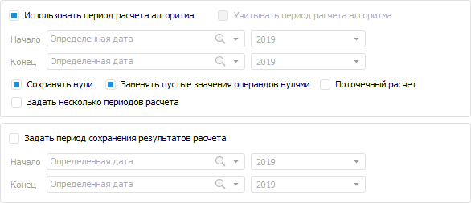

# Настройка дополнительных параметров расчёта и сохранения данных: Алгоритм расчёта показателей, настольное приложение

Настройка дополнительных параметров расчёта и сохранения данных: Алгоритм расчёта показателей, настольное приложение
-

# Настройка дополнительных параметров расчёта и сохранения данных

Нажмите кнопку  «Дополнительные
 настройки» на [панели параметров расчёта](Formula.htm).
 Будут отображены дополнительные параметры расчёта и сохранения данных:

Для задания периода расчёта формулы, отличного от периода расчёта алгоритма:

	- Снимите флажок «Использовать
	 период расчёта алгоритма».

	- Установите флажок «Учитывать
	 период расчёта алгоритма» при необходимости. По умолчанию флажок
	 снят, расчёт формулы выполняется только по заданному периоду. При
	 установке флажка расчёт формулы выполняется с учётом пересечения периода
	 расчёта формулы и периода расчёта алгоритма.

Примечание.
 Использование флажка доступно только при снятом флажке «Использовать
 период расчёта алгоритма».

	- Выберите способ задания дат начала и окончания периода расчёта
	 формулы в полях «Начало» и
	 «Конец»:

		- Определённая дата.
		 Задайте определённую дату в редакторе дат, расположенном справа.
		 Формат даты в редакторе дат зависит от заданного [шага
		 динамики](Calculated_Element_Select.htm);

		- Дата начала расчёта алгоритма.
		 Задайте количество периодов в редакторе чисел, расположенном справа,
		 для смещения даты начала расчёта алгоритма. Дата начала расчёта
		 алгоритма совпадает с заданной датой начала периода расчёта на
		 вкладке «[Управление
		 периодом расчёта](../Work/Calculation_period_management.htm)» в диалоге «[Параметры
		 алгоритма расчёта](../Work/Set_up_calculation_parameters.htm)» или на [панели
		 параметров](../Work/Beginning_of_work.htm). При расчёте формулы используется дата начала расчёта
		 алгоритма с учётом смещения на заданное количество периодов;

		- Дата окончания расчёта алгоритма. Задайте количество периодов в редакторе
		 чисел, расположенном справа, для смещения даты окончания расчёта
		 алгоритма. Дата окончания расчёта алгоритма совпадает с заданной
		 датой окончания периода расчёта на вкладке «[Управление
		 периодом расчёта](../Work/Calculation_period_management.htm)» в диалоге «[Параметры
		 алгоритма расчёта](../Work/Set_up_calculation_parameters.htm)» или
		 на [панели параметров](../Work/Beginning_of_work.htm).
		 При расчёте формулы используется дата окончания расчёта алгоритма
		 с учётом смещения на заданное количество периодов;

		- Дата начала расчёта формулы. Задайте количество периодов в редакторе
		 чисел, расположенном справа, для смещения даты начала расчёта
		 формулы. Дата начала расчёта формулы совпадает с заданной датой
		 начала периода расчёта на вкладке «[Управление
		 периодом расчёта](../Work/Calculation_period_management.htm)» в диалоге «[Параметры
		 алгоритма расчёта](../Work/Set_up_calculation_parameters.htm)» или
		 на [панели параметров](../Work/Beginning_of_work.htm). При расчёте формулы используется
		 дата начала расчёта формулы с учётом смещения на заданное количество
		 периодов;

		- Дата окончания расчёта формулы. Задайте количество периодов в редакторе
		 чисел, расположенном справа, для смещения даты окончания расчёта
		 формулы. Дата окончания расчёта формулы совпадает с заданной датой
		 окончания периода расчёта на вкладке «[Управление
		 периодом расчёта](../Work/Calculation_period_management.htm)» в диалоге «[Параметры
		 алгоритма расчёта](../Work/Set_up_calculation_parameters.htm)» или
		 на [панели параметров](../Work/Beginning_of_work.htm). При расчёте формулы используется
		 дата окончания расчёта формулы с учётом смещения на заданное количество
		 периодов;

		- Дата из значения параметра.
		 Выберите параметр блока расчёта, настроенный на вкладке «[Параметры](Parameters.htm)». Задайте количество
		 периодов в редакторе чисел, расположенном справа, для смещения
		 даты из значения параметра. При расчёте формулы используется дата
		 из значения параметра с учётом смещения на заданное количество
		 периодов;

Примечание.
 При выборе атрибута справочника в раскрывающемся списке доступны атрибуты
 справочника типа «Дата» и «ДатаВремя».

		- Дата из текущей координаты.
		 Выберите атрибут справочника куба, который настроен для измерения
		 на вкладке «[Приёмник](Master_calculation_block_page_consumer.htm)»/«[Источники](../../Web/Calculation_block/Page_Sources.htm)» блока расчёта. Задайте
		 количество периодов в редакторе чисел, расположенном справа, для
		 смещения даты из текущего рассчитываемого значения элемента справочника.
		 При расчёте формулы используется дата из значения атрибута по
		 текущему рассчитываемому элементу указанного справочника с учётом
		 смещения на заданное число периодов.

Заданные периоды для смещения дат зависят
 от [шага динамики](Calculated_Element_Select.htm) и влияют
 на результат расчёта формулы. Например, если в формуле расчёта задан годовой
 шаг динамики с датой начала расчёта алгоритма (с 01.01.2020) и количеством
 периодов «2», то расчёт формулы будет начинаться с 01.01.2022. Если в
 формуле расчёта задан месячный шаг динамики с датой начала расчёта алгоритма
 (с 01.01.2020) и количеством периодов «2», то расчёт формулы будет начинаться
 с 01.03.2022.

Для задания периода сохранения результатов расчёта:

	- Установите флажок «Задать период
	 сохранения результатов расчёта».

	- Выберите способ задания дат начала и окончания периода сохранения
	 результатов расчёта в полях «Начало»
	 и «Конец». Способы задания
	 дат аналогичны способам задания дат начала и окончания периода расчёта
	 формулы.

После выполнения действий будет задан период сохранения результатов
 расчёта. Результаты расчёта будут сохраняться только в указанном диапазоне
 дат после расчёта алгоритма. Если период сохранения результатов расчёта
 не задан, то результаты расчёта сохраняются с даты начала расчёта алгоритма
 до даты окончания.

Для сохранения только ненулевых значений, полученных в результате расчёта
 блока, снимите флажок «Сохранять нули».

Для использования в расчёте пустых значений операндов, участвующих
 в формуле, снимите флажок «Заменять пустые
 значения операндов нулями».

Для изменения способа расчёта формулы в блоке используйте флажок «Поточечный расчёт». По умолчанию
 флажок снят и используется векторный расчёт, то есть формулы рассчитываются
 по всем точкам данных. При установленном флажке выполняется последовательный
 расчёт формул в каждой точке данных: сначала формулы рассчитываются по
 первой точке данных, затем по второй точке и так далее.

Примечание.
 Поточечный расчёт может использоваться для конкретных формул и для всего
 алгоритма расчёта. Для получения подробной информации об особенностях
 использования поточечного расчёта обратитесь к разделу «[Расчёт
 алгоритма](../Work/Perform_calculations.htm)».

Для задания формул, которые будут действовать в определённые периоды
 времени выполните следующие действия:

	- Установите флажок «Задать несколько
	 периодов расчёта». В области формул станут доступны кнопки
	 для создания дополнительных периодов и их настройки.

	- Нажмите кнопку  «Добавить
	 промежуточную дату расчёта» для создания дополнительных периодов
	 расчёта. При добавлении промежуточной даты расчёта, период в котором
	 она находится, разделяется на два периода: выбранная дата входит в
	 первый период, расчёт второго периода начинается со следующий даты
	 от выбранной (со следующего года, квартала и т.д. в зависимости от
	 выбранного шага динамики):

В заголовках вкладок будут использоваться
 сокращения «Нр» - начало расчётного периода, заданное для алгоритма или
 в настройках блока расчёта; «Кр» - конец расчётного периода, заданный
 для алгоритма или в настройках блока расчёта.

	- Выберите период и задайте формулу расчёта. Для каждого периода
	 можно задавать свою формулу.

Для изменения промежуточной даты расчёта выберите вкладку с периодом
 и нажмите кнопку 
 «Изменить промежуточную дату расчёта».

См. также:

[Начало
 работы с расширением «Алгоритмы расчёта» в веб-приложении](../../Web/Work/Beginning_of_work.htm) | [Настройка
 формул расчёта](Formula.htm)

		Справочная
		 система на версию 10.9
		 от 18/08/2025,
		 © ООО «ФОРСАЙТ»,
