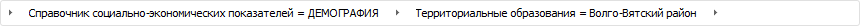

# Выбор рассчитываемого элемента и календарной динамики расчёта: Алгоритм расчёта показателей, настольное приложение

Выбор рассчитываемого элемента и календарной динамики расчёта: Алгоритм расчёта показателей, настольное приложение
-

# Выбор рассчитываемого элемента и календарной динамики расчёта

При составлении [формулы расчёта](Formula.htm) в качестве
 рассчитываемого элемента могут использоваться:

	- элементы измерения [приёмника
	 данных](Master_calculation_block_page_consumer.htm);

	- [параметры](Parameters.htm) блока расчёта или блока
	 контроля.

Для определения рассчитываемого элемента предназначена [цепочка
 навигации](Formula.htm):

По умолчанию в цепочке навигации отображаются нефильтруемые измерения,
 которые не отмечены в списке измерений приёмника данных. Для фильтруемого
 измерения можно выбрать элемент, по которому будет выполняться расчёт
 вне зависимости от заданной фильтрации на странице «[Приёмник](Master_calculation_block_page_consumer.htm)»
 в мастере редактирования блока расчёта или контроля.

При использовании параметра в формуле расчёта можно динамически менять
 рассчитываемый элемент без изменения формул.

Для выбора элемента измерения:

	- из нефильтруемого измерения:

		- Щёлкните по названию измерения в цепочке навигации. Будет
		 отображён список элементов измерения.

		- Выберите элемент в списке для каждого измерения.

	- из фильтруемого измерения:

		- Щёлкните по кнопке , расположенной в
		 левой части цепочки навигации. Будет отображён список фильтруемых
		 измерений.

		- Выберите измерение. Выбранное измерение будет отображено
		 в цепочке навигации.

		- Щёлкните по названию измерения. Будет отображён список элементов
		 измерения.

		- Выберите элемент в списке для каждого добавленного измерения.

После выполнения действий в формуле будет использоваться выбранный элемент.

Для выбора параметра, задающего значение измерения:

	- Щёлкните по кнопке , расположенной после
	 названия нефильтруемого или фильтруемого измерения.

	- Выберите параметр в раскрывающемся меню «Установить
	 параметры». Для выбора доступны только параметры типа «Отметка».

После выполнения действий значение измерения будет определять выбранный
 параметр.

Примечание.
 Если в параметре задан [источник](../Work/Parameters_of_the_calculation_algorithm.htm),
 в котором содержатся [управляющие
 измерения](uinavobj.chm::/cube/createcube/master_calculation/uimd_cube_createcube_master_calculation_managed_dim.htm), то набор элементов управляемых измерений
 в параметрах будет зависеть от управляющего измерения.

При необходимости выберите календарную динамику расчёта. По умолчанию
 используется годовая динамика.

## Выбор календарной динамики

Для выбора календарной динамики расчёта используйте раскрывающийся список
 «Шаг динамики» на [панели
 параметров](Formula.htm):

	- годовая. Используется по умолчанию;

	- полугодовая;

	- квартальная;

	- месячная;

	- недельная;

	- дневная.

Расчёт формулы зависит от флажка «[Использовать
 период расчёта алгоритма](Additional_Calculation_and_Data_Saving_Parameters.htm)»:

	- если флажок установлен, то расчёт формулы вычисляется на каждом
	 шаге календарной динамики расчёта в рамках заданного периода расчёта
	 алгоритма;

	- если флажок снят, то шаг динамики влияет на [смещение](Additional_Calculation_and_Data_Saving_Parameters.htm)
	 дат, заданных с учётом количества периодов.

Если календарная динамика формулы расчёта отличается от [календарной
 динамики операнда](Calculation_Formula_Generation.htm#calendar), то в результате расчёта формулы данные будут рассчитаны
 по календарной динамике формулы. Например, если для формулы задана месячная
 динамика расчёта, а для операнда годовая, то расчёт данных будет выполняться
 по месяцам.

См. также:

[Начало
 работы с расширением «Алгоритмы расчёта» в веб-приложении](../../Web/Work/Beginning_of_work.htm) | [Настройка
 формул расчёта](Formula.htm)

		Справочная
		 система на версию 10.9
		 от 18/08/2025,
		 © ООО «ФОРСАЙТ»,
