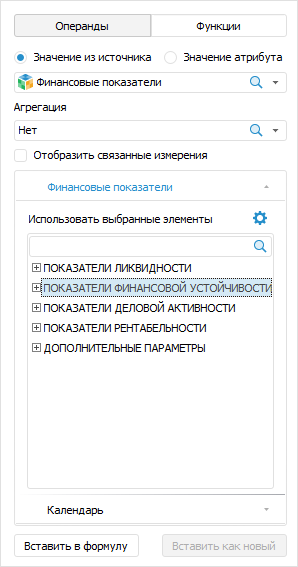
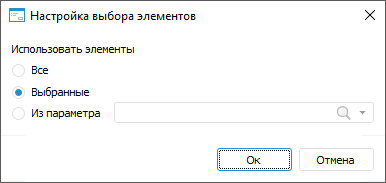
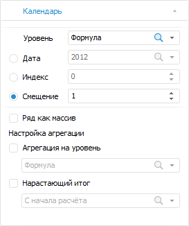
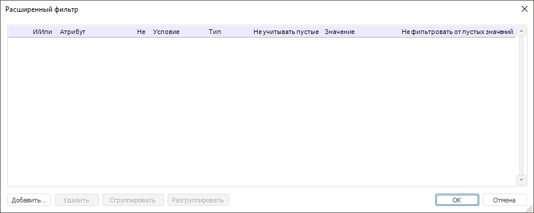
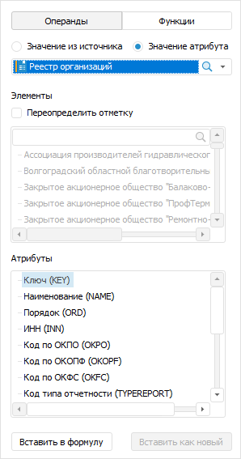

# Формирование формулы расчёта: Алгоритм расчёта показателей, настольное приложение

Формирование формулы расчёта: Алгоритм расчёта показателей, настольное приложение
-

# Формирование формулы расчёта

	Формула расчёта формируется в [области формул](Formula.htm)
	 и используется для преобразования данных из источника в приёмник.

	В формуле допускается использование операндов, функций, арифметических
	 операций, цифр, знаков сравнения и круглых скобок.

	Операнд - это элемент данных из источника, над которым выполняются
	 действия при расчёте формулы. Функция - это последовательность действий,
	 выполняемых над операндом при расчёте формулы.

	Операнды и функции вставляются с помощью боковой панели. Цифры,
	 знаки сравнения и круглые скобки вводятся с клавиатуры.

	Доступные типы операндов:

		- на основе отметки элементов
		 измерений. Применяется, если в формуле надо использовать
		 значение данных, полученное по заданной отметке элементов измерений;

		- на основе атрибутов измерений.
		 Применяется, если в формуле надо использовать значение указанного
		 атрибута, полученное по заданной отметке измерения.

	Календарная динамика операндов должна совпадать с календарной динамикой
	 формулы. Если в формуле требуются операнды с календарной динамикой,
	 отличной от календарной динамики формулы, то используйте функции [агрегации](UiNav.chm::/GUI/Expression_editor_func.htm#aggregation).
	 Они позволяют привести календарную динамику операндов к календарной
	 динамике формулы.

	[Пример использования
	 функций агрегации](javascript:TextPopup(this))

		Например, есть формула расчёта потери энергии с месячной динамикой:

		{ Потребление электроэнергии субъектом РФ[t]
		 } * { Потери электроэнергии[Годы.t] } / { Потребление электроэнергии
		 субъектом РФ[Годы.t] }

		Операнды «{ Потери электроэнергии[Годы.t] }» и «{ Потребление
		 электроэнергии субъектом РФ[Годы.t] }» имеют годовую динамику.
		 Для корректного расчёта их данные нужно дезагрегировать с годовой
		 динамики на месячную с помощью функции Interpolate:

		{ Потребление электроэнергии субъектом РФ[t]
		 } * Interpolate({ Потери электроэнергии[Годы.t] } / { Потребление
		 электроэнергии субъектом РФ[Годы.t] },MsInterpolateType.Repeat_,MsFrequency.Monthly)

## Вставка операнда на основе отметки
	 измерений

	Результатом расчёта операнда будет значение данных, полученное по
	 заданной отметке элементов измерений.

		- На боковой панели установите переключатель «Операнды»
		 и переключатель «Значение из
		 источника».

		- В раскрывающемся списке выберите источник данных, используемый
		 операндом. Будут отображены вкладки с измерениями выбранного источника.
		 Например:

	

		- Если операнд должен выполнять агрегацию, то в раскрывающемся
		 списке «Агрегация» выберите
		 метод агрегации.

	Агрегация позволят использовать в формуле
	 несколько значений элементов из измерения операнда, агрегированных
	 выбранным способом. Агрегация может быть настроена по любому измерению
	 операнда, кроме календарного.

	Совет.
	 После создания операнда можно настроить расчёт агрегации только по
	 тем значениям измерения, которые соответствуют определённым правилам.
	 Для получения подробной информации обратитесь к разделу «[Настройка
	 фильтрации агрегируемых значений операнда](#aggrsetup)».

		- Если в операнде должны участвовать связанные измерения источника
		 данных, то установите флажок «Отобразить
		 связанные измерения». [Связь
		 измерений](Page_Sources.htm#link) задаётся на этапе выбора [источников
		 данных](Page_Sources.htm) блока расчёта.

		- Для каждого измерения выберите
		 элемент, на основе которого формируется операнд. Если операнд
		 должен выполнять агрегацию, то выберите несколько элементов, по
		 которым будет выполняться агрегация.

Для изменения вида отображения элементов
 по существующим [атрибутам](UiNavObj.chm::/reference_book/Master_RDS_reference_book/Attributes.htm)
 измерения выполните команду «Наименования»
 в контекстном меню списка элементов и выберите один или несколько атрибутов.
 Скрытые атрибуты недоступны для использования. При выборе нескольких атрибутов
 значения разделяются через вертикальную черту «|». По умолчанию в области
 формул и списке элементов на боковой панели отображаются наименования
 элементов. Вид отображения элементов изменяется только на боковой панели.

Для сортировки элементов измерения выполните
 команду «Сортировка» в контекстном
 меню списка элементов и выберите один из способов сортировки:

		- . По возрастанию;

		- . По убыванию;

		- По атрибуту. Выберите в раскрывающемся списке один из атрибутов
		 измерения, по которому будет выполнена сортировка элементов.

Для сброса настроенной сортировки элементов
 выполните команду «Сортировка > Сбросить»
 в контекстном меню списка элементов.

Для разворачивания иерархии списка элементов
 выполните команду  «Развернуть
 все» в контекстном меню списка элементов.

Для сворачивания иерархии списка элементов
 выполните команду  «Свернуть
 все» в контекстном меню списка элементов.

	Если источник данных содержит [управляющие
	 измерения](uinavobj.chm::/cube/createcube/master_calculation/uimd_cube_createcube_master_calculation_managed_dim.htm), то при выборе элемента управляющего
	 измерения будет обновлён набор элементов на вкладках управляемых измерений.

	Для настройки способа выбора элементов
	 нажмите кнопку  «Настройка»
	 на вкладке измерения. Будет открыт диалог «Настройка
	 выбора элементов»:

	

	Задайте способ выбора элементов:

			- Все. Будут выбраны
			 все элементы. Способ доступен, если операнд выполняет агрегацию;

			- Выбранные. По
			 умолчанию. Будут выбраны элементы, отмеченные пользователем;

			- Из параметра.
			 Значение элемента задаётся параметром, выбранным в данном
			 диалоге. Для выбора доступны [собственные
			 параметры блока расчёта](Parameters.htm) или добавленные в блок [параметры
			 алгоритма расчёта](../Work/Set_up_calculation_parameters.htm). Параметры должны иметь тип «Отметка».

		- Если для операнда требуются настройки
		 календаря, отличные от всей формулы, то перейдите на вкладку «Календарь»:

	

	Примечание.
	 Вкладка отсутствует, если в [приёмнике
	 данных](Master_calculation_block_page_consumer.htm) календарь используется как обычное измерение.

	Задайте настройки календаря для операнда:

			- В раскрывающемся списке «Уровень»
			 выберите календарную динамику операнда. По умолчанию выбран
			 элемент «Формула»
			 и календарная динамика операнда совпадает с календарной динамикой
			 формулы.

	Примечание.
	 Если календарная динамика операнда отличается от [календарной
	 динамики формулы расчёта](Calculated_Element_Select.htm#frequency), то в результате расчёта формулы данные
	 будут рассчитаны по календарной динамике формулы.

			- Выберите способ получения календарных данных:

				- Дата. Используется,
				 если требуется зафиксировать дату, на которую будут взяты
				 данные операнда. Например, данные за 2018 год;

				- Индекс.
				 Используется, если требуется зафиксировать точку ряда,
				 на которую будут взяты данные операнда. Например, на третью
				 точку от начала ряда;

				- Смещение.
				 Выбран по умолчанию. Используется, если все данные операнда
				 надо сместить вперёд или назад на определённое количество
				 точек во временном периоде относительно всей формулы.
				 Например, в формуле используются данные начиная с 2000
				 года, а в операнде со смещением будут использоваться данные
				 начиная с 2003 года.

	Задайте способ передачи операнда в расчёт
	 с помощью флажка «Ряд как массив»:

			- флажок снят.
			 Значение по умолчанию. Точка операнда, используемая в формуле,
			 будет зависеть от даты, на которую выполняется расчёт.

			Например, формула имеет годовую динамику и рассчитывается с
			 2000 по 2018 годы. В расчёте формулы за 2000 год будет использоваться
			 значение операнда за 2000 год, в расчёте формулы за 2001 год
			 - значение операнда за 2001 год и так далее;

			- флажок установлен.
			 В формуле все значения операнда будут представлены в виде
			 массива, а не точки. При вставке в уравнение операнда данного
			 типа используйте обработчик, преобразующий операнд к одному
			 значению. Обработчиком может выступать статистическая, математическая
			 или пользовательская функция.

			Например, в формуле необходимо использовать минимальное значение
			 операнда {X}. Для этого следует установить флажок «Ряд
			 как массив» и использовать функцию нахождения минимума: Min({X}).

	Задайте настройки агрегации календаря
	 для операнда:

			- Агрегация на уровень.
			 Установите флажок, если нужно повысить календарную динамику
			 операнда. В соответствующем раскрывающемся списке выберите
			 динамику, в которой должны быть данные операнда.

			Например, формула имеет годовую динамику, а операнд в формуле
			 - месячную. Для корректного использования операнда в формуле
			 установите флажок «Агрегация
			 на уровень» и выберите динамику «Формула»
			 или «Год»;

			- Нарастающий итог.
			 Установите флажок, если операнд надо вычислять с нарастающим
			 итогом. В соответствующем раскрывающемся списке выберите период,
			 с которого будет рассчитываться нарастающий итог.

			Вычисление операнда с нарастающим итогом позволяет в текущем
			 периоде учитывать данные за предыдущие периоды. Например,
			 есть операнд со следующими значениями: 2015 г - 3, 2016г -
			 5, 2017г. - 9, 2018г. - 4. Если установить флажок «Нарастающий
			 итог» и выбрать период «С
			 начала расчёта», то при вычислении будут использоваться
			 следующие значения операнда: 2015 г - 3, 2016г - 8, 2017г.
			 - 17, 2018г. - 21.

		- В области формул установите курсор в место вставки операнда
		 и нажмите кнопку «Вставить в
		 формулу» на боковой панели. Также можно скопировать отмеченные
		 элементы измерения и вставить их в область формул с помощью одноимённых
		 команд контекстного меню или сочетания клавиш CTRL+C, CTRL+V.

	Операнд на основе отметки измерений будет вставлен в формулу. Например:

	{ Финансовые показатели! ПОКАЗАТЕЛИ ФИНАНСОВОЙ
	 УСТОЙЧИВОСТИ | На отчетную дату отчетного периода[t] }

	В начале текста операнда идёт название источника данных, заканчивающееся
	 восклицательным знаком. Далее через вертикальную черту идут названия
	 элементов, отмеченных в измерениях.

	Если в диалоге «[Настройка
	 выбора элементов](#elementselection)» указано, что отметка измерения задаётся параметром,
	 то название параметра будет указано в фигурных скобках. Например:

	{ Финансовые показатели! ПОКАЗАТЕЛИ ЛИКВИДНОСТИ,
	 ПОКАЗАТЕЛИ ДЕЛОВОЙ АКТИВНОСТИ | {Отчётная дата}[t] }

	Настройки агрегации влияют на отображения текста операнда:

		- если для операнда настроена агрегация, то в начале текста
		 операнда отображается символ ∑, например:

	{ ∑ Финансовые показатели!
	 ПОКАЗАТЕЛИ ЛИКВИДНОСТИ | На отчетную дату отчетного периода[t]
	 }

		- если агрегируется два элемента, то они указываются через
		 запятую. Например:

	{ ∑ Финансовые показатели!
	 ПОКАЗАТЕЛИ ЛИКВИДНОСТИ, ПОКАЗАТЕЛИ ДЕЛОВОЙ АКТИВНОСТИ | На отчетную
	 дату отчетного периода[t] }

	Если агрегируется три и более элемента,
	 то указывается только первый и последний элементы через многоточие.
	 Например:

	{ ∑ Финансовые показатели!
	 ПОКАЗАТЕЛИ ЛИКВИДНОСТИ...ДОПОЛНИТЕЛЬНЫЕ ПАРАМЕТРЫ | На отчетную
	 дату отчетного периода[t] }

		- если в диалоге «[Настройка
		 выбора элементов](#elementselection)» указано, что для агрегации выбраны все элементы
		 измерения, то вместо списка отмеченных элементов отображается
		 текст «Все». Например:

	{ ∑ Финансовые показатели!
	 Все | На отчетную дату отчетного периода[t] }

		- если для агрегируемого измерения настроена [фильтрация](#aggrsetup),
		 то в тексте операнда для фильтруемого агрегируемого измерения
		 будет добавлено слово «Фильтр»,
		 а его фильтруемые элементы будут помещены в круглые скобки. Например:

	{ ∑ Финансовые показатели!
	 Фильтр(ПОКАЗАТЕЛИ ЛИКВИДНОСТИ...ДОПОЛНИТЕЛЬНЫЕ ПАРАМЕТРЫ) | На
	 отчетную дату отчетного периода[t] }

	[t] в конце операнда означает полную отметку по календарному измерению,
	 используемую по умолчанию. Символ [t] будет дополнен или изменён в
	 зависимости от заданных календарных настроек:

		- если раскрывающемся списке «Уровень»
		 выбрана календарная динамика, отличающаяся от календарной динамики
		 формулы, то она будет отображена перед символом t, отделённая
		 точкой. Например, выбрана полугодовая динамика:

	{ Финансовые показатели!
	 ПОКАЗАТЕЛИ ЛИКВИДНОСТИ | На отчетную дату отчетного периода[Полугодия.t]
	 }

		- если в поле «Дата»
		 указано определённое значение, то оно будет отображено в конце
		 операнда в квадратных скобках. Например, указан 2018 год:

	{ Финансовые показатели!
	 ПОКАЗАТЕЛИ ЛИКВИДНОСТИ | На отчетную дату отчетного периода[2018]
	 }

		- если в поле «Индекс»
		 зафиксирована точка ряда, на которую будут взяты данные операнда,
		 то она будет отображена в конце операнда в квадратных скобках.
		 Например, на третью точку от начала ряда:

	{ Финансовые показатели!
	 ПОКАЗАТЕЛИ ЛИКВИДНОСТИ | На отчетную дату отчетного периода[3]
	 }

		- если в поле «Смещение»
		 задано смещение отличное от нуля, то его размер будет указан в
		 квадратных скобках вместе с [t]. Например, в поле «Смещение»
		 указано значение -1:

	{ Финансовые показатели!
	 ПОКАЗАТЕЛИ ЛИКВИДНОСТИ | На отчетную дату отчетного периода[t-1]
	 }

### Настройка фильтрации агрегируемых значений
	 операнда

	Если для операнда на основе отметки измерений применяется агрегация
	 данных, то можно настроить фильтрацию агрегируемых значений и выполнять
	 агрегацию только по тем значениям измерения, которые соответствуют
	 определённым условиям.

	Для настройки фильтрации:

		- Щёлкните по операнду в области формул.

		- На боковой панели установите переключатель «Операнды»
		 и убедитесь, что для операнда в раскрывающемся списке «Агрегация»
		 выбран какой-либо метод агрегации.

		- Перейдите на вкладку измерения, для которого настраивается
		 фильтрация агрегируемых значений, и нажмите кнопку  в заголовке вкладки.
		 Будет открыт диалог «Расширенный
		 фильтр»:

	

	Если для измерения уже настроена фильтрация,
	 то в заголовке отображается кнопка .
	 Её нажатие открывает диалог «Расширенный
	 фильтр», в котором можно посмотреть и изменить текущие условия
	 фильтрации измерения.

		- Задайте условия фильтрации агрегируемых значений. Для получения
		 подробной информации о процессе задания условий обратитесь к разделу
		 «[Настройка
		 фильтрации по значениям атрибутов](UiNav.chm::/GUI/UFE/AttributeFiltering.htm)».

	Если требуется, аналогичным образом настройте фильтрацию для следующего
	 измерения. В результате будет настроена фильтрация агрегируемых значений
	 операнда.

## Вставка операнда на основе атрибутов
	 измерений

	Результатом расчёта операнда будет значение указанного атрибута,
	 полученное по заданной отметке измерения.

		- На боковой панели установите переключатель «Операнды»
		 и переключатель «Значение атрибута».

		- В раскрывающемся списке выберите измерение источника данных,
		 используемое операндом. Будут отображены списки с элементами и
		 атрибутами выбранного измерения. Например:

	

		- Если для операнда требуется переопределить отметку элементов
		 измерения, заданную на этапе добавления [приёмника](Master_calculation_block_page_consumer.htm)
		 и [источников](Page_Sources.htm) данных, то установите
		 флажок «Переопределить отметку»
		 и задайте отметку в списке «Элементы».

Для изменения вида отображения элементов
 по существующим [атрибутам](UiNavObj.chm::/reference_book/Master_RDS_reference_book/Attributes.htm)
 измерения выполните команду «Наименования»
 в контекстном меню списка элементов и выберите один или несколько атрибутов.
 Скрытые атрибуты недоступны для использования. При выборе нескольких атрибутов
 значения разделяются через вертикальную черту «|». По умолчанию в области
 формул и списке элементов на боковой панели отображаются наименования
 элементов. Вид отображения элементов изменяется только на боковой панели.

Для сортировки элементов измерения выполните
 команду «Сортировка» в контекстном
 меню списка элементов и выберите один из способов сортировки:

		- . По возрастанию;

		- . По убыванию;

		- По атрибуту. Выберите в раскрывающемся списке один из атрибутов
		 измерения, по которому будет выполнена сортировка элементов.

Для сброса настроенной сортировки элементов
 выполните команду «Сортировка > Сбросить»
 в контекстном меню списка элементов.

Для разворачивания иерархии списка элементов
 выполните команду  «Развернуть
 все» в контекстном меню списка элементов.

Для сворачивания иерархии списка элементов
 выполните команду  «Свернуть
 все» в контекстном меню списка элементов.

	Для отображения в списке группы элементов
	 или альтернативной иерархии используйте одноимённые команды в контекстном
	 меню списка элементов.

		- В списке «Атрибуты»
		 выберите атрибут, на основе значений которого формируется операнд.

		- В области формул установите курсор в место вставки операнда
		 и нажмите кнопку «Вставить в
		 формулу» на боковой панели. Также можно скопировать отмеченные
		 элементы измерения и вставить их в область формул с помощью одноимённых
		 команд контекстного меню или сочетания клавиш CTRL+C, CTRL+V.

	Операнд на основе атрибутов измерений будет вставлен в формулу.
	 Например:

	{Финансовые показатели!ПОКАЗАТЕЛИ ДЕЛОВОЙ АКТИВНОСТИ.Наименование}

	В начале текста операнда идёт название источника данных, заканчивающееся
	 восклицательным знаком. Далее идёт название измерения или название
	 отмеченного элемента, если была переопределена отметка элементов измерения.
	 Затем через точку указано наименование выбранного атрибута.

	Если предполагается выполнение [поточечного
	 расчёта](../Work/Perform_calculations.htm) всего алгоритма и/или конкретной формулы и в формуле используются
	 элементы атрибута [версионного
	 справочника](UiNavObj.chm::/reference_book/FAQ/UiRds_Work_RDS_Elements_work_2.htm), то при расчёте алгоритма значения
	 элементов будут фиксированными на [дату
	 начала расчёта](../Work/Calculation_period_management.htm) для каждой календарной точки. Для перестроения
	 значений элементов на текущую дату расчёта для каждой календарной
	 точки создайте параметр [MsUseRDSVersions](Setup.chm::/UiWebSetup/03_Setup_Web/BI_Server_Registry_Key.htm#debug)
	 типа REG_DWORD со значением «1» в разделе реестра HKEY_LOCAL_MACHINE\SOFTWARE\Foresight\Foresight Analytics Platform\10.0\Debug на локальных
	 компьютерах всех пользователей.

	Важно.
	 Использование параметра приводит к снижению производительности и продолжительному
	 расчёту алгоритма.

## Вставка операнда на основе уже существующего
	 операнда

		- Щёлкните по операнду в области формул. На боковой панели
		 будут отображены настройки операнда без возможности изменения
		 источника данных.

		- Измените настройки операнда.

		- В области формул установите курсор в место вставки операнда
		 и нажмите кнопку «Вставить как
		 новый» на боковой панели.

	Операнд на основе уже существующего операнда будет вставлен в формулу.

## Вставка параметров

	Для вставки параметра:

		- В области формул установите курсор в место вставки параметра.

		- Введите открытую фигурную скобку "{". Отобразится
		 всплывающая подсказка со списком всех параметров блока расчёта.

		- Выберите требуемый параметр и введите закрытую фигурную
		 скобку "}".

	Параметр будет вставлен в формулу. Для вставки параметров доступна
	 также всплывающая подсказка, вызываемая сочетанием клавиш ПРОБЕЛ+CTRL.

## Вставка функций

	На боковой панели установите переключатель «Функции».
	 Будет отображён список функций, доступных для использования в формуле.

	Для вставки функции:

		- Выберите формулу на боковой панели.

		- В области формул установите курсор в место вставки операнда
		 и нажмите кнопку «Вставить в
		 формулу» на боковой панели или дважды щёлкните по функции.

		- Функция будет вставлена в область формул. Нажмите сочетание
		 клавиш ALT+ENTER для отображения всплывающей подсказки по параметрам
		 функции.

		- Задайте параметры функции.

	Функция будет вставлена в формулу. Для вставки формул доступна также
	 всплывающая подсказка, вызываемая сочетанием клавиш ПРОБЕЛ+CTRL.

	Примечание.
	 Для [повышения
	 производительности](setup.chm::/01_SysReq/Performance_Recommendations.htm) продукта «Форсайт. Аналитическая платформа»
	 используйте условный оператор [?:](fore.chm::/08_operators/Fore_If.htm)
	 вместо функции [Iif](uinav.chm::/GUI/Function/Logical/Func_Logical_Iif.htm).

	Для получения описания доступных функций обратитесь к разделу «[Функции, доступные
	 в редакторе выражения](UiNav.chm::/GUI/Expression_editor_func.htm)».

См. также:

[Начало
 работы с расширением «Алгоритмы расчёта» в веб-приложении](../../Web/Work/Beginning_of_work.htm) | [Настройка
 формул расчёта](Formula.htm)

		Справочная
		 система на версию 10.9
		 от 18/08/2025,
		 © ООО «ФОРСАЙТ»,
