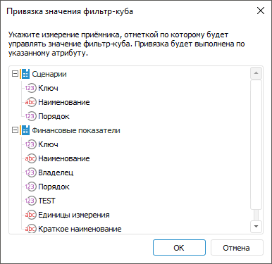

# Настройка фильтрации по данным: Блок расчёта, настольное приложение

Настройка фильтрации по данным: Блок расчёта, настольное приложение
-
-

# Настройка фильтрации по данным

	Фильтрация по данным предназначена для дополнительной фильтрации
	 измерений приёмника данных по наличию данных в фильтрах.

	Настройка фильтрации по данным выполняется на странице «Фильтрация
	 по данным» в мастере редактирования блока расчёта:

	

	Для настройки фильтрации по данным:

		- Добавьте один или несколько фильтров:

			- для добавления фильтра, содержащегося в блоке, вызовите
			 раскрывающееся меню кнопки «Добавить».
			 Меню содержит список кубов, используемых в качестве [приёмника](Master_calculation_block_page_consumer.htm)
			 и [источников данных](Page_Sources.htm) блока расчёта;

			- для добавления фильтра из репозитория нажмите кнопку
			 «Добавить». Будет
			 открыт диалог выбора объекта.

	Примечание.
	 При дальнейшей настройке дополнительной фильтрации элементов измерения
	 [приёмника](Master_calculation_block_page_consumer.htm)
	 по значениям указанного атрибута добавьте фильтр, структура которого
	 отличается от структуры приёмника, но содержит хотя бы одно общее
	 измерение. Фильтрация элементов происходит только в общих измерениях
	 фильтра и приёмника.

	[Фильтрация
	 без учёта отметки в приёмнике](javascript:TextPopup(this))

		Если добавленный фильтр содержит
		 хотя бы одно общее измерение с [приёмником](Master_calculation_block_page_consumer.htm),
		 то по умолчанию фильтрация элементов будет происходить только
		 в общих измерениях. Установите флажок «Исключить
		 измерение» для исключения измерения из фильтрации. В этом
		 случае для фильтрации будет учитываться только отметка элементов
		 измерения и данные фильтра. Отметка элементов измерения приёмника
		 не будет участвовать в фильтрации по данным.

		Если фильтр и приёмник не содержат
		 общих измерений, то флажок «Исключить
		 измерение» отсутствует.

		- Выделите измерение фильтра, для которого будет настраиваться
		 фильтрация.

		- Задайте [настройки
		 фильтрации измерения](FilteringByData.htm#filtering).

		- Выполните [привязку
		 значения фильтра](FilteringByData.htm#filter_cube) для дополнительной фильтрации элементов
		 измерения [приёмника](Master_calculation_block_page_consumer.htm)
		 по значениям указанного атрибута. При использовании дополнительной
		 фильтрации отметка элементов измерения приёмника зависит от значений
		 отмеченных элементов измерений выбранного фильтра и учитывается
		 при расчёте алгоритма. Если значения элементов равны значению
		 указанного атрибута, то по измерениям фильтра передаётся отметка
		 элементов в приёмник и при расчёте алгоритма выполняется фильтрация
		 элементов в соответствии с полученной отметкой.

	Примечание.
	 При расчёте алгоритма не учитывается отметка элементов календарного
	 измерения. Период расчёта задаётся на вкладке «[Управление
	 периодом расчёта](../Work/Calculation_period_management.htm)» в окне «[Параметры алгоритма
	 расчёта](../Work/Set_up_calculation_parameters.htm)» или на [панели
	 параметров](../Work/Beginning_of_work.htm).

	После выполнения действий будет настроена фильтрация по данным.

	Для удаления фильтра и настроек фильтрации, связанных с ним,
	 выделите куб и нажмите кнопку «Удалить».

	Примечание.
	 При выполнении многопоточного расчёта настроенная фильтрации по данным
	 влияет на общее время расчёта алгоритма. Для получения подробной информации
	 обратитесь к разделу «[Как
	 выполнять многопоточный расчёт?](../../FAQ/MultiThreadedCalculation.htm#multithread)».

	Для получения подробной информации о работе фильтрации обратитесь
	 к разделу «[Примеры
	 фильтрации по данным](../../Web/Calculation_block/Examples_Filtering_Data.htm)».

## Настройка фильтрации измерения

	Для выбора элементов измерения, по которым будет рассчитываться
	 блок, выделите измерение фильтра и откройте окно «Настройка
	 фильтрации»:

		- нажмите кнопку «Задать
		 фильтр»;

		- дважды щёлкните по измерению.

	После выполнения одного из действий будет открыто окно «Настройка
	 фильтрации»:

	

Порядок настройки:

	- Выберите элементы, по которым будет рассчитываться блок. Установите
	 один из переключателей:

		- Все элементы. Расчёт
		 блока будет идти по всем элементам измерения;

		- Выбранные элементы.
		 Расчёт блока будет идти только по выбранным элементам измерения.
		 Список элементов формируется в области «Выбранные
		 элементы» с помощью кнопок:

			-  «Выбрать элементы». Добавляет
			 элементы, выделенные в области «Все
			 элементы», в область «Выбранные
			 элементы»;

			-  «Исключить элементы». Удаляет
			 выделенные элементы из области «Выбранные
			 элементы».

Фильтрация будет производиться по всем элементам,
 содержащимся в области «Выбранные элементы».
 При необходимости выполнения расчёта по всем элементам, кроме тех, которые
 содержатся в области «Выбранные элементы»,
 установите флажок «Исключить выбранные
 элементы (N)», где N -
 количество выбранных элементов.

Для работы с [отметкой
 элементов измерения](UiSelection.chm::/Selection/Selection_of_the_dimension_elements.htm#selection) используйте команды контекстного
 меню. Если к элементам, расположенным в области «Все
 элементы», применена [схема
 отметки](UiSelection.chm::/Selection/Selection_of_the_dimension_elements.htm#selection_schemas), то она учитывается при переносе элементов
 в область «Выбранные элементы».

Для поиска элемента в каждой из областей
 начните вводить наименование искомого элемента в строку  «Поиск».
 При вводе наименования частично или полностью в области будет отображаться
 список элементов, наименования которых содержат искомое сочетание символов;

Примечание.
 Если в качестве фильтра используется параметрический куб и для него
 [задана связь параметра
 с параметром алгоритма расчёта](../Work/Manage_cubes_settings.htm), то при изменении значения параметра
 переключатель будет автоматически переведён в положение «Все
 элементы».

		- Из параметра. Расчёт
		 блока будет идти по элементам, заданным параметром типа «Отметка». Способ доступен, если
		 блок содержит параметры типа «Отметка».

Если требуется, чтобы блок рассчитывался
 по всем элементам, кроме отмеченных, то установите флажок «Исключить
 выбранные элементы».

	- Для задания условий, которым должны соответствовать атрибуты
	 элементов, при выполнении расчёта блока, используйте группу параметров
	 «Расширенный фильтр». Работа
	 с данной группой параметров аналогична работе с диалогом «[Расширенный
	 фильтр](uinav.chm::/GUI/UFE/AttributeFiltering.htm)».

После выполнения действий блок будет рассчитываться только по элементам,
 соответствующих фильтру.

## Привязка значения фильтра

	Для привязки значения фильтра по атрибуту измерения [приёмника](Master_calculation_block_page_consumer.htm):

		- Выберите добавленный фильтр, отличающийся от приёмника.

		- Нажмите кнопку «Привязка
		 значения».

	После выполнения действия будет открыто
	 окно «Привязка значения фильтра»:

	

	В окне отображаются измерения, которые
	 содержатся в приёмнике, но не содержатся в выбранном фильтре.

		- Выберите атрибут измерения, по значениям которого будут
		 отфильтрованы элементы измерения приёмника, и нажмите кнопку «ОК».

	После выполнения действий будет выполнена привязка значений атрибута
	 измерения приёмника для фильтрации элементов по отметке фильтра.
	 Измерение приёмника добавляется в состав фильтра и доступно для
	 [настройки фильтрации](FilteringByData.htm#filtering):

	

См. также:

[Начало
 работы с расширением «Алгоритмы расчёта» в веб-приложении](../../Web/Work/Beginning_of_work.htm) | [Вставка
 и настройка блоков расчёта](Calculation_unit.htm) | [Как
 выполнять многопоточный расчёт?](../../FAQ/MultiThreadedCalculation.htm)

		Справочная
		 система на версию 10.9
		 от 18/08/2025,
		 © ООО «ФОРСАЙТ»,
