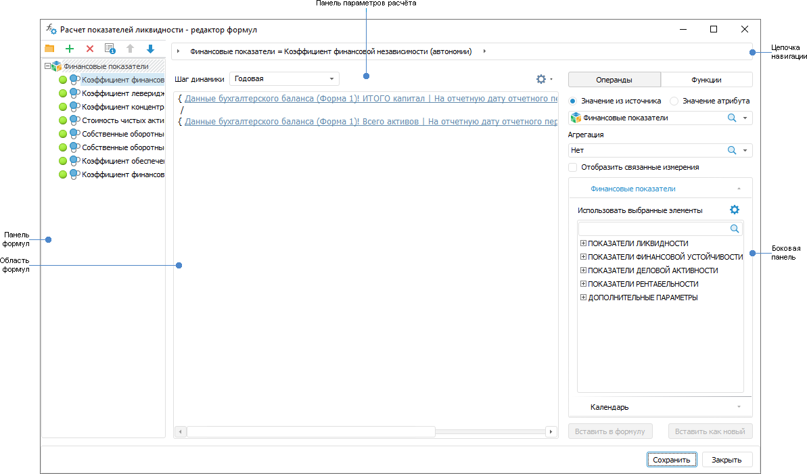

# Настройка формул расчёта: Алгоритм расчёта показателей, настольное приложение

Настройка формул расчёта: Алгоритм расчёта показателей, настольное приложение
-

# Настройка формул расчёта

Формулы расчёта определяют, каким образом данные из источников будут
 преобразованы перед загрузкой в приёмник.

Для настройки формул расчёта:

	- выполните команду «Редактор
	 формул» в контекстном меню [блока
	 расчёта](Calculation_unit.htm) или [блока
	 контроля](../Control_Block/Control_Block.htm);

	- дважды щёлкните по блоку расчёта или блоку контроля.

После выполнения действия будет открыт диалог «<наименование блока> - редактор формул»:

Для настройки формулы расчёта:

	- [Создайте формулу](Formula_Creation.htm).

	- [Выберите элемент измерения
	 и календарную динамику расчёта](Calculated_Element_Select.htm).

	- [Сформируйте формулу
	 расчёта](Calculation_Formula_Generation.htm).

	- [Настройте
	 дополнительные параметры расчёта](Additional_Calculation_and_Data_Saving_Parameters.htm).

В результате будет настроена формула расчёта. Повторите шаги для настройки
 набора формул.

Формулы будут рассчитаны в том порядке, в котором они следуют на панели
 формул. Для изменения порядка следования формул используйте кнопки  «Вверх»
 и  «Вниз».

Важно. Если
 в формулах используется один и тот же источник данных в качестве операнда,
 то учитывайте порядок расчёта формул. Формула A, в которой используется
 результат расчёта формулы B, должна следовать после формулы B, в которой
 выполняется расчёт результирующего источника данных. Данные источника
 изменяются после расчёта первой формулы и в последующих формулах используется
 изменённый набор данных.

Для исключения формул из расчёта выделите их и выполните команду «Исключить из расчёта» в контекстном
 меню. Если формулы сгруппированы в папке, то для исключения из расчёта
 всех формул в папке выполните аналогичную команду в контекстном меню папки.
 Для расчёта исключённых элементов выполните команду «Включить
 в расчёт» в контекстном меню.

Для удаления формулы выделите её и нажмите кнопку  «Удалить» на панели формул.

Примечание.
 При редактировании формул возможна [ошибка](FAQ.chm::/Errors/Error_while_working.htm#7_11),
 связанная с системным дефектом ОС Windows.

См. также:

[Начало
 работы с расширением «Алгоритмы расчёта» в веб-приложении](../../Web/Work/Beginning_of_work.htm) | [Вставка
 и настройка блоков расчёта](Calculation_unit.htm)

		Справочная
		 система на версию 10.9
		 от 18/08/2025,
		 © ООО «ФОРСАЙТ»,
