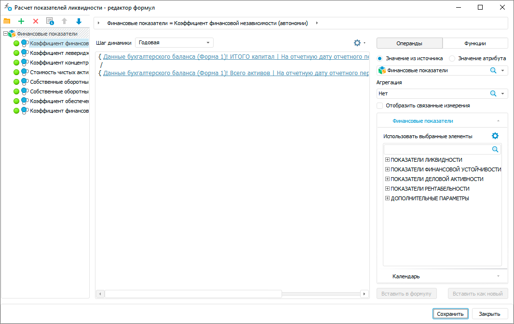
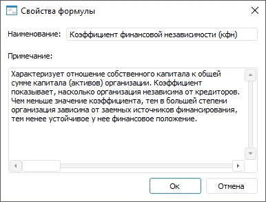

# Создание формулы расчёта: Алгоритм расчёта показателей, настольное приложение

Создание формулы расчёта: Алгоритм расчёта показателей, настольное приложение
-

# Создание формулы расчёта

	Для создания формулы:

		- Откройте диалог «[<наименование блока>
		 - редактор формул](Formula.htm)».

	[Для
	 открытия окна](javascript:TextPopup(this))

				- выполните команду «Редактор
				 формул» в контекстном меню [блока
				 расчёта](Calculation_unit.htm) или [блока
				 контроля](../Control_Block/Control_Block.htm);

				- дважды щёлкните по блоку расчёта или блоку контроля.

	

		- Выполните одно из действий:

			- нажмите кнопку  «Добавить
			 формулу» на панели формул;

			- выполните команду «Создать > 
			 Формулу» контекстного меню папки или панели формул.

		- Введите наименование формулы и нажмите клавишу ENTER.

	После выполнения действий формула будет добавлена в конец списка
	 формул.

	Для работы с формулой доступны следующие операции:

		- [переименование формулы](#rename);

		- [добавление примечания к формуле](#note);

		- [группировка формул](#group);

		- [копирование формулы в буфер обмена](#copy);

		- [вставка формулы из буфера обмена](#paste).

## Переименование формулы

	Для переименования формулы:

		- Переведите наименование формулы в режим редактирования:

			- дважды щёлкните по формуле;

			- нажмите клавишу F2.

		- Введите новое наименование формулы и нажмите клавишу ENTER.

	После выполнения действий формула будет переименована.

	Также переименование формулы доступно с помощью окна «[Свойства
	 формулы](Formula_Creation.htm#note)».

## Добавление примечания к формуле

	Для добавления примечания к выделенной формуле:

		- Нажмите кнопку  «Свойства».
		 После чего будет открыто окно «Свойства
		 формулы»:

	

		- Задайте параметры:

			- Наименование.
			 При необходимости измените наименование формулы;

			- Примечание.
			 Введите краткое описание назначения формулы.

		- Нажмите кнопку «Ок».

	После выполнения действий будет добавлено примечание к формуле.

## Группировка формул

	Для группировки формул с помощью папок:

		- Добавьте папку:

			- нажмите кнопку  «Добавить
			 папку» на панели формул;

			- выполните команду «Создать > 
			 Папку» контекстного меню папки или панели формул.

	После выполнения одного из действий папка
	 будет добавлена в папку или в конец списка формул.

		- Введите название папки.

		- Повторите шаги для добавления набора папок.

		- Переместите формулу в папку или из папки с помощью механизма
		 Drag&Drop. В папке могут содержаться формулы и другие папки
		 с формулами.

	После выполнения действий формулы будут сгруппированы по папкам.

	Для удаления папки:

		- Выделите папку.

		- Выполните одно из действий:

			- нажмите кнопку  «Удалить»
			 на панели формул;

			- выполните одноимённую команду контекстного меню папки.

	Папка будет удалена со всеми формулами, содержащимися в ней.

## Копирование формулы в буфер обмена

	Для копирования формулы в буфер обмена:

		- выполните команду  «Копировать»
		 в контекстом меню формулы;

		- выделите формулу, используйте сочетание клавиш CTRL+C.

	После выполнения одного из действий формула будет скопирована в
	 буфер обмена.

## Вставка формулы из буфера обмена

	Для вставки формулы из буфера обмена:

		- выполните команду  «Вставить»
		 в контекстом меню формулы;

		- используйте сочетание клавиш CTRL+V.

	После выполнения одного из действий в конце списка формул будет
	 вставлена формула из буфера обмена.

См. также:

[Начало
 работы с расширением «Алгоритмы расчёта» в веб-приложении](../../Web/Work/Beginning_of_work.htm) | [Настройка
 формул расчёта](Formula.htm)

		Справочная
		 система на версию 10.9
		 от 18/08/2025,
		 © ООО «ФОРСАЙТ»,
