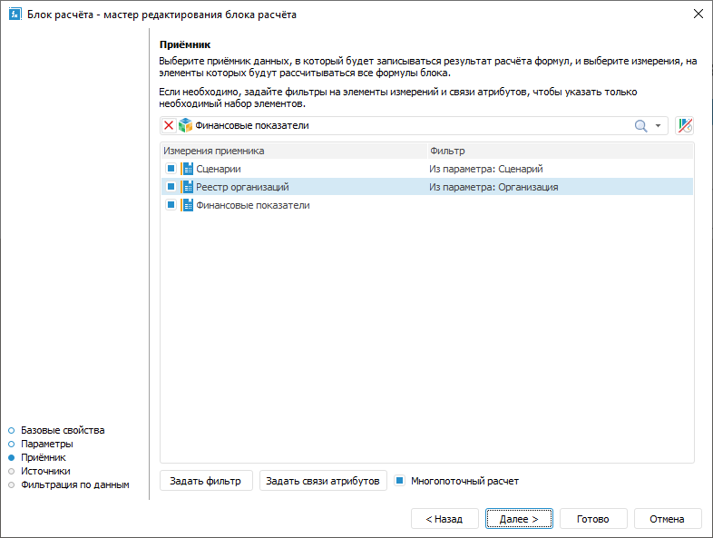
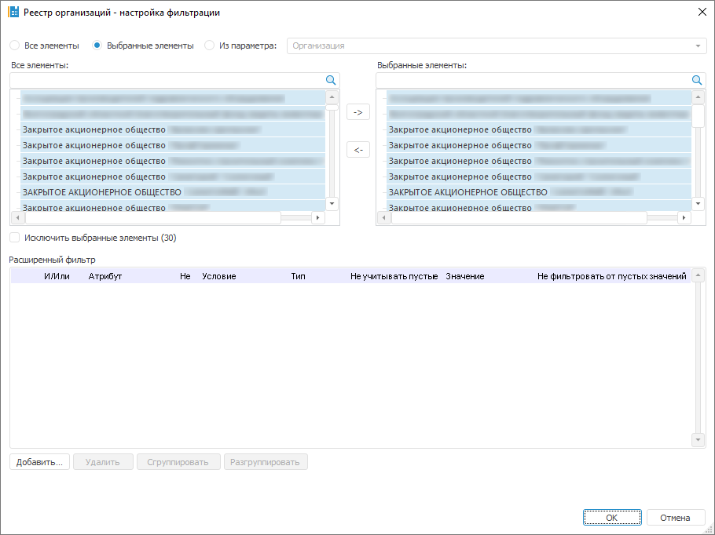
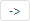
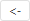

# Выбор и настройка приёмника данных: Блок расчёта, настольное приложение

Выбор и настройка приёмника данных: Блок расчёта, настольное приложение
-

# Выбор и настройка приёмника данных

Приёмник определяет объект, в который будут выгружены данные после расчёта
 блока.

Выбор и настройка приёмника данных выполняется на странице «Приёмник»
 в мастере редактирования блока расчёта:

Для выбора и настройки приёмника данных:

	- В раскрывающемся списке выберите приёмник данных.

В качестве приёмника могут использоваться
 следующие объекты репозитория:

		- [стандартный
		 куб](UiNavObj.chm::/Cube/CreateCube/Master_Standart/UiMd_Cube_CreateCube_Master_Standart.htm);

		- [представление-куб](UiNavObj.chm::/Cube/CreateCube/Master_Calculation/UiMd_Cube_CreateCube_Master_Calculation.htm);

		- [виртуальный
		 куб](UiNavObj.chm::/Cube/CreateCube/Master_Virtual_Cube/UiMd_Cube_CreateCube_Master_Virtual.htm);

		- [автоматический
		 куб](UiNavObj.chm::/Cube/CreateCube/Master_Auto/UiMd_Cube_CreateCube_Master_Auto.htm);

		- [база
		 данных временных рядов](UiNavObj.chm::/TimeSeriesDatabase/CreateTimeSeriesDatabase.htm).

	- Выберите роль календаря. По умолчанию календарь рассматривается
	 в качестве календарного измерения и по нему нельзя задать фильтрацию
	 или настроить формулу расчёта. Для работы с календарём в качестве
	 обычного измерения нажмите кнопку ,
	 расположенную рядом с раскрывающимся списком для выбора приёмника
	 данных. Календарь будет отображён в списке измерений приёмника и с
	 ним можно работать как с обычным измерением. Для работы с календарём
	 как с календарным измерением переведите кнопку 
	 в ненажатое состояние.

Примечание.
 Изменение роли календаря доступно, если для блока расчёта не заданы [формулы](Formula.htm).

	- Отметьте флажками измерения приёмника, по которым будет выполняться
	 фильтрация по элементам. Фильтрация позволяет выполнять расчёт только
	 по части элементов измерения. Также фильтруемые измерения не участвуют
	 в составлении [формул расчёта](Formula.htm) блока. Формулы
	 составляются только для нефильтруемых измерений.

Если отметка измерения используется в [формулах расчёта](Formula.htm), то при установке флажка выдается
 подтверждение на сброс отметки. После подтверждения действия будет сброшена
 отметка в термах формулы и [настройка
 способа выбора элементов](Calculation_Formula_Generation.htm#operandselection) операнда из параметра. Также изменится [настройка фильтрации измерения](FilteringByData.htm#filtering)
 на фильтрацию по всем элементам измерения.

Примечание.
 После сброса отметки отредактируйте термы в [формуле](Formula.htm)
 вручную.

При снятии флажка отображается окно «Фиксация отметки» аналогичное окну
 «[Удаление связи](Page_Sources.htm#unlink)». Задайте фиксацию
 отметки, если отметка измерения используется в [формулах
 расчёта](Formula.htm), и нажмите кнопку «ОК».
 После снятия флажка не будет выполняться фильтрация по элементам измерения
 приёмника. В формулах расчёта будет использоваться зафиксированная отметка.

Примечание.
 Если установлен переключатель «Зафиксировать
 позже» при выборе фиксации отметки, то редактирование [формулы](Formula.htm)
 выполняется вручную.

	- Настройте фильтрацию по элементам для отмеченного флажком измерения:

		- нажмите кнопку «Задать
		 фильтр»;

		- дважды щёлкните по измерению.

Будет открыт диалог «[Настройка
 фильтрации](Master_calculation_block_page_consumer.htm#filter)», в котором задайте настройки фильтрации измерения приёмника
 данных.

	- Настройте для измерения фильтрацию по связям атрибутов.
	 Фильтрация уменьшает количество элементов, по которым выполняется
	 расчёт, на основе связей атрибутов. Для применения данного вида фильтрации:

		- Выделите измерение.

		- Нажмите кнопку «Задать
		 связи атрибутов». Будет отображен диалог «Фильтрация
		 по связям атрибутов», в котором задайте настройки фильтрации.
		 Для получения подробной информации обратитесь к разделу «[Настройка
		 фильтрации по связям атрибутов](UiModelling.chm::/2_Container_of_Modeling/2_3_Work_object/2_3_3_MetaModel/AttrLinksDimFilter.htm)».

	- При необходимости установите флажок «Многопоточный
	 расчет» для выполнения многопоточного расчёта блока. Многопоточный
	 расчёт блока будет выполняться, если установлен флажок «Многопоточный
	 расчет» в окне «[Настройка выполнения
	 расчёта](../Work/Perform_calculations.htm)». По умолчанию флажок снят и расчёт блока выполняется
	 в один поток.

Примечание.
 Использование многопоточного расчёта для блока расчёта доступно только
 при отметке хотя бы одного измерения приёмника в шаге 3.

Для получения подробной информации о многопоточном
 расчёте обратитесь к разделу «[Как
 выполнять многопоточный расчёт?](../../FAQ/MultiThreadedCalculation.htm)».

В результате будет настроен приёмник данных в блоке расчёта.

## Настройка фильтрации измерения приёмника данных

Фильтрация позволяет выполнять расчёт только по части элементов измерения.
 Также фильтруемые измерения не участвуют в составлении [формул](Formula.htm)
 расчёта блока. Формулы составляются только для нефильтруемых измерений.

Для выбора элементов измерения, по которым будет рассчитываться блок,
 используйте диалог «Настройка фильтрации»:

Порядок настройки:

	- Выберите элементы, по которым будет рассчитываться блок. Установите
	 один из переключателей:

		- Все элементы. Расчёт
		 блока будет идти по всем элементам измерения;

		- Выбранные элементы.
		 Расчёт блока будет идти только по выбранным элементам измерения.
		 Список элементов формируется в области «Выбранные
		 элементы» с помощью кнопок:

			-  «Выбрать элементы». Добавляет
			 элементы, выделенные в области «Все
			 элементы», в область «Выбранные
			 элементы»;

			-  «Исключить элементы». Удаляет
			 выделенные элементы из области «Выбранные
			 элементы».

Фильтрация будет производиться по всем элементам,
 содержащимся в области «Выбранные элементы».
 При необходимости выполнения расчёта по всем элементам, кроме тех, которые
 содержатся в области «Выбранные элементы»,
 установите флажок «Исключить выбранные
 элементы (N)», где N -
 количество выбранных элементов.

Для работы с [отметкой
 элементов измерения](UiSelection.chm::/Selection/Selection_of_the_dimension_elements.htm#selection) используйте команды контекстного
 меню. Если к элементам, расположенным в области «Все
 элементы», применена [схема
 отметки](UiSelection.chm::/Selection/Selection_of_the_dimension_elements.htm#selection_schemas), то она учитывается при переносе элементов
 в область «Выбранные элементы».

Для поиска элемента в каждой из областей
 начните вводить наименование искомого элемента в строку  «Поиск».
 При вводе наименования частично или полностью в области будет отображаться
 список элементов, наименования которых содержат искомое сочетание символов;

Примечание.
 Если в качестве фильтра используется параметрический куб и для него
 [задана связь параметра
 с параметром алгоритма расчёта](../Work/Manage_cubes_settings.htm), то при изменении значения параметра
 переключатель будет автоматически переведён в положение «Все
 элементы».

		- Из параметра. Расчёт
		 блока будет идти по элементам, заданным параметром типа «Отметка». Способ доступен, если
		 блок содержит параметры типа «Отметка».

Если требуется, чтобы блок рассчитывался
 по всем элементам, кроме отмеченных, то установите флажок «Исключить
 выбранные элементы».

	- Для задания условий, которым должны соответствовать атрибуты
	 элементов, при выполнении расчёта блока, используйте группу параметров
	 «Расширенный фильтр». Работа
	 с данной группой параметров аналогична работе с диалогом «[Расширенный
	 фильтр](uinav.chm::/GUI/UFE/AttributeFiltering.htm)».

После выполнения действий блок будет рассчитываться только по элементам,
 соответствующих фильтру.

См. также:

[Начало
 работы с расширением «Алгоритмы расчёта» в веб-приложении](../../Web/Work/Beginning_of_work.htm) | [Вставка и настройка блоков расчёта](Calculation_unit.htm) |
 [Как выполнять многопоточный
 расчёт?](../../FAQ/MultiThreadedCalculation.htm)

		Справочная
		 система на версию 10.9
		 от 18/08/2025,
		 © ООО «ФОРСАЙТ»,
