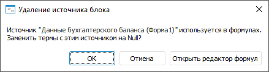
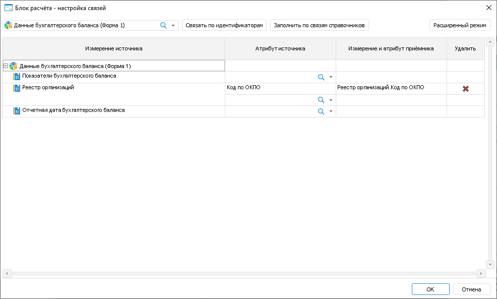
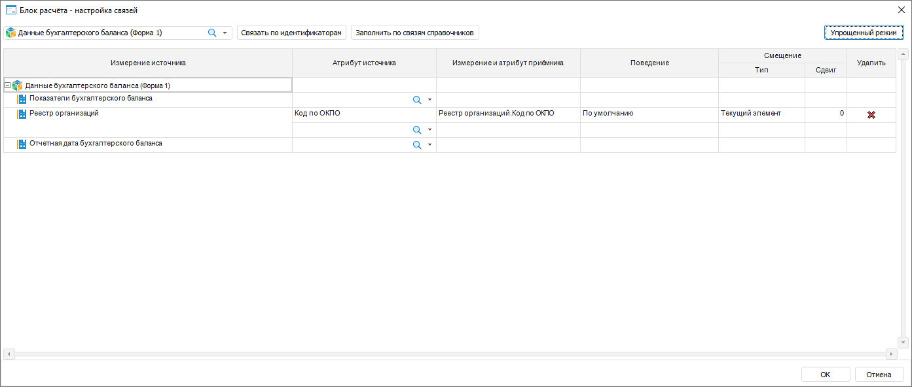
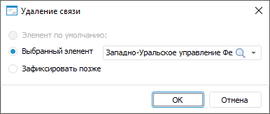
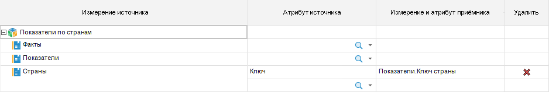
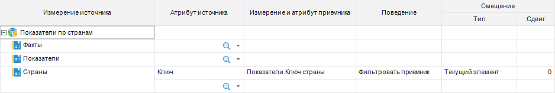
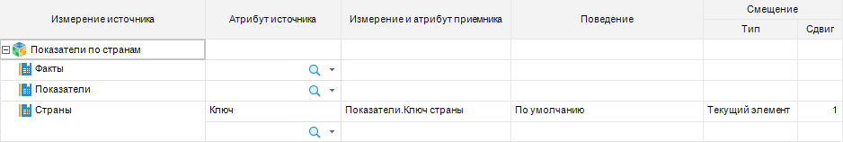
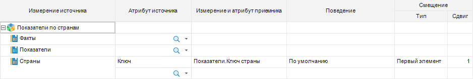
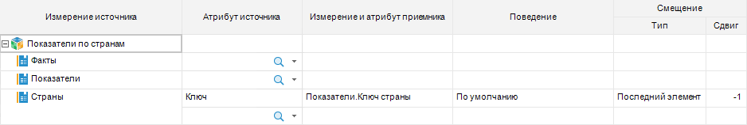

# Выбор и настройка источников данных: Блок расчёта, настольное приложение

Выбор и настройка источников данных: Блок расчёта, настольное приложение
-

# Выбор и настройка источников данных

Источники определяют объекты, на основании данных которых будет выполнен
 расчёт блока.

Выбор и настройка источников данных выполняется на странице «Источники»
 в мастере редактирования блока расчёта:

Для выбора и настройки источника данных:

	- Нажмите кнопку «Добавить».
	 Будет открыт диалог выбора объекта, в котором укажите источник.

	В качестве источников данных могут использоваться следующие объекты
	 репозитория:

		- [стандартный
		 куб](UiNavObj.chm::/Cube/CreateCube/Master_Standart/UiMd_Cube_CreateCube_Master_Standart.htm);

		- [представление-куб](UiNavObj.chm::/Cube/CreateCube/master_conception/uimd_cube_createcube_master_conception.htm);

		- [виртуальный
		 куб](UiNavObj.chm::/Cube/CreateCube/Master_Virtual_Cube/UiMd_Cube_CreateCube_Master_Virtual.htm);

		- [автоматический
		 куб](UiNavObj.chm::/Cube/CreateCube/Master_Auto/UiMd_Cube_CreateCube_Master_Auto.htm);

		- [база
		 данных временных рядов](UiNavObj.chm::/TimeSeriesDatabase/CreateTimeSeriesDatabase.htm).

	- Выберите роль календаря. По умолчанию календарь рассматривается
	 в качестве календарного измерения и по нему нельзя настроить связи.
	 Для работы с календарём в качестве обычного измерения установите флажок
	 «Календарь», расположенный
	 рядом с названием источника данных. Календарь будет отображён в списке
	 измерений источника и с ним можно работать как с обычным измерением.
	 Для работы с календарём как с календарным измерением снимите флажок
	 «Календарь».

	- Настройте связи измерений источника и приёмника данных. Связи
	 задают соответствие между измерениями источников данных и измерениями
	 приёмника данных, тем самым сокращая количество рассчитываемых элементов
	 и ускоряя расчёт блока. Для настройки связей нажмите кнопку «Настроить». Будет открыт диалог
	 «[Настройка
	 связей](Page_Sources.htm#link)», в котором задайте связи. Для автоматической настройки
	 связей по идентификаторам атрибутов в одинаковых измерениях приёмника
	 и источников нажмите кнопку «Связать
	 всё».

В результате будет добавлен и настроен источник данных. Если требуется,
 то аналогичным образом добавьте ещё источники данных.

Для удаления источника данных нажмите кнопку «Удалить».
 Если источник данных используется в [формулах расчёта](Formula.htm),
 то при удалении отображается окно подтверждения:

Выберите действие:

	- ОК. Источник данных
	 будет удален. Используемые термы с удаляемым источником данных в формулах
	 расчёта будут заменены на значение Null;

	- Отмена. Источник данных
	 не будет удален;

	- Открыть редактор формул.
	 Будет открыт [редактор формул](Formula.htm) для изменения
	 формул расчёта с удаляемым источником данных. В окне редактора формул
	 доступно только редактирование и удаление формул, в которых используется
	 источник данных. После изменения или удаления формул нажмите кнопку
	 «ОК» и подтвердите действие
	 в окне «Удаление источника блока».

## Настройка связей измерений источника и приёмника
 данных

Связи задают соответствие между измерениями источников данных и измерениями
 приёмника данных, тем самым сокращая количество рассчитываемых элементов
 и ускоряя расчёт блока.

Для настройки связей измерений источника и приёмника данных используйте
 диалог «Настройка связей». Настроить
 связь можно разных режимах: упрощённом и расширенном. Вид диалога отличается
 в зависимости от режима настройки:

	 Упрощённый режим Расширенный режим

		

		

Порядок настройки:

	- упрощённый режим. Используется
	 по умолчанию.

		- Выберите источники данных, для которых будут настраиваться
		 связи. Для этого используйте раскрывающийся список в верхнем левом
		 углу диалога. В столбце «Измерение
		 источника» будут отображены все измерения выбранных источников.
		 По умолчанию в списке выбран источник, выделенный на странице
		 «Источники» в мастере
		 редактирования блока расчёта. Если на странице не выбран ни один
		 источник, то в списке будут выбраны все источники данных блока.

		- В столбце «Атрибут источника»
		 выберите связываемый атрибут в измерении источника данных.

		- В столбце «Измерение и
		 атрибут приёмника» выберите атрибут из измерения приёмника
		 данных, содержащий такие же значения, что и выбранный атрибут
		 источника. В списке содержатся только те измерения [приёмника](Master_calculation_block_page_consumer.htm),
		 для которых настроена фильтрация. Например, для создания связи
		 в источнике данных выбран атрибут «Индекс»
		 в измерении «Города».
		 Для создания корректной связи в приёмнике надо выбрать атрибут,
		 содержащий индекс города в измерении, содержащем данные о городах.

Примечание.
 Если блок расчёта редактируется и для измерения источника данных не было
 ранее создано связей, а данный источник уже используется в [формулах
 расчёта блока](Formula.htm), то при создании связи будет отображено предупреждение
 о том, что сбросится отметка данного измерения в операндах формул. Таким
 образом, в формулах расчёт будет идти по всему измерению. Для продолжения
 создания связи и сброса отметки измерения в формуле нажмите кнопку «Да», для прерывания процесса создания
 связи - кнопку «Нет».

	- расширенный режим. Позволяет
	 дополнительно настроить поведение связи и смещение отметки в приёмнике
	 данных. Для получения примера функционирования связи с разным поведением
	 и с разным смещением обратитесь к разделу «[Примеры
	 работы связи измерений источника и приёмника данных](#example)».

		- Выполните все шаги настройки, предусмотренные в упрощённом
		 режиме.

		- Нажмите кнопку «Расширенный
		 режим». В диалоге будут отображены дополнительные столбцы.
		 Для возврата в упрощённый режим нажмите кнопку «Упрощённый
		 режим».

		- В столбце «Поведение»
		 выберите принцип работы связи:

			- По умолчанию.
			 В связанном измерении источника данных будут оставлены только
			 те отмеченные элементы, для которых есть соответствующий отмеченный
			 элемент в связанном измерении приёмника данных. Если соответствующий
			 элемент в источнике не найден, то возникнет ошибка в расчёте;

			- Фильтровать приёмник.
			 В связанном измерении приёмника данных будут оставлены только
			 те отмеченные элементы, для которых есть соответствующий отмеченный
			 элемент в связанном измерении источника данных;

			- Пустая точка, если
			 элемент не найден. В связанном измерении источника
			 данных будут оставлены только те отмеченные элементы, для
			 которых есть соответствующий отмеченный элемент в связанном
			 измерении приёмника данных. Если соответствующий элемент в
			 источнике не найден, то вместо него в расчёте будет использоваться
			 значение Null.

		- В группе «Смещение»
		 в столбце «Сдвиг» задайте
		 количество элементов, на которое будет смещена отметка в измерении
		 источника данных. В столбце «Тип»
		 укажите режим смещения:

			- Текущий элемент.
			 Используется по умолчанию. Смещение отметки выполняется для
			 каждого отмеченного элемента, полученного по связи;

			- Первый элемент.
			 Смещение отметки выполняется только для первого отмеченного
			 элемента, полученного по связи. Отметка с остальных элементов
			 снимается. Если по связи получена отметка элементов, принадлежащих
			 разным родителям, то смещение отметки выполняется только для
			 первого дочернего элемента в каждой группе элементов, принадлежащих
			 одному родителю. Отметка с остальных дочерних элементов снимается.
			 При использовании данного вида смещения сдвиг может быть только
			 положительным или нулевым;

			- Последний элемент.
			 Смещение отметки выполняется только для последнего отмеченного
			 элемента, полученного по связи. Отметка с остальных элементов
			 снимается. Если по связи получена отметка элементов, принадлежащих
			 разным родителям, то смещение отметки выполняется только для
			 последнего дочернего элемента в каждой группе элементов, принадлежащих
			 одному родителю. Отметка с остальных дочерних элементов снимается.
			 При использовании данного вида смещения сдвиг может быть только
			 отрицательным или нулевым.

Совет.
 Используйте смещение от первого или последнего элемента чтобы указать,
 что среди множества получившихся по связи элементов хотите использовать
 только один. Например, для каждого элемента по связи X.KEY = X.PARENT_KEY
 было получено множество его детей. Для того чтобы не выполнять агрегацию
 этих значений, а просто взять значение предпоследнего элемента, выберите
 в столбце «Тип» значение «Последний элемент», а в столбце
 «Сдвиг» укажите значение -1.

В результате будет установлена связь по атрибутам между измерениями.
 Если требуется, то аналогичным образом добавьте ещё связи атрибутов.

Для автоматического добавления всех возможных связей на основе:

	- идентификаторов атрибутов нажмите кнопку «Связать
	 по идентификаторам». Связи будут созданы для всех одинаковых
	 измерений в источниках и приёмниках данных;

	- связей между измерениями нажмите кнопку «Заполнить
	 по связям справочников». Связи будут созданы для тех измерений,
	 в которых содержатся [связанные
	 атрибуты](UiNavObj.chm::/reference_book/Master_RDS_reference_book/Link.htm).

Для удаления связи между атрибутами нажмите кнопку 
 «Удалить» в конце соответствующей
 строки.

Если блок расчёта редактируется, и удаляемая связь
 является единственной для измерения источника данных, а источник уже используется
 в [формулах расчёта блока](Formula.htm), то будет отображён
 диалог «Удаление связи»:

Выберите способ фиксации отметки по данному измерению в операндах формул
 расчёта:

	- Элемент по умолчанию.
	 В качестве отметки будет использоваться элемент по умолчанию, заданный
	 с помощью языка Fore в справочнике, на котором основано измерение.
	 Способ доступен, если в справочнике задан [элемент по умолчанию](KeRds.chm::/Samples/DefaultElement.htm);

	- Выбранный элемент. Выберите
	 элемент, который будет использоваться в качестве отметки по измерению;

	- Зафиксировать позже.
	 Измерение остаётся без фиксированной отметки и расчёт будет выполняться
	 по всем элементам измерения. Зафиксировать отметку можно отредактировав
	 [формулы расчёта](Formula.htm) блока.

## Примеры работы связи измерений источника и приёмника
 данных

Приведён пример функционирования связи с разным [поведением](#behavior)
 и с разным [смещением](#offset). Используемые измерения являются
 абстрактными и используются для демонстрации принципов работы связей.
 Отметка измерений демонстрируется на справочниках НСИ, являющихся основой
 для данных измерений.

### Примеры поведения

Например, есть измерение «Показатели»
 в приёмнике данных и измерение «Страны»
 в источнике данных. Измерения содержат следующие данные и в них задана
 следующая отметка:

Связь настроена между атрибутами «Ключ»
 в измерении «Страны» и «Ключ страны» в измерении «Показатели»:

Рассмотрим отметку, которая будет использоваться в блоке расчёта, при
 различном поведении связи:

	- По умолчанию. В связанном
	 измерении источника данных будут оставлены только те отмеченные элементы,
	 для которых есть соответствующий отмеченный элемент в связанном измерении
	 приёмника данных. При расчёте возникнет ошибка из-за того, что для
	 элемента «Инфляция, %» не
	 зафиксирована отметка в измерении «Страны».

	Полученная отметка Исходная отметка Используемые настройки

		

		

		

	- Фильтровать приёмник.
	 В связанном измерении приёмника данных будут оставлены только те отмеченные
	 элементы, для которых есть соответствующий отмеченный элемент в связанном
	 измерении источника данных.

	 Полученная отметка Исходная отметка Используемые настройки

		

		

		

	- Пустая точка, если элемент
	 не найден. В связанном измерении источника данных будут оставлены
	 только те отмеченные элементы, для которых есть соответствующий отмеченный
	 элемент в связанном измерении приёмника данных. При расчёте по элементу
	 «Инфляция, %» будет использоваться
	 значение Null в измерении «Страны».

	 Полученная отметка Исходная отметка Используемые настройки

		

		

		

### Примеры смещения

Например, есть измерение «Показатели»
 в приёмнике данных и измерение «Страны»
 в источнике данных. Измерения содержат следующие данные и в них задана
 следующая отметка:

Связь настроена между атрибутами «Ключ»
 в измерении «Страны» и «Ключ страны» в измерении «Показатели»:

Рассмотрим отметку, которая будет использоваться в блоке расчёта, при
 связи, использующей смещение с различным сдвигом:

	- Текущий элемент. Смещение
	 отметки выполняется от каждого элемента, полученного по связи.

Отметка, полученная при применении смещения
 на один элемент вперёд:

	 Полученная отметка
	  Исходная отметка Используемые настройки

		

		

		

	- Первый элемент. Смещение
	 отметки выполняется только для первого отмеченного элемента, полученного
	 по связи. Отметка с остальных элементов снимается. Если по связи получена
	 отметка элементов, принадлежащих разным родителям, то смещение отметки
	 выполняется только для первого дочернего элемента в каждой группе
	 элементов, принадлежащих одному родителю. Отметка с остальных дочерних
	 элементов снимается.

Отметка, полученная при применении смещения
 от первого элемента на один элемент вперёд:

	 Полученная отметка Исходная отметка Используемые настройки

		

		

		

	- Последний элемент. Смещение
	 отметки выполняется только для последнего отмеченного элемента, полученного
	 по связи. Отметка с остальных элементов снимается. Если по связи получена
	 отметка элементов, принадлежащих разным родителям, то смещение отметки
	 выполняется только для последнего дочернего элемента в каждой группе
	 элементов, принадлежащих одному родителю. Отметка с остальных дочерних
	 элементов снимается.

Отметка, полученная при применении смещения
 от последнего элемента на один элемент назад:

	 Полученная отметка Исходная отметка Используемые настройки

		

		

		

См. также:

[Начало
 работы с расширением «Алгоритмы расчёта» в веб-приложении](../../Web/Work/Beginning_of_work.htm) | [Вставка
 и настройка блоков расчёта](Calculation_unit.htm)

		Справочная
		 система на версию 10.9
		 от 18/08/2025,
		 © ООО «ФОРСАЙТ»,
