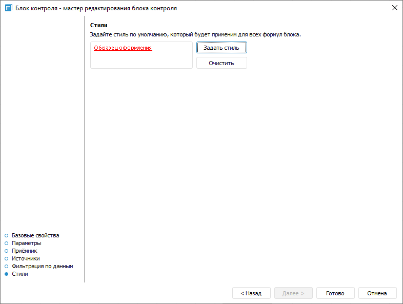

# Настройка оформления данных, не прошедших контроль: Блок контроля, настольное приложение

Настройка оформления данных, не прошедших контроль: Блок контроля, настольное приложение
-

# Настройка оформления данных, не прошедших контроль

Настройка оформления позволяет в форме ввода визуально выделить данные,
 которые не прошли контроль.

Для настройки стиля оформления используйте страницу «Стили»
 в мастере редактирования блока контроля:

Для задания стиля нажмите кнопку «Задать
 стиль». Будет открыт диалог «Форматирование»,
 содержащий следующие вкладки:

	- [Формат числа](uinav.chm::/gui/format/uireport_table_attribute_format.htm).
	 Настройки формата отображения данных;

	- [Шрифт](uinav.chm::/gui/format/uireport_table_attribute_type.htm). Настройки
	 шрифта текста в ячейках: тип, размер, цвет и прочее;

	- [Заливка](uinav.chm::/gui/format/uireport_table_attribute_view.htm). Настройки
	 заливки фона ячеек: тип заливки, её цвет, штриховка и прочее;

	- [Выравнивание](uinav.chm::/gui/format/uireport_table_attribute_arrange.htm).
	 Настройки текста в ячейке: выравнивание, отступы и прочее;

	- [Границы](uinav.chm::/gui/format/uireport_table_attribute_border.htm). Настройки
	 стиля границ ячейки: отображаемые границы, тип и цвет линий границ;

	- [Прочее](uinav.chm::/gui/format/uireport_table_attribute_others.htm). Настройки
	 защиты ячейки, её печати и прочее.

Для сброса заданного стиля и возврата к стилю по умолчанию нажмите кнопку
 «Очистить».

Примечание.
 На этапе построения формы ввода при выборе алгоритма расчёта задаются
 собственные [настройки
 стиля](DataEntryForms.chm::/desktop/Table/Calculation_Practices.htm#common) для данных, не прошедших контроль. Данные настройки
 имеют более высокий приоритет по сравнению с настройками стиля в блоке
 контроля. Например, если заданы настройки шрифта в форме ввода и в блоке
 контроля, то для оформления данных, не прошедших контроль, будут применены
 настройки шрифта из формы ввода.

См. также:

[Начало
 работы с расширением «Алгоритмы расчёта» в веб-приложении](../../Web/Work/Beginning_of_work.htm) | [Вставка
 и настройка блоков контроля](Control_Block.htm)

		Справочная
		 система на версию 10.9
		 от 18/08/2025,
		 © ООО «ФОРСАЙТ»,
