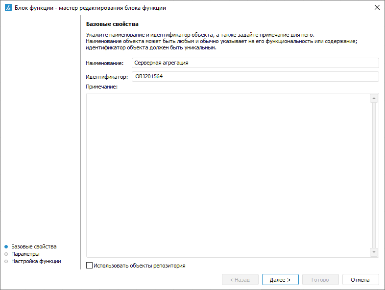

# Настройка базовых свойств: Блок функции, настольное приложение

Настройка базовых свойств: Блок функции, настольное приложение
-

# Настройка базовых свойств

Настройка базовых свойств блока функции выполняется на странице «Базовые свойства» в мастере редактирования
 блока функции:

Укажите:

	- Наименование. Наименование
	 блока должно нести смысловую нагрузку, раскрывать его функциональность.

	- Идентификатор. Идентификатор
	 блока должен быть уникальным в рамках алгоритма расчёта. Он состоит
	 только из букв латинского алфавита, цифр и знаков подчёркивания. Идентификатор
	 может начинаться с любого допустимого символа, кроме цифры.

	- Примечание. Необязательный
	 элемент. Примечание может содержать любую информацию по усмотрению
	 пользователя.

Если алгоритм расчёта расположен в [контейнере](UiNavObj.chm::/Container/Container.htm)
 или [бизнес-приложении](Constructor.chm::/Intro/Designer_business_applications.htm),
 то на странице «Базовые свойства»
 будет отображаться флажок «Использовать
 объекты репозитория». По умолчанию флажок снят и в процессе настройки
 блока могут использоваться только те объекты репозитория, которые содержатся
 в соответствующем контейнере или бизнес-приложении. Для использования
 любых объектов репозитория при настройке блока установите флажок «Использовать объекты репозитория».

См. также:

[Начало
 работы с расширением «Алгоритмы расчёта» в веб-приложении](../../Web/Work/Beginning_of_work.htm) | [Вставка
 и настройка блоков функций](Function_Block.htm)

		Справочная
		 система на версию 10.9
		 от 18/08/2025,
		 © ООО «ФОРСАЙТ»,
